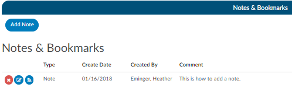
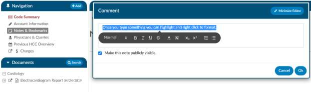
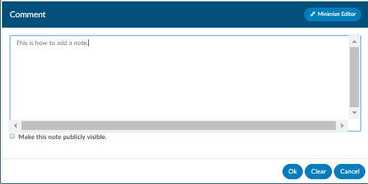
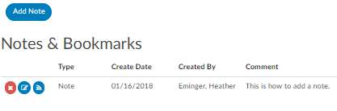
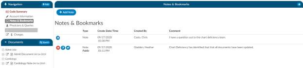
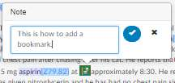

+++
title = 'Notes and Bookmarks'
weight = 30
+++

The Notes & Bookmarks becomes visible in the center pane after clicking on the hyperlink from the
Navigation Pane. This pane presents a summary and chronological history of all notes and bookmarks
added to this account.

## Add Note

Notes can be added to the patient chart by clicking on the **Add Note** button within the Notes &
Bookmarks Pane.

When notes or bookmarks are applied to the chart, the Notes and Bookmarks link in the Navigation
pane will turn red.

## Adding formatting

Account Notes also have formatting options for text. Once you type something you can highlights and a
popup with formatting options displays. A user can now select text in those areas and can change the
styles of text.

## Publicly Visible Note

After clicking the add note button, enter the account note Comment in the Comment window. You have
the option to make this note publicly visible among all users by clicking on the checkbox.

To keep your Comment box open while continuing to work on the chart, click on the Minimize Editor
button. This will move a placeholder to the **Accounts Action Bar**.

## Note Icons

## Setting a Note/Bookmark to Private

If an end user puts a note on the account, they can make it public or private. Even if an end user marks a
note/bookmark as private users that have a role of administrator or manager can still see private
messages. The private note/bookmark is simply marked private from all other users that do not have the
role of administrator or manager. This feature allows for a manager to review a patient chart and if they
do not want the existing public note to show in the account note, they can change an existing note
private without putting in a new note. Then they have to make it public, then switch it to private in
order to have the account note blank.

## Add Bookmark to a Text Document

You can add a bookmark to a document by highlighting the relevant word(s), phrase or location within
the text and then right-clicking to open the Bookmark menu.

Left-click the location within the selected document or specific text for bookmarking, then right-click to
open the Bookmark window. From the Bookmark menu, select Bookmark to open the Note window to add your note 
for this bookmark.

Add the note for your bookmark in the Note text box, then click the checkmark button to save the bookmark 
with your note for future reference. Bookmarks within documents will have the bookmark icon. To view 
bookmarks from within a document, click on the green list icon to open and view the bookmark note.

To review all bookmarks within a chart, go to Notes & Bookmarks in the Navigation Pane. All of the 
bookmarks within the chart are listed in the Notes & Bookmarks pane.

You can take further action on bookmarks within the Notes & Bookmarks pane using the following icon
action buttons

| Icon                   | Description |
| ---------------------- | ----------- |
|  | Click on this button to delete the selected bookmark. |
|  | Click on this button to edit a previously added bookmark. |
|  | Click on this button to jump to the location where the bookmark was created. |

> [!note] Image Documents Cannot Contain Bookmarks
Bookmarks cannot be added to images/scanned documents.
