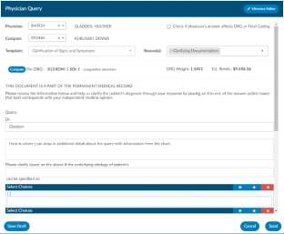
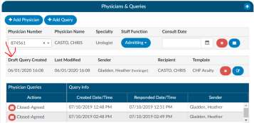
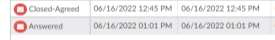
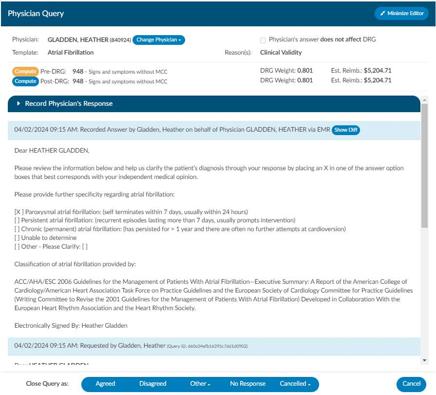
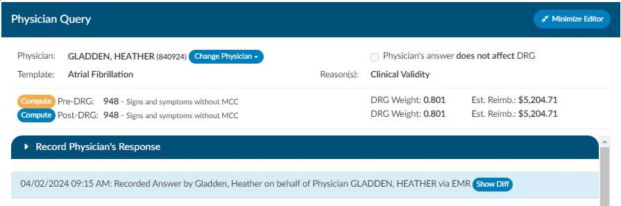
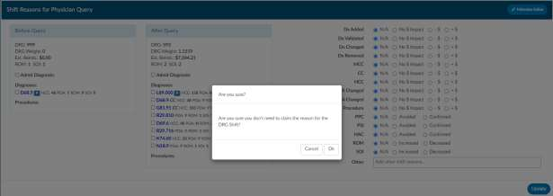
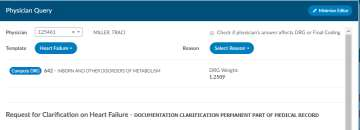
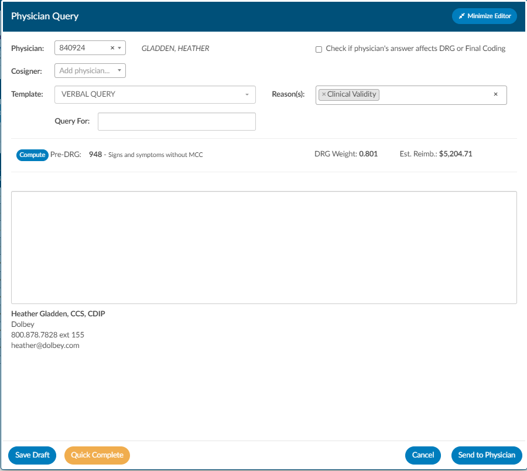
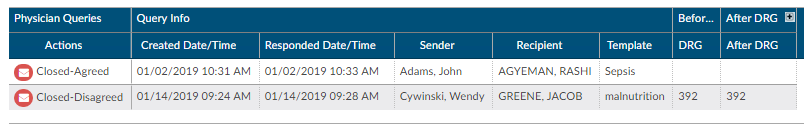

+++
title = 'Physicians and Queries'
weight = 40
+++

Within this page you can add physicians and change the staff function. if it is not correct.

## Adding & Editing Physicians

The bottom portion, ‘Account Physicians’, is pre-populated by your registration system. Physicians can
be added, changed, or removed if incorrect or missing. To add a physician, click on the ‘Add Physician’
button and begin typing in the physician’s last name to populate a list to choose from, then click add.
Choose the staff function that fits the physician you choose. If it is a consulting physician enter in the
consultation date.

## Removing a Physician

To remove a physician that either you added or was sent incorrectly from the registration system click
on the red ‘X’ button to remove the physician.

## Save Layout and Reset Filters

When moving around the columns in the Physician Queries grid and then clicking the Save Layout
button, the columns and order will be saved for the Queries grid for all future accounts for that user.
Any other user will see the default layout. Next to the Save Layout button is a Reset Filters button, this
will take any custom layout and change it back to the default fields.

## Adding a Query

You can also add a physician query if your facility has chosen to use this feature. To add a query to a
physician that is listed, click on either the envelope icon next to the physician or if the physician is not
listed then click on ‘Add Query’.

Add a physician if the physician did not auto fill by clicking on the ‘add physician’ button and begin typing
in the last name. Then click on ‘Select Template’ to choose the query template you wish to use

## Adding a Cosigner

If configured, you will be able to see a co-signer field that allows you to assign a cosigner. The cosigner
field is a field that can be sent in the outbound interface for the query. The receiving system can
choose to use this process if the co-signer needs to receive the query after the main user answers,
but before it gets returned to Dolbey.

When a physician query is created, a new "Cosigner" physician dropdown appears below the existing "Physician"
dropdown. Filling in this field is optional. When the query is saved as a draft or sen outbound, the cosigner
field will be saved with the query and sent as an additional recipient.

In the grid inside the Physicians & Queries, the user may also choose to add "Cosigner" as a visible
column.

## Creating the Query

Write the query or fill out details as needed. Please refer to your manager for details as each organization
has custom query templates and additional details surrounding queries. Once completed, select from the
reason dropdown why you are sending the query and above that field check the box if the query will affect
final coding.

Click “Send” to complete and send the query or click “Save Draft” if you are not ready to send. If you save
the query as draft, you will notice there is now a draft query section that is separated from sent or closed
queries. If a user has at least one draft, but no sent queries, the total drafts count on their personal
dashboard will display as zero.

Alternatively, for organizations who do not have a physician query interface AND do not create a physician
query until a response is received, a query can be created and not sent. When enabled, a physician query
will show a “Continue” button in place of “Send”. Clicking the “Continue” button will refresh the query to
open the physician response fields so that the query can then be closed.

If you want an automatic signature to be addended to the query you can add it within each users profile.

## Placeholder Queries

Some customers create a physcian query and then copy and paste it into a different system rather then
send them through and interface this is called a place holder query for reporting and transparence of
other users. There is a feature that can be activated within the 2.52 release that allows text entered into
field will no longer display in bold if you want to activate the non-bold text option please contact CAC
Support. The bolding was intially added as an option for those sites to be able to tell what was keyed in
by the end user appart from the template.

## Query Status

You can see the status of the query in the actions column on the query grid. The following are status
options:

| Status    | Defined |
| --------- | ------- |
| Open      | This is a query that has been sent but not yet responded to by the provider.
| Answered  | This is a query that has been sent and has received a response but, it has yet to be closed by the end user.
| Cancelled | This is a query that has been cancelled by the end user, you will see in the status column cancelled followed by the reason for the cancel such as created in error, wrong account, or others.
| Closed    | This is a query that has been closed by the end user, you will see in the status column closed followed by the outcome of the query such as agree, disagree, no option or no response.

## Closing a Query

When you are ready to close a query, whether that be to review a response and update the outcome or
to cancel a query, you can click on the envelope icon.

Upon clicking on this icon, you would open the query to see the response from the provider if they 
answered.

## Query Response Show Diff

The physician query has a "Show Diff" toggle above physician query responses in the Physician Query
dialog

Clicking it will show additional text in blue highlighting and deleted text in red highlighting. When the
diff is shown, the button changes to "Hide Diff," which when clicked will show the unaltered response.

> [!caution] Diff False Positives
If you have an interface that imports the physicians response the diff logic may report false
positives and false negatives, like changes from double quotes to single quotes or the addition/deletion
of blank lines.

After reviewing the response, you can then close the query as agree, disagree, no opinion, no response
or cancel if needed.

## Documenting Shift Reasons

Shift reasons can be categorized as either automatic or manual. In the case of automatic shift reasons,
the following dialog box will not be visible. However, if you have enabled manual shift reasons, you will
encounter the dialog box below. If you wish to enable or disable this feature, please contact CAC
Support.

Upon selecting an outcome for the query, such as "agreed," and if your site has chosen to collect shift
reasons, a dialog box will appear. This dialog box will display the pre and post-query DRG (if applicable)
along with options for shift reasons. These shift reasons can be chosen by the end user to explain the
rationale behind the change in the DRG. It's important to note that changes in the DRG might occur for
reasons unrelated to the query outcome. Please be aware that the shift reasons dialog is customizable,
so your site may offer different options than what is shown in the screenshot below.

## Query Impact

Upon initiation of the query you will see a ‘Compute Button’ below the template name. Click to
compute your Pre-Query DRG if there isn’t one already showing. By clicking this button, it will take
whatever ‘Assigned Codes’ you have currently added to the chart to compute a DRG.

Once the pre-query DRG is completed you would follow the same process to send the query. Once the
query has been responded to you would then open the query to complete and since we are capturing
impact, you will now compute a post-query DRG. Likely the previous DRG would auto-populate unless
you made changes to added, deleted, or changed any codes, re-sequenced or changed the discharge 
disposition. If there is no DRG then follow the same process you did pre-query.

Post Query you will see a ‘Compute Button’ below the template name.

Click to compute your Pre-Query DRG. By clicking this button, it will take whatever ‘Assigned Codes’ you
have currently added to the chart to compute a DRG you can minimize the query and added, deleted, or
changed any codes, re-sequenced or changed the discharge disposition then recalculate.

## Quick Complete

The Quick Complete button is designed for sites that create placeholder queries ONLY. This feature
allows a user to log a query without sending it externally. The query logging allows the user to assign a
provider, template, reason, and both pre and post-DRG information along with closing the query with
shift reasons all in one session. This quick complete button aims to streamline these actions into a
single, integrated process. This feature is a new opt-in feature that needs to be turned on. Contact CAC
Support to enable this feature.

Once enabled, create a new physician query, and notice a new "Quick Complete" button in the footer.
Clicking it will automatically save the query and reopen it with "Record Physician Response" expanded to
record a physician's response. The "Quick Complete" button only appears on new queries, including
queries opened from drafts. It will not appear if a query is edited or if a query's physician is changed.

## Physician Query Grid

At the bottom of the Physicians & Queries page any query that was created will display whether you
were the sender or not. If there is data in the table then there are queries that have been sent. If there
are queries you will see the below grid. This grid will display information about when the query was
created by whom, who it was sent to and if there was a reply and when. The actions column has 3 main
actions; open which means that the query has not been answered, replied meaning that the physician
has replied but the coder has yet to close the query, and Closed – meaning the coder has closed with an
agreed, disagreed or no opinion status.

## Change Physician Queried

This button allows you to change the physician if you sent the query to the wrong physician. Click on the
Change Physician button and select the new physician. This will change the physician and open a Send
New Query button next to the new name. Clicking this will cancel the original query and send the query 
out to the new physician you selected.

> [!caution] Physician Queries Not Always Cancelable
Your site may not support canceling physician queries. If you redirect the query you may still have
to cancel the query within the EMR; consult your manager to know if additional steps need to be taken
to cancel the query in total to the originating physician.

## Change Physician and Date/Time on Query

You can change the responding Physician since more and more are taking the "team" approach so that a
patient can get quicker care without taxing a single provider. Whomever is on call will take care of the
patient on behalf of the other provider and since the turn around reports are commonly tied a provider
we want to ensure the correct responding provider will get the credit for a quick turnaround.

**How can i change the responding provider?**

Once a query is opened and responded or you decide to record the physician’s response on behalf of the
physician you will see to by the provider you will see a section to select a physician and you can also
update the date in time if you are manually closing queries so that the management reports reflect
accurate turnaround times.

