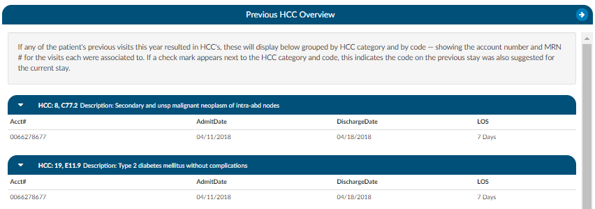

+++
title = 'Previous HCC Overview'
weight = 140
+++
 
The previous HCC overview will display the HCC history to show for both the current and prior year.
HCCs will be collected once the HCCs has been enabled in the mapping table. It is recommended to turn
HCCs on for all patient types to capture a more complete picture of HCCs. As a reminder, this will not
capture data prior to turning this feature on in the mapping table. (In mappings, under the Categories
mapping, there is a check box.) When HCCs are enabled, these will display below grouped by HCC
category and by code — showing the account number and MRN # for the visits each were associated to.

If a check mark appears next to the HCC category and code, this indicates the code on the previous stay
was also suggested for the current stay. If the patient chart you are currently coding has codes that
result in HCCs once they are added to the assigned code tree the code will display with an ‘H’ next to the
code. By hovering over the ‘H’ icon, the HCC category will display.

