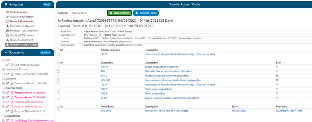

+++
title = 'Transfer Codes From Previous Encounter Viewer'
linkTitle = 'Transfer Codes Viewer'
weight = 150
+++

Transfer codes can be used to help combine account codes into one encounter. Most sites leverage the
ADT to combine the actual account, however, you may need to copy codes from one encounter to
another.

If a patient has two different accounts and the coder has already done work on each of the accounts,
the Transfer Codes feature can be an easy way to post codes when you’re within one account and want
to search in another account, and have the ability to open that other account and see the codes.
To transfer codes, type in the account number, then click load account. Once you have loaded the
account, use the check boxes to the left of the codes to choose which codes you will transfer. Once you
have finished that, select “Transfer Codes” and the codes you selected will be added to the “assigned
code” tree that is on the current account.

