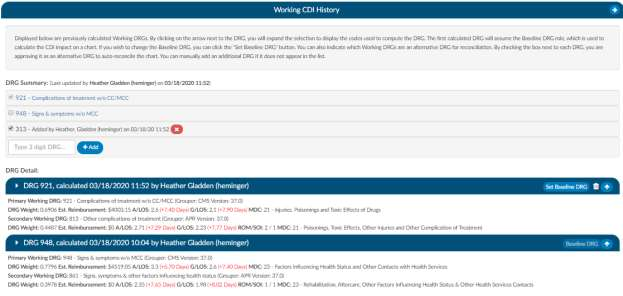
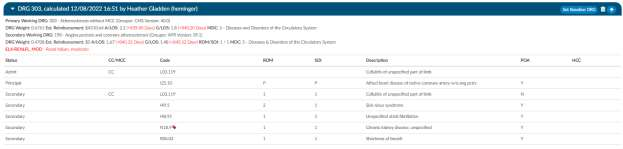

+++
title = 'Working CDI History'
weight = 70
+++

The working CDI History can be used to look at historical working DRG calculations. The coders cannot
edit this information, but they can review the data.

The first calculated DRG will assume the Baseline DRG role, which is used to calculate the CDI impact on
a chart. If you wish to change the Baseline DRG, you can click the "Set Baseline DRG" button.

## Adding an Alternative Working DRG

You can also indicate which Working DRGs are an alternative DRG for reconciliation. By checking the box
next to each DRG, you are approving it as an alternative DRG to auto-reconcile the chart. You can
manually add an additional DRG if it does not appear in the list.

By clicking on the arrow prior to the DRG information it will expand the selection so you can see the
codes that went into the DRG and the sequence. If you see any codes with a plus sign it means that you
have not added this code to the account. The plus sign does not indicate that you need to add this code
it just allows you to quickly add the code if you have determined you want to use this code using your
coding judgment and supporting documentation. If applicable, the code’s HCC designation will show the
HCC number and its version.

