+++
title = 'Managing Codes'
weight = 30
+++

Upon opening the account for initial coding review, all the engine
suggested codes will be listed in the Unassigned pane on the right-hand
side under the Assigned Codes pane.

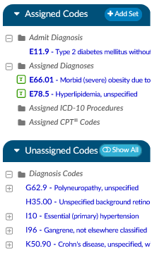

Codes are placed into the following categories:

1. Diagnosis Codes
2. Procedure Codes
3. CPT® Codes

From here, you can right-click on a code, then either Assign or Edit/Assign the selected code.

Selecting Edit/Assign will open a window to review the code, code description, set the POA indicator, 
and designate the code status as Admit, Principal or Secondary.

Clicking OK after making these selections will then move the selected code to the Assigned Codes pane.

Left-clicking on an Unassigned Code will open the relevant document in the center document viewer and
highlight instances of the suggested code in yellow.

Continue reviewing all Unassigned Codes until all Assigned Codes have been validated with POA
indicator and status

## Adding a Code

There are multiple ways you can add a code to a chart if it has not already been suggested by the engine
for validation:

- Suggested Code
- Add Code
- Add Code from Codebook

## Adding a Code to a Text Document

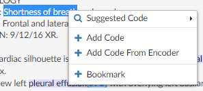

After reviewing all suggested codes from either the Documents Pane or Unassigned Code Pane, you can
add a code to a text document by highlighting the relevant word(s) or phrase and then right-clicking to
open the Add Code menu. Left-click and drag the mouse to highlight the selected text for code addition,
then right-click to open the Add Code Menu.

## Suggested Code

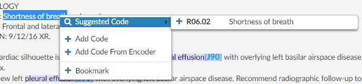

Left-click and drag the mouse to highlight the selected text for code addition, then right-click to open
the Add Code Menu. Click on “Suggested Code” to have Fusion CAC present any relevant code based on
the highlighted word or phrase. If the correct code appears in this list, clicking on it will add the code to
the document.

## Supporting Evidence

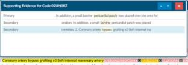

This is defined as the components within the chart that were used to make up any suggested codes. The
customer might find it overwhelming on a complex chart but, if they understand what it’s there for it
will be more helpful that overwhelming.

In a nutshell, the supporting details help you understand why the engine suggested a code. If you click
on the down arrow next to the code it will show you the words/phrases it is linked to, to create the
code. This linkage will quickly tell you if the code is correct or if it tried to put two thoughts
together that didn’t belong together. If you click on the down arrow next to the code it will show
you the words/phrases is linked to, to create the code.

## Add Code (via Direct Entry)

Use Add Code when you know the code to be assigned and do not need the encoder.

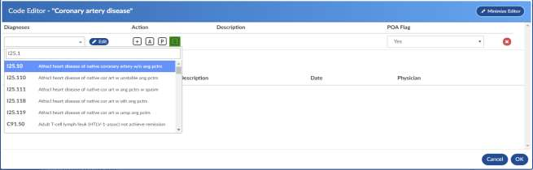

Click on the Add Code + sign to open the Code Editor window. Enter at least the first 2 characters of
the code to bring up the drop-down listing of available codes for the main term, then scroll down the
listing for codes to confirm the sub-term and select the appropriate code for complete coding.

From the Code Editor window, you can also confirm the code description, set the POA Indicator, and
designate the code as Admit, Principal or Secondary.

Alternatively, you may also enter the text description of the code and select the code that way.

> [!note] Code Editor Window
> You can add either a Diagnosis or Procedure/CPT® code from the Code Editor window.

## Add Code from Encoder

You can add a code to a text document by highlighting the relevant word(s) or phrase and then right-
clicking to open the Add Code menu.

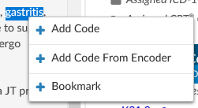

Left-click and drag the mouse to highlight the selected text for code addition, then right-click 
to open the Add Code Menu.

Click on the Add Code from Encoder + sign to launch the Encoder. Continue to use the encoder and 
accept the final code which will be returned to your chart

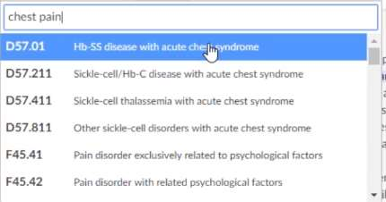

## Adding a Code to a Scanned Document

Although the engine does not suggest codes from scanned documents, you can add codes to scanned
documents for codes not assigned elsewhere within the chart. *Adding codes to scanned documents is
recommended only when a code has not already been added to a text document within the chart or
documentation to be coded is not found elsewhere.*

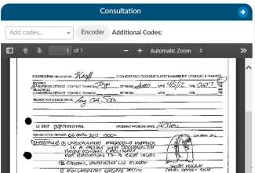

To add a code to a scanned document, start typing the code in the **Add codes…** drop-down box or click on the
**Encoder** button in the bar above the scanned document.

Codes added to the scanned document will appear in the **Additional Codes** box

## Adding a Code from Codebook

You can add a code to a text document by highlighting the relevant word(s) or phrase and then right-clicking
to open the Add Code menu.

Left-click and drag the mouse to highlight the selected text for code addition, then right-click to open the 
Add Code Menu.

Click on **Add Code from Encoder** + to launch the Encoder. Continue to use the encoder and accept the final 
code which will be returned to your chart.

> [!caution] Adding From Encoder Varies
> The exact functionality of adding a code from encoder can vary depending on your facility settings
> and the encoder used.
>
> Please consult your manager if you need further instructions.

## Editing a Code

To edit an existing or suggested code, left click on the code to bring up the encoder and Code Editor
windows. If you are set up with dual monitors, you can move the encoder window to the second
monitor and keep it open as you work through validation of each the engine suggested codes. From the
Code Editor window, you can update the code from the code drop-down menu, via Direct Entry, or
Encoder. You can also validate/update the POA indicator and validate/update the code status (Admit,
Principal, or Secondary).

If you wish to change the code, place your curser in the drop-down box where the code you wish to
change is displayed. You can remove, for example, the .9 and replace it with the code extension that you
need vs. entering the entire code.

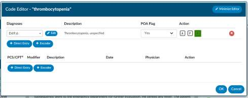

| Icon                   | Description                                                                   |
| ---------------------- | ----------------------------------------------------------------------------- |
|  | This button launches the encoder for the existing code                        |
|  | Adds a new line for direct entry of additional codes                          |
|  | Launches the encoder for selection of a code                                  |
|  | Saves any changes for the current session of Code Editor                      |
|  | Closes window without saving changes from the current session of Code Editor  |
|  | Deletes the selected code from the chart                                      |

You also have the option to minimize and restore the Code Editor window to continue viewing
documents or other areas of the chart as you are working to complete additional details for the
procedure code.

| Icon                   | Description                                                                   |
| ---------------------- | ----------------------------------------------------------------------------- |
|  | Minimizes Code Editor window so that the main screen can be viewed            |
|  | Restores the Code Editor window to full size for review and completion        |

## Adding Procedure Code Data

Procedure codes typically require additional information for Physician and Date of Service for the
procedure indicated along with procedure details. These fields are configured according to facility
requirements and may look different in your version of Fusion CAC.

To enter in a date and physician to the procedure codes, right-click on the procedure code and then
select Edit Procedure Info from the menu. After selecting a procedure code, the Code Editor window for
the selected procedure code will open.

### Add Procedure Date

To enter the procedure date, start entering the date in MM/DD/YYYY format or click on the calendar to
select the procedure date.

### Add Physician

To add the physician, click into the **Add physician…** drop-down menu. Start entering the name of the
physician who completed the procedure, then select the physician’s name to complete this field. You
will need to enter in at least 3 characters of the physician’s last name to view the drop-down listing.
Continue entering characters of the physician’s last name to narrow the listing of physicians to choose
from.

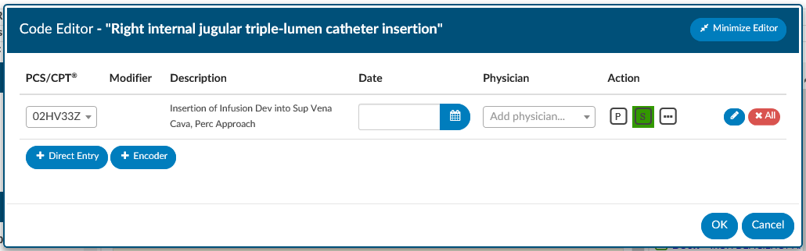

### Add Additional Procedure Details

Click on the ellipsis button under the Action heading indicated with the (…). This button allows you to
add in additional procedure details.

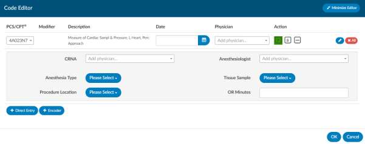

| Icon                   | Description                                                                   |
| ---------------------- | ----------------------------------------------------------------------------- |
|  | Opens drop-down menu of options available for procedure additional details, e.g., Anesthesia Type, Procedure Location, Tissue Sample |
|  | Adds a new line for direct entry of additional codes                          |
|  | Launches the encoder for selection of a code                                  |
|  | Saves any changes for the current session of Code Editor                      |
|  | Closes window without saving changes from the current session of Code Editor  |
|  | Deletes the selected code from the chart                                      |

You also have the option to minimize and restore the Code Editor window to continue viewing
documents or other areas of the chart as you are working to complete additional details for the
procedure code.

| Icon                   | Description                                                                   |
| ---------------------- | ----------------------------------------------------------------------------- |
|  | Minimizes Code Editor window so that the main screen can be viewed            |
|  | Restores the Code Editor window to full size for review and completion        |

## Code Sequencing

There are multiple ways to re-sequence codes that have been validated and added to a chart:

- Sequence using existing Encoder
- Sequence using CAC Controls

Best practice recommendation is to re-sequence codes using the existing encoder. Do this by clicking
the Compute button and launching the encoder.

### Code Sequencing and Grouping through Encoder

After clicking the **Compute** button, all patient demographic information and validated codes are
uploaded to the existing encoder. Use the encoder to re-sequence codes, complete grouping, and
complete the encoder session to return the computed grouping and re-sequenced codes to Fusion CAC.
From here you will be directed to the **Code Summary** page for review of Validation Results (and
resolution or errors), Assigned Diagnosis Codes, and Assigned Procedure Codes.

### Code Sequencing with CAC

If grouping and billing edits are not required, codes can be re-sequenced by dragging and dropping
codes within the Assigned Codes Pane.

Left click and hold the code to be re-sequenced, then move it to the new sequence location and release.

> [!important] TruCode Resequencing
> TruCode users have the option to perform an encoder calculation without automatically
> resequencing the assigned codes on an as-needed basis.

In the dropdown menu on the right-side of the "Compute" button, the "Compute w/o Resequence" menu will
perform the encoder computation but leave all diagnosis codes in their original position. This feature 
will enable sites to re-sequence codes above a certain position.

### Principal Dx Analyzer

> [!note] TruCode&#8482; Users Only
This fix only applies to TruCode&#8482; users.

## Mass Editing Codes

Mass editing of codes can be accessed by right clicking and selecting “Edit All Codes” on any of the 
code headers such as assigned diagnosis, assisted procedures, admit diagnosis.

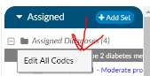

Each code has a checkbox, and each section has an ‘ALL’ checkbox. If the
user clicks the All checkbox, a checkmark will appear in all codes under it. Any change made to one of
those checked codes will be reflected in all other checked codes. Note that you can update PCS and CPT
codes together. If there is a check mark, the change will be made to both the CPT and the Procedure
Code. When both CPT and Procedure are selected together, only the Physician and Date can be
changed.

The CPT code section has a Modifier column with a plus sign. Clicking the plus will open up the details
window to add/change Modifier, plus other items that are included in that window. Clicking on the
ellipsis symbol next to the Episode field will also open the details. The user can add up to 4 modifiers,
unless they are using the 3M™ Coding and Reimbursement System (CRS) then they will be able to add
upto 5 modifiers.

## Add Another Episode

Right clicking on a procedure allows you at add another instance of the same procedure without
needing to duplicate the effort of recoding the procedure.

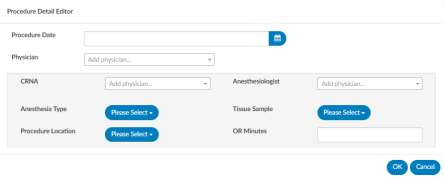

From Edit Procedure Info, you can also update additional information for the selection of procedure
codes to add procedure date, add physician, and update additional details (for example,
Anesthesiologist, Anesthesia Type, Tissue Sample, Procedure Location, OR Minutes). These fields are
configured according to facility requirements and may look different in your version of Fusion CAC.

