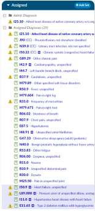
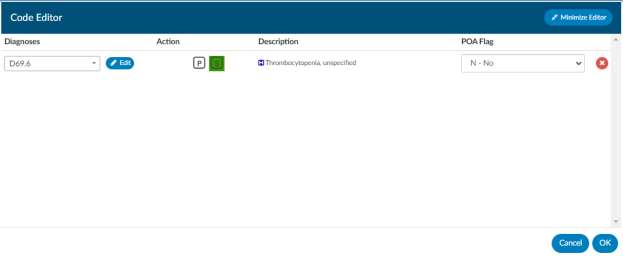
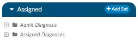
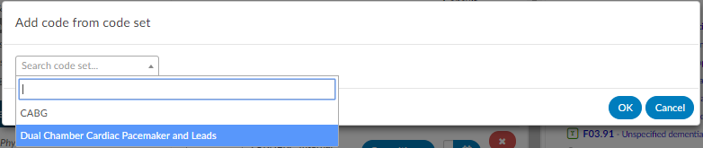
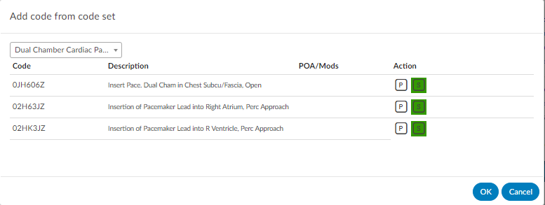
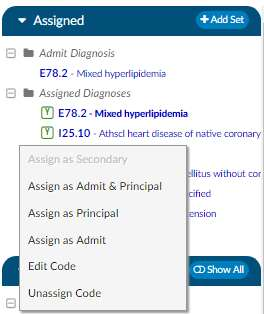
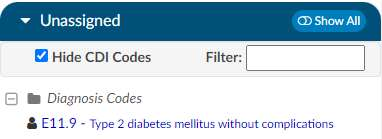
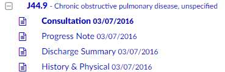
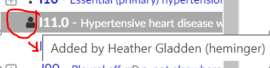
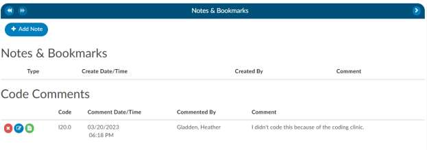

+++
title = 'Code Panels'
weight = 80
+++

## Unassigned Codes Panel

### Diagnosis Codes

In the bottom right panel on the screen, is a list of unassigned **Diagnosis Codes** that have been suggested
by the engine for validation. Left-clicking on the diagnosis code will take you to the location within the
document that prompted the code suggestion.

### Procedure Codes

Under unassigned Diagnosis Codes are listed all unassigned **Procedure Codes** that have been suggested
by the engine for validation. Left-clicking on the procedure code will take you to the location within the
document that prompted the code suggestion.

### CPT® Codes

Under unassigned Procedure Codes are listed all unassigned **CPT® Codes** that have been suggested by
the engine for validation. Left-clicking on the CPT® code will take you to the location within the
document that prompted the code suggestion.

## Assigned Codes Panel

The Assigned pane sits above the Unassigned pane on the right-hand side of the
Account Screen. The Assigned pane includes Admit Diagnosis, Principal and/or
Visit Reasons Assigned Diagnoses, Principal and Secondary ICD-10 Procedures
and Assigned CPT® Codes. Once a coder validates a code from the document or
right clicks and assigned a code from the unassigned codes menu, they will
appear in the assigned codes pane. All codes on submit within this pane will go
outbound to your abstraction or billing system. Codes can be removed from
here by right-clicking and selecting unassign.

Codes falling below the 25th position will display within a light purple color.

### Code Editor

This is an additional quicker way to open the Code Editor dialog via the right-click menu right from the
assigned code tree. When clicking on the code from the assigned code tree you will edit only the code
along with the position you have clicked on. However, if you use the hot key from the unassigned code
tree you will open a full code editor, since no action has been assigned yet to that code.

### Add Code Set Button

Click on the Add Set button to add a code set configured based on facility needs.

You have the option of adding codes from a code set for standard procedures based on facility settings.
Click on the Add Set button to open the **Add code from code set** window then click on the down arrow to
review a menu of code sets.

Click on the Code Set to view a listing of the codes for this code set.

Click OK to simultaneously add all codes from this code set to the chart.

### Admit Diagnosis

Listed first in the Assigned pane is the Admit Diagnosis. You can right-click
on any assigned diagnosis code and select Copy as Admit Diagnosis to add
the code as the Admit Diagnosis. This right click menu will change
depending on if you click on diagnosis or procedures and if you are in an
inpatient vs outpatient chart.

### Assigned Diagnoses

Under Admit Diagnosis are listed all Assigned Diagnoses as they are
validated and added via direct entry or using the encoder. There is no
designation for principal but, it will display as the first listed under assigned
diagnosis and it will appear in bold text. You will need to right click on the code you want to add as an
assigned principal code to see the bold text.

### Assigned ICD-10 Procedures

Listed beneath Assigned Diagnoses are all Assigned ICD-10 Procedures as they are validated and added
using the encoder.

### Assigned CPT® Codes

Following the listed Assigned ICD-10 Procedures are the Assigned CPT® Codes

### Unassigned Codes

The Unassigned pane sits beneath the Assigned pane on the right-hand side of the Account Screen. The
Unassigned pane includes Diagnosis Codes, Procedures Codes and CPT® Codes. From this pane, you can toggle
between showing All Codes or just the Unassigned Codes

The user can view all codes suggested by the engine within the Unassigned Codes pane. This allows the 
user to view each code with a link to the documentation and context of words and phrases which prompted
the code suggestion.

If the code has a plus sign to the left of the code, there are codes within the document for review
and validation.

### Allow Coders to hide CDI added codes

If a CDI adds a code to a document, this can now be hidden by the
Coder. When the Coder opens the account, a new box in the
Unassigned Codes Pane will be viewable. When checked, any code
added to a document by a CDI will be hidden from the list.

### Show All/Show Unassigned Button

Click on the Show All button to toggle between showing All Codes suggested by the engine on this
account or Show Unassigned to view just the suggested codes pending validation to be moved to the
Assigned Codes pane.

### Bold assigned codes in the Show All code tree

If there is a code that appears on multiple document types and one of those is assigned, it will now appear as BOLD
in the Show All codes tree. In this example, the code was assigned on the Consultation document type. Please
note, this may not be retroactive.

### Displayed Icons

In this pane there are 2 different symbols you may see. If you do not see an icon next to the code the
engine suggested these codes.

| Icon                     | Description |
| ------------------------ | ----------- |
|       | The Person icon indicate a user manually entered this code and the system **did not** suggest it, by hoovering over this icon it will display the user who manually added it.  |
|  | The exclamation mark icon indicates a user manually entered this code and the system **did** suggest it. If you click on the + next to the code then select the person icon can you see by hoovering over the person icon it will display the user whom manually added it. |

### Code Comments

A comment can now be added to a code on the document tree, or the Unassigned/Show All code tree. The
comment will show as a green flag in the trees and on the code in the document. On the trees, the comment is
readable via a hover over; in the document itself, the flag can be clicked to open the comment. The comment can
be added to or deleted by erasing the text. The comment will show in its own section in the Notes and Bookmarks
viewer, and can be edited or deleted there.

