+++
title = 'Document Tree'
weight = 70
+++

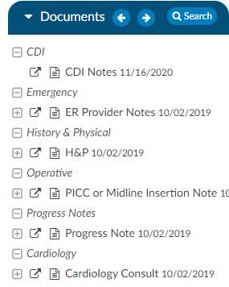

The Documents Pane frames the Documents Tree and is located on the left-hand side of the Account Screen.
The Documents Tree includes a listing of all documents in a patient chart categorized by document type
as configured by the hospital.

Icons next to document names in the Documents Tree indicate document types. Each document in the
Documents Tree uses an icon or bolding to give information about the document. Listed below are
Document Indicators.

For convenience, you may want to **pop out** the document into a separate window to continue viewing it
while accessing other areas of the chart.

On the documents panel you will see a backward and forward arrow, This will allow the user to move up
and down through the documents listed in the panel.

| Icon                   | Description |
| ---------------------- | ----------- |
|  | Open document in new tab/window |
|  | Image document |
|  | Text document |
|  | You have not view this document.  The title is NOT BOLD after you view the document (but will still be BOLD for other users until they view the document.)
|  | Document with engine code suggestions |
| **Black Background**   | Fusion CAC will now archive documents that contain codes assigned by coders. This document will appear in the Documents pane with white text against a black background. Bookmarks on those documents will also be retained. Doing a Ctrl Click on the document header in the viewer will now show the archive date and time. 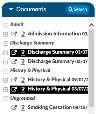 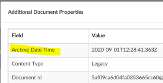|

### Text Document Visual Differences

The ability to see the differences between two documents has been added. This is for text only
document; attempting to use images or manual documents will result in a red
toast message advising the user to use a different document.

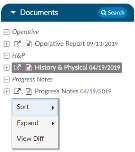

To see differences, the user must first open a document. Next, they will right
click on another document in the document tree and select View Diff from the
menu. This will bring up a new tab. The left side of the tab will show the older
document, and the right side will show the newer document. The older
document will show strike-outs wherever something was changed, and the right
side will show blue highlights for anything that was added. In the example, an
older Consultation document is being matched against a newer Consultation document.

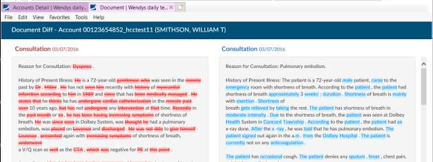

### Search Button

The Documents pane includes a Search button. Click on the Search button to open and enter the
specific terms or phrase to be found within the documents in the chart. After pressing the Enter key,
documents that include the searched term or phrase will be highlighted in
**RED**.

Click on the document highlighted in
**RED**
to view the searched term/phrase within the document. Each
occurrence of the searched term/phrase will be highlighted
in yellow.

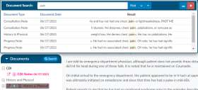

Upon clicking the search button, a floating window will now open and will fill with all results for
the search word. Each result will display the name and date of the document along with a short
portion of the sentence containing the word. The arrows allow you to move up and down through the
list. This window stays active when using auto-load and will update with each account’s search
results. The window can be minimized to a ‘Restore’ button on the Document tree. Clicking on the
Restore button will re-open the search window and will display the results.

### Read/Unread

When returning to a chart after new documents have been added, documents that have not previously
been reviewed will appear in **BOLD** text. Documents that have been previously viewed will appear in
normal text.

### Document Viewer

The document pane is in the middle in which displays a document or viewer clicked on within the
document tree or navigation pane.

On the main header there are backward and forward arrows now appear to the left in the blue bar of
the viewer panel in account detail. This will allow users to move back and forth through documents that
have been opened onto the viewer screen. Note that when a user arrows back and forth, then clicks on
another document, the user starts a new history for that option.

If there is a physician on a document, the name will show in the document viewer header, on the
popout, and in the Ctrl+ click of the header.

### Pop Out Document

Click on the **pop out** icon to open the selected document in a new window. The document opens in
a new window for continued viewing while other areas of the chart are accessed during the current
coding session.

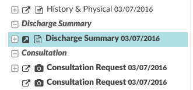

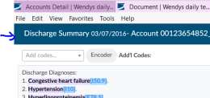

### Sort Documents

Sorting documents within the Documents pane is available by right-clicking on a document within
the pane and selecting **Sort**, then **Default**, **A-Z**, **Z-A**, **Date Ascending**, or 
**Date Descending**.

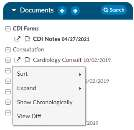

You can reorganize the Document Tree by right clicking on the documents. You
can click on sort; this will allow you to sort the documents within the folders
alphabetically or date. You can also sort chronologically which removes all
folders and will organize all documents in chronological order.

### Expand Documents

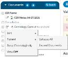

Right-click on a document within the Documents pane and select **Expand** to
visualize all documents within a documents folder or all suggested codes
within each document. The default view is **Expand Documents**, with options
to **Collapse All**. This is helpful if you just want to see the folder structure to
see what options you have to then open a folder to view those specific
documents. 

### Zoom Documents

To adjust the level of zoom on a document, right-click within the document
and click “Zoom”. This feature is available both on the main page and in
popped out documents. When a user selects a zoom level, that level will be
retained for all documents. The last zoom level used before sign out is the
zoom level the user will get when they sign back in.

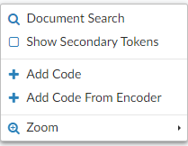

The right click zoom will not be available for photo documents or pdf documents,
since they have their own. Zoom will also not be available on worksheets. This
feature is not compatible for Firefox users because Firefox does not support the style.

#### Documented Codes

If the document has a plus sign to the left of the document name, there
are codes within the document for review and validation.

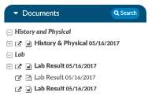

Click on the **\[+\]** next to a document to expand and show all codes found
on the selected document.

*Before Clicking*
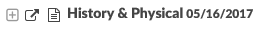

*After Clicking*
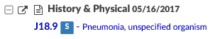

Clicking on a document will load the document in the document viewer. Clicking on a suggested code
listed underneath the document will take you to highlighted text within the document that triggered the
engine to make that code suggestion.

