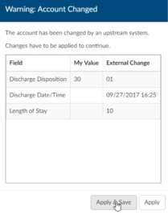

+++
title = 'Exiting an Account'
weight = 200
+++

Once you have finished working in an account, there are three ways of proceeding

- **Cancel** - This cancels all work in the chart and either returns to the Workgroup or autoloads the next account (if autoload is selected). Upon canceling if you have unsaved changes you will be prompted. 
- **Save** - This saves your work and either returns to the Workgroup or autoloads the next account (if autoload is selected.)
- **Submit** - This saves and sends your work to the next phase of workflow, based on your organizations requirements and either returns to the Workgroup or autoloads the next account (if autoload is selected).

## Account Changed Warning Box

Upon selecting one of these options, Fusion CAC may present a pop-up
warning that reads, “Warning: Account Changed. The account has been
changed by an upstream system” This warning appears when Fusion CAC
has received a change to the account – usually a new document – between
the time the account was opened and when the user chooses to Cancel,
Save, or Submit. This warning allows the user to double check their work
based on new information provided to Fusion CAC.

Selecting **“Save and Apply”** will apply the incoming changes to the account
and continue with the process the user had selected. Choosing **“Apply”** will
apply the incoming changes to the account and return the user to the
account to continue working.

## Ending a Coding Session (Log Off)

To log out of the application, click on the down-arrow next to your user name in the
top right corner of the software, then select ‘Log Out.’
