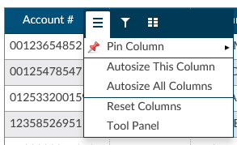
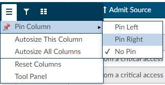
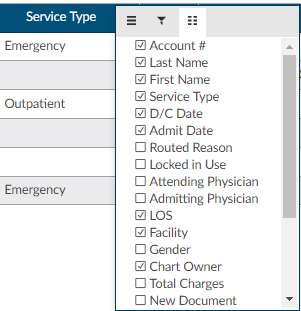
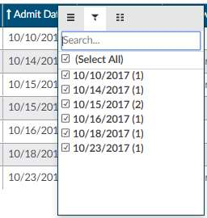
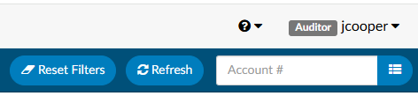
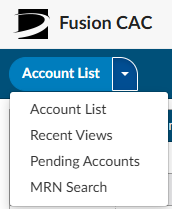
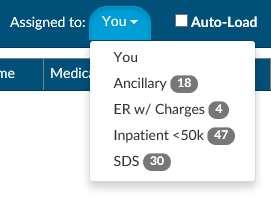
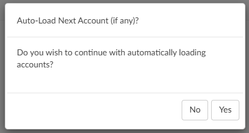
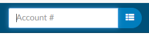
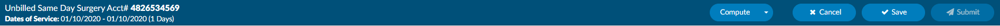

+++
title = 'Loading Accounts'
weight = 10
+++

## {} Assigned Accounts Grid

### {} Column Settings

Each column within the Assigned Accounts Grid has menu options to pin, auto
size, and reset columns as well as a Tool Panel to select which columns you
want displayed in your view of the assigned accounts grid. 

Click on the {} Menu icon to view the drop-down listing.

### {} Pin Column

The Pin Column feature will allow you to freeze certain columns to the left
{} or right {} of your
accounts  grid pane. Doing so will keep these columns visible when you move to
other areas of the assigned  accounts grid.

To pin multiple columns, click on each column that you want to pin and select
the menu option based on where you would like to view the selected pinned
column. Columns can be rearranged after they have been pinned based on your
view preferences. To unpin a column, select the
{}Pin Column{} option from the menu and choose
{}No Pin{}.

### {} Auto size & Reset Columns

Within the assigned accounts listing, the default column width is based on the
account with the data field having the most characters. You can size individual
columns or all columns to automatically fit the width of contents of that
particular column. To Auto size just one column, select the menu button for the
column, then select {}Autosize This Column{}. To
automatically fit the width of contents for ALL columns, select the menu button
for any column, then select {}Autosize All Columns{}.

To return column widths to their default settings, select the menu button for
any column, then select {}Reset Columns{}.

### {} Tool Panel

The Tool Panel feature gives you the flexibility to customize what columns you want to display within your Assigned Accounts Grid. 
When you click on {}Tool Panel{} from the {} Menu icon, a list of headers will come up to the right of the screen.
This allows you to select/deselect column headings based on your preferences. Click on Tool Panel again to
hide the Tool Panel selection menu.

Tool panel settings will remain for all future coding sessions and subsequent logins.

## {} Grid Columns Fields

### {} Hide or Show Columns

Once headings have been selected/deselected to view in the Assigned Accounts Grid via the Tool Panel, you can also choose which columns you want to view during a particular working session. 
This can be done by clicking on the Columns icon in any column on your assigned accounts listing.

To bring all columns back into view, click on
{}Reset Columns{} from the Column Settings drop-down
listing.

### {} Filter Menu

Using the Filter Menu allows you to narrow down and isolate the accounts to be
worked based on the data elements within the selected column. For example, the
Filter Menu for the D/C Date column allows you to filter the account listing by
selected dates using the checkboxes or entering specific dates in the Search
box.

A {} Filter icon in front of the column heading means
that a filter has been applied.

To remove any selected filters, click on the Filter button and then check the
box for {}**Select All**  to remove all filters.

If you filter columns, you can use the
{}Reset Filter{} button to remove filters vs.
removing  the filter from the column itself. This button is found towards the top right of the application screen.

## {} Sorting Accounts within a Single Column

Sorting work queue columns is an integral part of workflow. By sorting
information in the assigned accounts grid, you can see data the way you want
and find accounts quickly. You can sort data by text
({} or {}),
numbers ({} or {}),
and dates (oldest to newest and newest to oldest).

To sort a single column, click once on the column header of the column you want
to sort. The column header will change to an up arrow. This will sort the
column first in ascending order {}. Click the
column header again to change to a descending {}
sort with a down arrow.

| UI                                | Description     |
| --------------------------------- | --------------- |
|   | Ascending Sort  |
|  | Descending Sort |

Clicking on the column heading a third time will return the column to the
default sort and the arrow will disappear

## {} Sorting Accounts for Multiple Columns

In the assigned accounts grid, you can select multiple columns for ascending
and descending sorts. For example, you can sort accounts by discharge date and
then by LOS to focus efforts on accounts with longer lengths of stay for a
specific discharge date. Sorting helps you to quickly visualize, organize, and
understand the Workgroup for effective decision making and finding the next
chart to be prioritized for coding.

To sort multiple columns, click the column heading of the first column in your
selection, then hold down the SHIFT button while you the click the column
headings of other columns you want to add to the selection for sorting. Click
the column header for your sort selection (ascending, descending, default)
until the individual column is sorted in the preferred sort order. After all
selections have been made, release the keys for the sort results.

## {} Accounts Button

In the top left corner of the application, click on the Accounts button to toggle between different account list views. The "Account List" view is the list of accounts of the workqueue you are in. The "Recent Views" will show a list of accounts you have recently touched. The "Pending Accounts" list is a list of the accounts you have added a pending reason to. The "MRN Search" is a way for you to search for accounts by a patient's medical record number. 

### {} Assigned to

Workgroups will be assigned to a coder or group of coders for accounts to be
coded. Workgroups are listings of similar accounts grouped by specified
criteria. Accounts can reside in only one Workgroup at any given time. Each
coder will have different groups assigned. Check with your manager to
understand your own Workgroup assignment.

Click on the {} Assigned to: {} button to display a
drop-down menu of assigned Workgroups. Next to each Workgroup name is a bubble
{} 5 {} with the number of accounts in the Workgroup.

> [!note] Empty Workgroups Not Shown
By default, a Workgroup must have at least one pending account to display in the
system. Assigned Workgroups will not be visible here if there are no accounts
available for coding for that specific Workgroup.

### {} Auto-Load

Checking the Auto-Load box before you start your session or when you are in an
assigned Workgroup will automatically load the next chart in the selected
Workgroup upon Save, Submit, or Cancel. You can discontinue Auto-Load at any
time by unchecking the {} Auto-Load box. This will
return you to the "Assigned to Workgroup" for manual selection of the next chart
in the selected Workgroup.

> [!note] Auto-load Uses Filter/Sort
> Auto-load will load the next account using the filters and sorts that you have
> applied to your Workgroup.

Fusion CAC will automatically open the next account in your assigned Workgroup
after you {}Cancel{},
{}Save{} or {}Submit{} the
current account.

To discontinue auto-loading of the next chart in your assigned Workgroup, you
can click {}No{} when presented with the
**Auto-Load Next Account?** dialog.

### {} Refresh Button

Fusion CAC is regularly reacting to account activity, submitting information to
the encoder, updating Workgroups, and receiving updated data to the EHR. When
you are working from the assigned accounts listing, from time to time you might
need to {} refresh the data and update the
Workgroups with recent information.

To ensure that you have the most up-to-date information for accounts in your
assigned Workgroups, or when your current session of Fusion CAC has been idle
for an extended period, hit the {}Refresh{} button to
update your session with recent activity.

> [!note] Avoid Browser Refresh
The **Refresh** button within Fusion CAC is different from the refresh button
in your browser. It is recommended that you NOT use the refresh button in your
browser, as this will reload your session, resulting in a loss of your work.

### {} Loading a Specific Account

If your facility has opted to use a workflow outside of Fusion CAC or the account
you wish to work on is not in your assigned Workgroup, you can open an account by
entering the account number in the **Account #** search box on the right side
of the Account List Control Bar. Press {}ENTER{}
after typing in the account number to open the account to the Account Screen.

### {} Accounts Action Bar

The Accounts Action Bar will be visible after you open an account from the
Workgroup or manually enter it from the Account # search box. 

On the left of the Accounts Action Bar, it includes information about the account including:

| Field                | Description                             |
| -------------------- | --------------------------------------- |
| **Chart Status**     | Unbilled, Submitted                     |
| **Patient Type**     | Inpatient, Outpatient, etc.             |
| **Account #**        |                                         |
| **Dates of Service** | From and Thru                           |
| **Length of Stay**   | based on current date or discharge date |

On the right of the Accounts Action Bar, it includes buttons to make the following actions:
{}Compute{} (accessing the encoder),
{}Cancel{}, {}Save{}, or
{}Submit{} to complete work and close a chart.

| Action      | Description                                                                                                                                                  |
| ----------- | ------------------------------------------------------------------------------------------------------------------------------------------------------------ |
| **Compute** | Launches the encoder. This button should be used to Compute the DRG or view encoder Edits.                                                                   |
| **Cancel**  | This button will CANCEL any changes made to the account and return to the Assigned Accounts Listing for selection of a new account.                          |
| **Save**    | This button will SAVE any changes made to the account during the current session. |
| **Submit**  | The SUBMIT button will save and send any changes made to the account downstream based on facility requirements (usually billing or abstraction).             |

