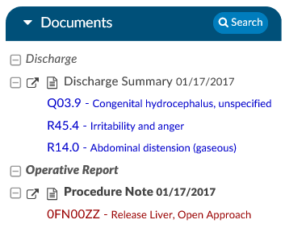

+++
title = 'Reviewing Documents'
weight = 20
+++

Documents presented in Fusion CAC should be reviewed to determine the specific reason for the encounter and the
conditions treated. Codes can be validated through document review from the Documents Pane or code review from the
Unassigned Codes pane. Codes can also be added manually via direct code entry or through use of an interfaced encoder.

## Validating a Code

Codes can be validated/added to the chart as Assigned Codes as
you are reviewing documents and the suggested codes within
the document.

Right-click on the code to Edit/Assign the code.

## Code Highlighting

- If the background of the text suggestion has a purple background, the text matches a code suggestion.
- If the background of the text suggestion has a red background, the text matches only a secondary token.
- If the background of the code has a green background this means the code was already validated on a different document.

