+++
title = 'Colors and Symbols'
weight = 100
+++

The Fusion CAC 2 application contains a variety of colors and symbols. The following table provides a
detailed explanation of the significance associated with each color and symbol.

### E&M Coding Viewer (Navigation Pane)

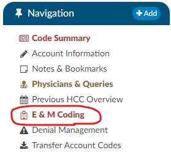

The E&M Coding viewer lettering will turn red if a user added charges and they were
not sent outbound. In order to send the charges outbound there is a check box at the
bottom of the viewer "Send Charges Outbound" then you must click save or submit. Once
charges are sent outbound the viewer text will return to the default color (black).

Please note that this feature is optional and requires configuration to enable the
sending of charges outbound.

### Physicians & Queries

The "Physicians & Queries" viewer will be highlighted with an amber background in the
Navigation Tree if the account has at least one physician query CACTWO-6136

>[!info]
Note that the amber background does not appear if the "Physician & Queries"
viewer is selected because the selection background overrides the amber background.

### Code Summary (Navigation Pane)

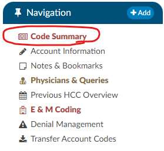

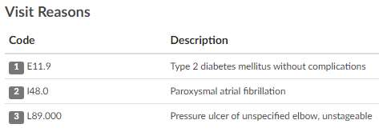

**Red**: The code summary will turn red if there is a validation rule error or warning present.
Once the validation rules are resolved the viewer text will return to the default color (black).

**Blue/Red Circles** that contain Numbers: These circles with numbers next to each code are
the Risk of Mortality (ROM) and Severity of Illness (SOI) which can be values 1-4, this
information comes from the APR-DRG which is a priority grouper licensed from 3M GPCS.

**P Icon**: This indicates the diagnosis is a principal.

**1-3 Numbers in Visit Reason Section**: This indicates the position number of visit reason.

### Validation Results (Code Summary)

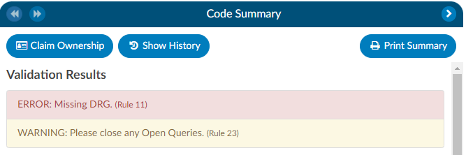

**Red**: This color is associated with validation hard stop used to notify a user that there may
be things that they need to resolve. It does prevent the user from submitting the chart.

**Yellow**: This color is associated with validation soft stop used to notify a user that there may
be things that they need to resolve. It does not prevent the user from submitting the chart.

### Document Tree

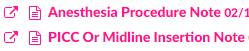

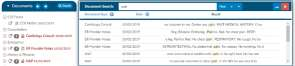

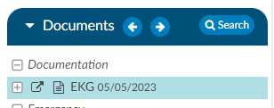

**White Paper Icon**: This icon means that the document is a text based document and may
be eligible to receive code suggestions.

**Camera Icon**: This icon means that the document is a scanned document and is not eligible to
receive code suggestions.

**Pink**: Documents that arrive late are highlighted in pink, alerting the end user that these
documents were not accessible during the coding process. These documents were added to the patient chart after the
submission.

**Black Background**: This color indicates the document has been archived which means that the document was
removed or replaced on the account and that the end user had already added codes or bookmarks on the document.

**Red Text**: The red text on the document name is displayed when you use the search and
what you search for it finds the word/phase in a document it will highlight the documents in
red to call attention to them.

**Grey Circle with Number**: The grey circle with a number on the document name is displayed when you use the
search and what you search for it finds the word/phase in a document it will highlight the
documents in grey circle with the number indicates the number of instances that word/phrase is within the
document.

**Square with arrow symbol**: This symbol is used if you want to pop out the documents into a separate tab.

**Aqua Background**: This color indicates this document has been popped out into a different tab.

### Document Pane

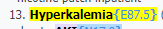

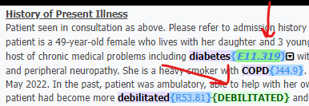

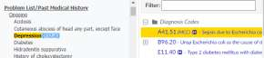

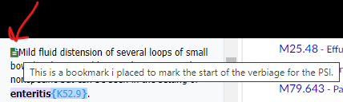

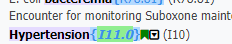

Words/Phrases and Codes can be highlighted in few different colors:

**Bright Yellow**: Words/Phrases and Codes can be highlighted bright yellow when you either
click on the code from the unassigned or Show all panel linking you to the code location
within the document. It can also result in yellow if you user uses the search feature to
search on a word or phrase you will notice the words will highlight yellow in the document.

**Green Highlight**: This color is used when a code is validated by an end users on a different
document other than the one you are looking at, this allows the end user on subsequent
document to quickly see what was already validated. Green is also used by CDI Alerts which
highlights words and phrases used to pull details out to link to text for clinical evidence for
CDI Alerts.

**Caution Yellow**: This color is associated with caution codes which indicates when the
system suggests codes that are flagged as cautionary. Caution codes are applied to documents that the
management team has identified as requiring careful consideration. These
cautionary documents enable the system to suggest codes that may not be present on
provider-facing or coder- codable documents. It's important to note that these
codes cannot be validated from these documents alone.

For instance, if a nurse mentions that a patient was treated for respiratory failure,
but there is no mention of it by the provider, the caution code serves as a reminder to ensure
that no relevant information is overlooked. It acts as a safety net to capture potential
discrepancies or omissions in the documentation process.

**Green Paper Icon**: This means that a bookmark has been added by an end user. If you hoover over this
you can see the note or if you go to notes & bookmarks within the navigation tree you can see all that
were placed.

**Green Flag**: The green flag next to the code within the document and is shown on the
show all or unassigned code tree this indicates there is a comment on a code. The code
comment can also be found on the notes & bookmarks under the navigation tree within the
code comment section.

### Audit Worksheet

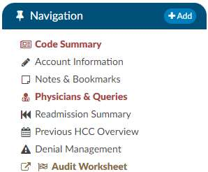

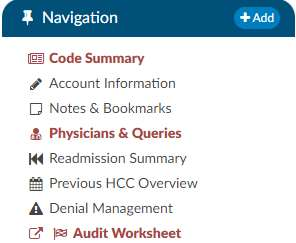

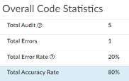

**Red**: The red indicates that there is an open audit.

**Brown**: The brown indicates that there is a closed audit.

**Asterisk Symbol**:

**P Icon**: This indicates the diagnosis is a principal.

**1-3 Numbers in Visit Reason Section**: This indicates the position number of visit reason.

**Comment Icon**: The comment icon allows auditors to enter in notes next to any of the codes
or items getting audited on the coder or auditor tree.

**Blue background**: Accuracy rate lines have a blue background, so they stand out.

### Code Tree

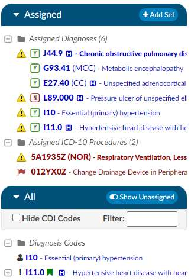

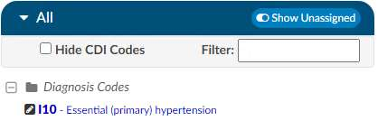

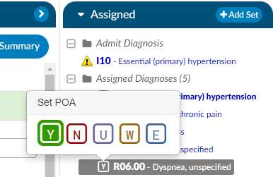

**H Icon**: This icon indicates that the code is an HCC.

**MCC**: This indicates that the code is an MCC.

**CC**: This indicates that the code is an CC.

**HAC**: This is returned upon computing for the MS-DRG indicates that the code is an HAC.

**NOR**: This indicates the procedure code is a non-OR procedure.

**Tag**: This is returned upon computing for the MS-DRG indicates that the code is the
culprit to one of the following quality measures **PSI**, **PDI**, **PC-06** or **Elixhauser**.

**Purple Background on Assigned Codes**: This means that there are more than 25
codes and any code in purple is below the the 25th position. This is important since CMS
only accepts 25 diagnosis codes in the event you need to consider resequencing codes
that need to be above the 25th position.

**Exclamation Icon**: This will appear on the "show all" tree when a user manually entered
this code and the system suggested it.

**Person Icon**: A user manually entered this code. It was not suggested by the application.
Hovering over the icon will display the user who added it.

**Caution Symbol**: The caution symbol next to the left of the code is a edit that comes from
the TruCode encoder or add on edits. If you hoover over the caution symbol you can see the
edit, if you need a larger view of the edit you can open the TruCode research page for further details.

**Green Flag**: In the "Show All" or "Unassigned Code Tree," the presence of a green flag next to
a code signifies that there is a comment associated with that particular code. This same flag
can also be found alongside the code within a document and in the notes & bookmarks section
under the navigation tree within the code comment section.

**Pencil Icon**: The pencil icon is exclusively available on non- TruCode sites, allowing end
users to manually input a code into the encoder using the compute button. This signifies
that there is no direct association between the code and any specific location on a document.

**Letter Blocks**: The letter blocks next to each of the diagnosis codes indicate the present on
admission (POA) status. When clicked the end user can change the status to the following:

- Y = Yes
- N = No
- U = Undefined
- W = Withdrawal
- E = Exempt

### Notes & Bookmarks (Navigation Tree)

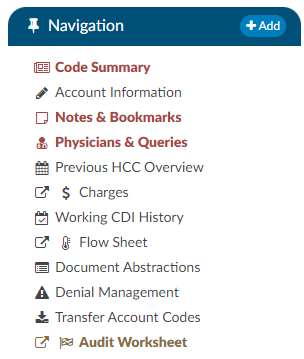

**Red**: The red indicates that there are notes, bookmarks or code comments.

### Physicians & Queries (Navigation Tree)

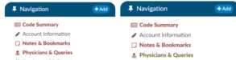

**Red**: The red indicates that there are answered queries awaiting review.
**Brown**: The brown indicates that there are open queries awaiting an answer

### Charges (Navigation Tree)

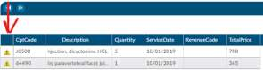

**Caution Symbol**: The caution symbol next to the left of the code is a edit that comes from
the TruCode encoder or add on edits. If you hoover over the caution symbol you can see the
edit, if you need a larger view of the edit you can open the TruCode research page for
further details.

### CDI Alerts (Navigation Tree)

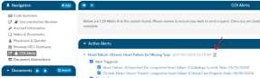

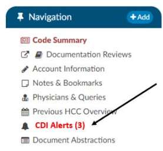

**Paper Icon**: The paper icon allows users to click to enter notes to indicate thoughts on
the CDI Alert.

For Example, a user may want to indicate they are "Watching the alert because they want to wait for a
consult to occur the next day to decide if a query is needed."

**Red with Number**: The red indicates that there are "Active CDI Alerts" and the number
represents to total active alerts.

### Dashboards

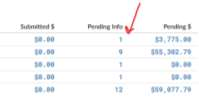

**Blue Text**: Most of the blue text on the dashboard is a clickable link. When clicked it
will open a new tab into a pop out with the details behind the number. There are some
numbers like numbers with a percentage rates or averages that won't yield pop out results.

### Tuning Dashboard (Tuning Menu)

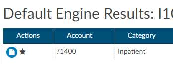

**Star Symbol**: The star symbol can be found in the tuning dashboard when clicking on a numbered result. This
represents the charts that an user accessed. The tuning team uses this to keep track of the
cases they have reviewed and those they have left to review.

### Right Corner (Anywhere)

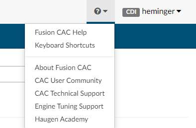

**Question Mark Icon**: This icon represents the help menu that you can find the user guide, hot
keys configured for your site and more. This icon can also have customized links for the
site and if this is needed a ticket can be logged with development

### Banner Bar

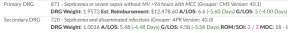
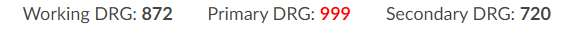
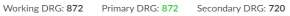

**ROM or SOI**: If these number are in red it means that the ROM or SOI on the score is high (either a 3 or a 4)

**G/LOS or ALOS**: If these are in green it means there are still days left in the patient stay and
red means they have exceeded the days.

**DRG**: if the DRG is red it means that a mismatch occurred where the CDI and coder do not match either the exact DRG
or if the DRGs are the same the DRG weight is different this can occur on APR-DRGs. If the DRG
is green it means the DRG's matched.
