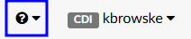

+++
title = 'General'
weight = 14
+++

## Help Menu

The Help Menu can be accessed by clicking on the **?** in the top right hand corner of the application.

Here, users will find the following resources:

|Resource|Description |
|--------|-------------------- |
|Fusion CAC Help|Fusion CAC User Guide |
|Keyboard Shortcuts|A list of shortcuts that can be used when woking an account in Fusion CAC |
|About Fusion CAC|License and version information |
|CAC User Community|A link to the Dolbey virtual user group, Dolbey Community. Users needing access should contact the SME Team (smeteam@dolbey.com)|
|CAC Technical Support|Document providing information on how to contact the Dolbey Support Team and escalation procedures for support issues. |
|Engine Tuning Support|An email address to contact the Dolbey Tuning Team |
|Haugen Academy|Access to the Haugen Academy educational platfom, if licensed by the organization |

### Keyboard Shortcuts

Keyboard shortcuts are keys or key combinations allowing users to take certain action within the application without using their mouse.
The keyboard short cuts can be changed by an administrator in the [Shortcut Configuration](https://dolbeysystems.github.io/fusion-cac-web-docs/administrative-user-guide/tools/shortcut-configuration/) tool. 
