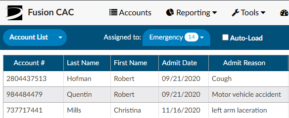

+++
title = 'Accessing Accounts'
weight = 10
+++

Clicking on the **Accounts** tab at the top of the screen allows users access to accounts in the system. Click anywhere on the row of the selected account to open it.

## Account List

 The main view for a workgroup is called the **Account List**. Account list displays accounts that need to be worked by the user. 

Accounts are commonly sorted into workgroups based on criteria set by the operational/management team. Each workgroup is a list of work that needs to be completed by users assigned to the workgroup. 

To access assigned worklists, click on the down arrow to the right of
the {}Assigned to{} button to view the list of assigned
workgroups. Each of the user's assigned worklist will be listed along with a bubble showing the number of accounts in the group ready for coding. Once all the charts from a worklist have been worked, the list will not display in the {}Assigned to{} dropdown until there are one or more charts to work. 

> [!note]
If there are no workgroups in the drop-down, ensure the drop-down menu to
the left of {}Assigned to{} says **Accounts**. If it does,
contact your {} supervisor.

If you want more information on how your workgroups are set up or why you are
assigned to a particular workgroup, you should contact your {} supervisor.

### {} Sorting and  {} Filtering

Once you have selected a workgroup, a list of accounts will appear in the grid. The displayed grid can be customized by using the column menu settings to pin, auto size, sort, filter, and select columns to display. Columns can also be re-ordered by clicking and dragging the column headings. These setting are custom and "sticky", meaning they can be set per user and remembered for future logins.

  

Using the Filter Menu allows users to narrow down and isolate the accounts to be worked based on the data elements within the selected column. For example, the Filter Menu for the D/C Date column allows you to filter the account list by selected dates using the checkboxes or entering specific dates in the Search box. A Filter icon in front of the column heading means that a filter has been applied. 

To remove any selected filters, click on the Filter button and then check the box for (Select All) to remove all filters. 
When filtering columns, use the ‘Reset Filter’ button to remove filters vs. removing the filter from the column its self. 

## Assigned Account Grid

Each column within the Assigned Accounts Grid has menu options to pin, auto size, and reset columns as well as a Tool Panel to select which columns you want displayed in your view of the assigned accounts grid. Click on the Menu icon to view the drop-down listing.

##### Pin Column

The Pin Column feature allows users to freeze certain columns to the right or left of the accounts grid pane. Doing so will keep these columns visible when moving to other areas of the assigned accounts grid. To pin multiple columns, click on each column that to be pinned and select the appropriate menu option. Columns can be rearranged after they have been pinned based on view preferences. To unpin a column, select the Pin Column option from the menu and choose No Pin.

##### Auto size & Reset Columns

Within the assigned accounts listing, the default column width is based on the account with the data field with the most characters. Users can size individual columns, or all columns to automatically fit the width of contents of that particular column. To auto size just one column, select the menu button for the column, then select Autosize This Column. To automatically fit the width of contents for ALL columns, select the menu button for any column, then select Autosize All Columns. To return column widths to their default settings, select the menu button for any column, then select Reset Columns.

##### Tool Panel

The Tool Panel feature gives users the flexibility to customize the display of columns within their Assigned Accounts Grid. In addition to the option of auto sizing columns to maximize what is displayed, users can select/deselect column headings based on preference.
Click on Tool Panel from the Column Setting drop-down listing to view the Tool Panel selection menu.  Select/deselect columns to be displayed and then click on Tool Panel again to hide the Tool Panel selection menu.

##### Grid Column Fields

Users can choose which columns to view when displaying their assigned accounts list by clicking on the Columns icon in any column on your assigned accounts listing.

Tool Panel settings will remain for all future coding sessions and subsequent logins. To bring all columns back into view, click on Reset Columns from the Column Settings drop-down listing.

## Manually Loading an Account

If a specific account is needed, it can be accessed by typing the account number into the
**Account #** field on the right side of the Account List bar. The entered
account will open after the user hits the {}Enter{} key or
click the {} List icon.

## Alternate Views

Other special-case views are available by clicking the drop-down next to **Account List** and selecting the appropriate option:

### {} Recent Views

The Recent Views menu item allows users to quickly find accounts accessed within the last 24 hours in sequenced order.

### {} Pending Accounts

The Pending Accounts menu item displays all of the accounts that currently have a **Pending Reason** set by the user.

### {} MRN Search

The MRN Search field allows users to search accounts by MRN. The grid will display MRNs that match the search.

