+++
title = 'Adding/Validating Codes'
weight = 11

+++

{}

### Validating a Code

Codes can be validated/added to the chart as Assigned Codes while reviewing documents and the suggested codes within each document.
Right-click on the code to Edit/Assign the code.

|Code Highlight|Meaning|
|--------------|--------|
|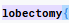|If the background of the text suggestion has a purple background, the text matches a code suggestion|
|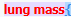|If the background of the text suggestion has a red background, the text matches only a secondary token|
|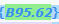|If the background of the code has a green background this means the code was already validated on a different document

### Adding a Code

There are multiple ways to add a code to a chart, if it has not already been suggested by the engine

#### Add Code via Right Click

After reviewing all suggested codes from either the Documents tree or the Unassigned code tree, users can add a code to a text document by highlighting the relevant word(s) or phrase and then right-clicking to open the Add Code menu. 

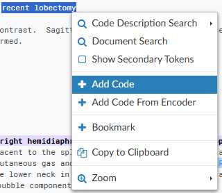

#### Add Code via Direct Entry

The {}Add Code{} box can be used when the code to be assigned is known and encoder is not needed. 

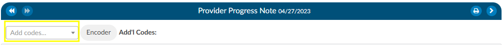

Alternatively, the user can highlight a term, right click, and select +Add Code. 

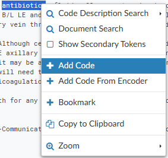

Enter at least the first 2 characters of the code to bring up the drop-down list of available codes for the main term, then scroll down the listing for codes to confirm the sub-term and select the appropriate code for complete coding. From the Code Editor window, users can also confirm the code description, set the POA Indicator, and designate the code as Admit, Principal or Secondary.
Users may also enter the text description of the code and select the code that way. 

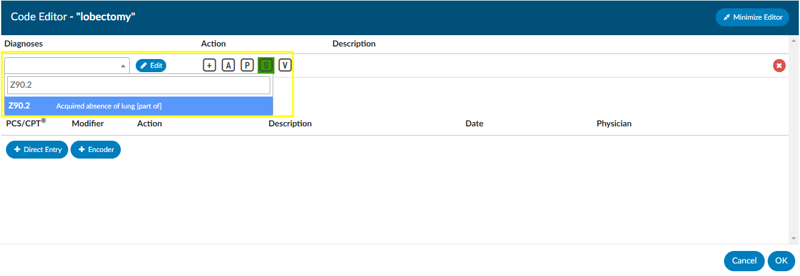

>[!Note] Either a Diagnosis or Procedure/CPT® code can be entered from the Code Editor window. 

#### Add Code From Encoder

Users can add a code to a text document by highlighting the relevant word(s) or phrase and then right-clicking to open the Add Code menu. Left-click and drag the mouse to highlight the selected text for code addition, then right-click to open the Add Code Menu. 
Click on the Add Code from Encoder  +  sign to launch the Encoder. Continue to use the encoder and accept the final code which will be returned to your chart.

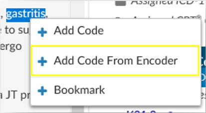

#### Add Code to Scanned Documents

The engine does not suggest codes from scanned documents. Users can add codes to scanned documents for codes not assigned elsewhere within the chart.  Adding codes to scanned documents is recommended *only* when a code has not already been added to a text document within the chart or documentation to be coded is not found elsewhere.

To add a code to a scanned document, start typing the code in the {}Add Code{} box or click on the Encoder button in the bar above the scanned document.

Codes added to the scanned document will appear in the Additonal Codes space at the top of the document viewer.

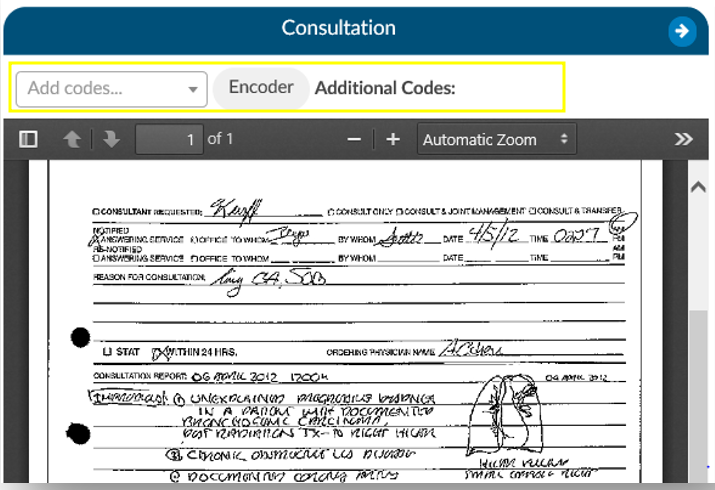

#### Add Code From Codebook

Users can add a code to a text document by highlighting the relevant word(s) or phrase and then right-clicking to open the Add Code menu. Left-click and drag the mouse to highlight the selected text for code addition, then right-click to open the Add Code Menu. 
Click on Add Code from Encoder + to launch the Encoder. Continue to use the encoder and accept the final code which will be returned to the chart.

>[!Note] The exact functionality of adding a code from encoder can vary depending on organizational settings and the encoder used.  Please consult your {} supervisor if you need further instructions.

### Code Description Search

Left-click and drag the mouse to highlight the selected text for code addition, then right-click to open the Add Code Menu. Click on Code Description Search to have Fusion CAC present any relevant code based on the highlighted word or phrase. If the correct code appears in this list, clicking on it will add the code to the document.

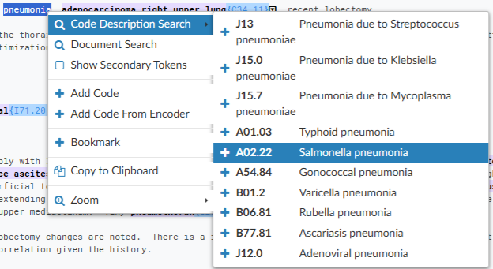

### Supporting Evidence 

Supporting evidence is defined as the components within the chart that were used to make up any suggested codes.

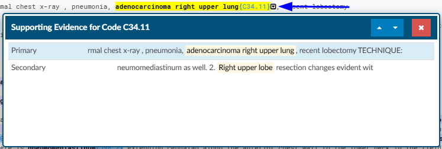

The supporting details help the user understand why the engine suggested a code. Clicking on the down arrow next to the code will show the words/phrases used to create the code. This linkage will allow users to determine if the code is correct or if it tried to put two thoughts together together incorrectly. 
  
## Best Practice: Reviewing Suggested Codes

#### Step 1: Review the Unassigned Codes Tree

The [Unassigned Codes](https://dolbeysystems.github.io/fusion-cac-web-docs/account-navigation/#unassigned-codes) tree is your starting point when opening an account. All codes suggested by the engine will initially appear in this tree.

Begin with a quick scan of the list to gain a general understanding of the patient’s documented conditions. This brief review provides helpful context before you begin reading the chart and validating or assigning codes.

> [!note] Important: At this stage, do not click on individual codes. This step should be a high-level overview only.

#### Step 2: Review Documents and Begin Coding

After scanning the Unassigned Codes tree, move to the [Documents tree](https://dolbeysystems.github.io/fusion-cac-web-docs/account-navigation/#document-tree) and begin reviewing the documentation necessary for coding.

##### Validate Codes as Needed

- As you read, If you encounter a suggested code from the engine and determine it is needed, right-click the code to add it to the [Assigned Codes tree](https://dolbeysystems.github.io/fusion-cac-web-docs/account-navigation/#assigned-codes).
- If the suggested code is not needed, ignore it and continue reviewing the documentation.

##### When You Identify a Condition That Needs a Code

If you find a term that requires coding but do not immediately see a suggested code within the document:
- Check the Unassigned Codes tree to see if the code is already listed.
- If the code appears in the Unassigned Codes tree, right-click the code from the Unassigned Codes tree and assign it as secondary. (Code position - such as principal, admit reason or visit reason can be determined later.)
  
> [!note] Important: Always right-click the code from the Unassigned Codes tree if you intend to use it. 
> Right-clicking moves the code to the Assigned Codes tree without navigating away from your current location in the document. Left-clicking will redirect you to another location in the chart and interrupt your workflow.

##### If No Code Was Suggested

If a condition needs to be coded and:
- No code was suggested in the document and
- The code does not appear in the Unassigned Codes tree
  
Then:
- Highlight the relevant word or phrase (double-click a word or click and drag to highlight a phrase).
- Right-click and select Add Code from Encoder.
- Use the Encoder to locate and assign the appropriate code.
