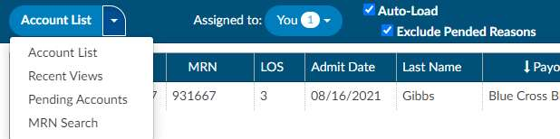
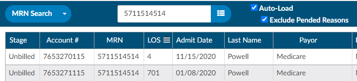

+++
title = 'Accessing Accounts'
weight = 10
+++

Clicking on the **Accounts** tab at the top of the screen allows users access to accounts in the system.

## Account List

 The main view for a workgroup is called the **Account List**. Account list displays accounts that need to be worked by the user. 

Accounts are commonly sorted into workgroups based on criteria set by the operational/management team. Each workgroup is a list of work that needs to be completed by users assigned to the workgroup. 

To access your Workgroups, click on the down arrow to the right of
the {}Assigned to{} button to view the list of assigned
workgroups.

> [!note]
If you do not see any groups in your drop-down, ensure the drop-down menu to
the left of {}Assigned to{} says **Accounts**. If it does,
contact your {} supervisor.

If you want more information on how your workgroups are set up or why you are
assigned to a particular workgroup, you should contact your {} supervisor.

### {} Sorting and  {} Filtering

Once you have selected a workgroup, a list of accounts will appear in the grid. The displayed grid can be customized by using the column menu settings to pin, auto size, sort, filter, and select columns to display. Columns can also be re-ordered by clicking and dragging the column headings. These setting are custom and "sticky", meaning they can be set per user and remembered for future logins.

Click anywhere on the row of the selected account to open it.

### Manually Loading an Account

If a specific account is needed, it can be accessed by typing the account number into the
**Account #** field on the right side of the Account List bar. The entered
account will open after the user hits the {}Enter{} key or
click the {} List icon.

## Alternate Views

Other special-case views are available by clicking the drop-down next to **Account List** and selecting the appropriate option:

### {} Recent Views

The Recent Views menu item allows users to quickly find accounts accessed within the last 24 hours in sequenced order.

### {} Pending Accounts

The Pending Accounts menu item displays all of the accounts that currently have a **Pending Reason** set.

### {} MRN Search

The MRN Search field allows users to search accounts by MRN.

