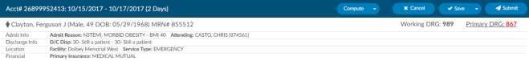

+++
title = 'Account Screen'
weight = 50
+++

## Banner Bar

Below the Accounts Action Bar is the Banner Bar.

From the Banner Bar, you can toggle between account demographic information and Primary DRG
information by clicking on the Primary DRG hyperlink. The DRG view displays information available from
the encoder for the computed DRG. You can also click on the Patient Name to expand collapse the
account demographic and DRG information. The Accounts Info bar includes information on the account
including:

- Gender Icon
- Patient Name – Last Name, First Name & Middle Initial
- Gender – Female or Male
- Age
- Date of Birth
- Medical Record Number

Below the account info bar, you will see 4 other sections including the following:

### Admit Info

- Admit Reason
- Admit Source
- Transferred From
- Attending Physician

### Discharge Info

- Discharge Disposition
- Discharged to

### Location

- Building (if applicable)
- Service Type

### Financial

- Primary Insurance
- Fin Class
- Total Charges

### DRG/APC

The DRG or APC information will appear on the Banner Bar after codes have been assigned and DRG or
APC computed and returned from the encoder.

The algorithm to determine the Elixhauser measure can be found on the code summary at the bottom
under the assigned codes.

## Navigation Pane

The Navigation Pane sits above the Documents Pane on the left-hand side of the Account Screen. 
The Navigation Pane includes hyperlinks to pages within the chart providing summary views of
coding information, demographic information, as well as clinical documentation, workflow, and 
worksheets.

Any Navigation link highlighted in **RED**
indicates action items  required to finalize the chart or  additional information available for review and reference. 
**When the Code Summary link displays RED, there are validation errors on the chart that must be 
resolved prior to submission.**

Click on the **Add Document** button to add a document configured based on your user role.

> [!note] Document Type Configuration
Document types available to be added are configured by system administrators.
