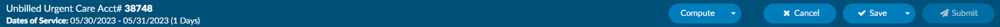
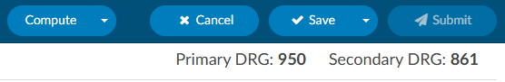

+++
title = 'Account Screen'
weight = 50
+++

## Account Action Bar

The blue bar accross the top of the screen is the Account Action Bar. This bar displays specific account information such as the account status,the account number/HAR, and the dates of service. Additonally, the Account Action Bar houses buttons allowing the user to compute, cancel, save, or submit the account as needed.

## Banner Bar

Below the Accounts Action Bar is the Banner Bar, which contains 

### Patient Information 

Information in the banner bar may include:

- Admit details
- Discharge details
- Patient Name – Last Name, First Name & Middle Initial
- Gender
- Patinet Age and date of birth
- Medical Record Number (MRN)

> [!info] Banner Bar Collapse/Expand
> Clicking the patient's name will collapse the banner bar to provide more vertical screen space.
> Clicking the patient's name again will expand the banner bar and the information displayed. 

### DRG/APC

From the Banner Bar, you can toggle between demographic information and Primary DRG
information by clicking on the Primary DRG hyperlink. 

The DRG view displays information available from the encoder for the computed DRG. The DRG or APC information will appear on the Banner Bar after codes have been assigned and DRG or APC computed and returned from the encoder.

## Navigation Pane

The Navigation Pane sits above the Documents Pane on the left-hand side of the Account Screen. 
The Navigation Pane includes hyperlinks, or [viewers](https://dolbeysystems.github.io/fusion-cac-web-docs/general-user-guide/account-screen/account-viewers/), to pages within the chart providing summary views of
coding information, demographic information, as well as clinical documentation, workflow, and 
worksheets.

Any Navigation link highlighted in **RED**
indicates action items  required to finalize the chart or  additional information available for review and reference. 

### +Add

Click on the +Add document button to add a document configured based on your user role. 

Available document types are configured with the operational/management team per organization. 

