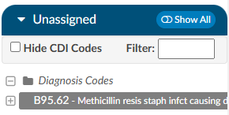
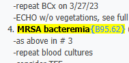

+++
title = 'Account Screen'
weight = 11
+++

## Account Action Bar

The blue bar accross the top of the screen is the Account Action Bar. This bar displays specific account information such as the account status,the account number/HAR, and the dates of service. Additonally, the Account Action Bar houses buttons allowing the user to compute, cancel, save, or submit the account as needed.

|Button |Function|
|-------|--------|
|Compute|Launches the encoder.  This button should be used to Compute the DRG or view encoder Edits.|
|Cancel |This button will CANCEL any changes made to the account and return to the Assigned Accounts Listing for selection of a new account.|
|Save   |This button will SAVE any changes made to the account during the current session and return to the Assigned Accounts Listing for selection of a new account.|
|Submit |The SUBMIT button will save and send any changes made to the account downstream based on facility requirements (usually billing or abstraction). |

## Banner Bar

Below the Accounts Action Bar is the Banner Bar, which contains 

### Patient Information 

Information in the banner bar may include:

- Admit details
- Discharge details
- Patient Name – Last Name, First Name & Middle Initial
- Gender
- Patinet Age and date of birth
- Medical Record Number (MRN)

> [!info] Banner Bar Collapse/Expand
> Clicking the patient's name will collapse the banner bar to provide more vertical screen space.
> Clicking the patient's name again will expand the banner bar and the information displayed. 

### DRG/APC

From the Banner Bar, you can toggle between demographic information and Primary DRG
information by clicking on the Primary DRG hyperlink. 

The DRG view displays information available from the encoder for the computed DRG. The DRG or APC information will appear on the Banner Bar after codes have been assigned and DRG or APC computed and returned from the encoder.

## Navigation Pane

The Navigation Pane sits above the Documents Pane on the left-hand side of the Account Screen. 
The Navigation Pane includes hyperlinks, or [viewers](https://dolbeysystems.github.io/fusion-cac-web-docs/general-user-guide/account-screen/account-viewers/), to pages within the chart providing summary views of
coding information, demographic information, as well as clinical documentation, workflow, and 
worksheets.

Any Navigation link highlighted in **RED**
indicates action items  required to finalize the chart or  additional information available for review and reference. 

### +Add

Click on the +Add document button to add a document configured based on your user role. 

Available document types are configured with the operational/management team per organization. 

## Document Tree

The Documents Tree includes a listing of all documents in a patient chart categorized by document type, as configured by the hospital. It frames the Documents Tree and is located on the left-hand side of the Account Screen. Icons next to document names in the Documents Tree indicate document types. Each document in the Documents Tree uses an icon or bolding to give information about the document. Listed below are Document Indicators.

|Icon    |Meaning |
|--------|--------|
||Open document in new tab/window to allow continued access to the document while working in other areas of the chart.|
||Image/scanned document|
|| Text document|
||Bold document titles indicate the document has not been viewed by the current user|
||Document with engine code suggestions|
||Archived documents that contain codes assigned by coders.  This document will appear in the Documents pane with white text against a black background.  Bookmarks on those documents will also be retained.  Doing a Ctrl Click on the document header in the viewer will now show the archive date and time.|

## Document Pane

The document pane is in the middle of the screen to display the document or viewer clicked on within the document tree or navigation pane.

On the left hand side of main header are backward and forward arrows. These arrows will allow users to move back and forth through documents that have been opened in the document the viewer screen. 

>[!Note] When a user arrows back and forth, then clicks on another document, the user starts a new history for that option. 

If there is a physician on a document, the name will show in the document viewer header, on the popout, and in the Ctrl+ click of the header.

## Code Panes

Upon opening the account for initial coding review, all the engine suggested codes will be listed in the Unassigned pane on the right-hand side under the Assigned Codes pane. 

Codes are categorized by Diagnosis Codes, Procedure Codes, and then CPT® Codes. 

From here, users can right-click on a code, then either Assign or Edit/Assign the selected code.

Selecting Edit will open a window to review the code, code description, set the POA indicator, and designate the code status as Admit, Principal or Secondary.

Clicking OK after making these selections will then move the selected code to the Assigned Codes pane.

Left-clicking on an Unassigned Code will open the relevant document in the center document viewer and highlight instances of the suggested code in yellow. 

 

Continue reviewing all Unassigned Codes until all Assigned Codes have been validated with POA indicator and status.
