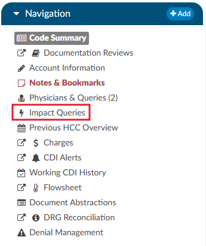
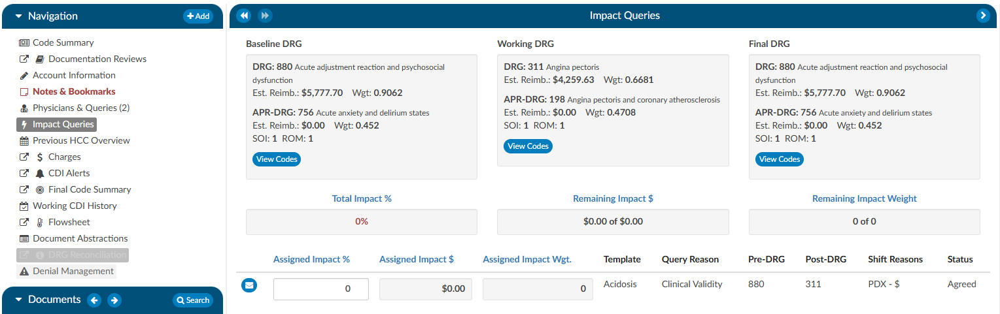

+++
title = 'Impact Queries'
weight = 27
+++

{}

The Impact Queries Viewer is designed exclusively for CDI teams. This tool may not be necessary for all customers, but it serves a specific purpose for those who use it. CDI teams often issue multiple queries per account and require a way to track the impact of each query distinctly. This viewer allows teams to determine whether the impact of a query accounts for the total change in the account or if it shares this impact with other queries.

## Purpose and Use

* **Impact Tracking:** Allows CDI specialists to clearly see the account impact of each query, from the initial baseline to the final assessment after all queries.
* **Impact Assignment:** Within each query, CDI specialists can assign a percentage to quantify the impact of the query on the account. This percentage is then translated into a dollar value attributed to the query.

This feature helps prevent double-counting and overestimating the impact that CDI claims on an account. After coding is completed, CDI specialists must revisit and reassess the account to determine and specify the precise impact each query had.

By using the Impact Queries Viewer, CDI teams can ensure more accurate and accountable query impact assessments, contributing to more precise documentation and reimbursement processes.

To access the Impact Queries Viewer, the user must have a CDI role **AND** there must be at least one (1) query sent by a CDI user.

Displayed at the top of the viewer is the Baseline, Working and Final DRG. The account impact equals Final DRG – Baseline DRG. 

Clicking on the {}View Codes{} button in either the Baseline or Working DRG boxes will take the user to the [Working CDI History](https://dolbeysystems.github.io/fusion-cac-web-docs/general-user-guide/account-screen/account-viewers/working-cdi-history/) viewer to allow the user to view how the CDS developed their DRG at different stages. Clicking on the {}View Codes{} button in the Final DRG box will take the user to the [Final Code Summary](https://dolbeysystems.github.io/fusion-cac-web-docs/general-user-guide/account-screen/account-viewers/code-summary/) viewer to show the user how the account was final coded by the Coder.

To review the query that was assigned, click on the **BLUE ENVELOPE**. This will open the query in a dialouge box.

To assign the impact of the query, the user will enter a percentage in the "Assigned Impact %" field. This will autocalculate the following fileds:
* Total Impact %
* Remaining Impact $
* Remaining Impact Weight
* Assigned Impact &
* Assigned Impact Wgt.

>[!Note]Impact Assignment
For guidelines on how to quantify the impact of a query, or queries, contact your {} supervisor for any internal policies and procedures. 

