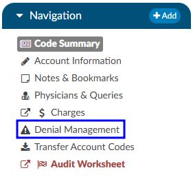
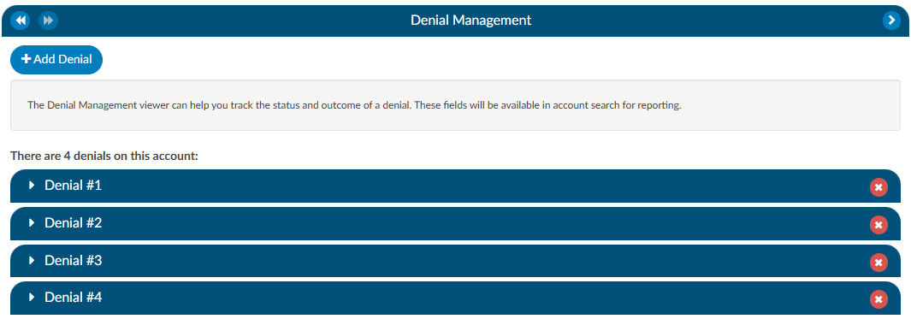

+++
title = 'Account Viewers'
weight = 52
+++

{}

## Addtional Viewers

> [!note] Optional Viewers
> The following viewers are part of optional
> [add-on modules](https://dolbeysystems.github.io/fusion-cac-web-docs/general-user-guide/add-on-modules/)
> and may not be used at all organizations. If you are unsure if a module is relevant to your
> organization, please contact your  supervisor. Organizations looking for more information on
> these modules should reach out to the Dolbey SME team via email (smeteam@dolbey.com).

##### Audit Viewer

The audit viewer displays when the account is opened by a user in the rold of Auditor. The audit viewer can be popped out onto a separate screen, allowing the auditor to have a screen for reviewing the chart. By selecting “Show All” codes in the unassigned code tree, the auditor is taken to the documents/documentation supporting that code.  This will help streamline the audit process. 

An account can have one or more audits added to it. By clicking "+ Add Audit," a new, blank audit worksheet will be created. These worksheets are numbered and displayed at the top of the audit viewer, along with a date stamp indicating when each worksheet was opened. The worksheet currently being viewed will be highlighted with a green background.

Data in the audit viewer is only intended for coder education and administrative staff to score how the coder is doing in a report card. The auditor will need to add the coder of record so that the coder of record, any auditor, or other user role that has been given access can view the audit worksheets. 

##### Denials Management

The denial management viewer displays on submitted accounts. Clicking on this viewer presents a form with several fields to be filled in when an account has been denied payment. 

Denial management tracking involves monitoring cases where a patient's submitted billing chart is rejected by the payer. Various reasons, such as medical necessity, code, or DRG assignment, could lead to these denials. This tool is designed to comprehensively record the specifics related to denial management and tracking. It is capable of documenting multiple denials for each chart, with the ability to log and categorize them for the purpose of tracking, managing workflows, and generating reports.

Mutiple denial sheets can be created within the viewer, if applicable. 

Sheets can be removed from the account by clicking on the red X to the right of each denial heading. For reporting within Account Search, a Denials drilldown is available. **This drilldown only reports on the first denial on the account**. 

The viewer has a multiselect entry for each denial.  The field is located above the Code(s) in Question entry. Clicking into the Root Causes field will cause a list to dropdown. Default options include: 

- Incorrect DX
- Incorrect PCS
- Incorrect PDX
- Incorrect POA
- Added DX
- Added PCS
- Removed DX
- Removed PCS

Options in the dropdown lists can be customized per organization by editing the appropriate mapping table in [mapping configuration](https://dolbeysystems.github.io/fusion-cac-web-docs/administrative-user-guide/mapping-configuration/).

- DenialType
- DenialStatus
- DenialOutcome
- DenialAppealRoute
- DenialReason
- DenialCodeChangeNeeded
- DenialDRGChangeNeeded

Each field (except Comments) can be added to [Grid Column Configuration](https://dolbeysystems.github.io/fusion-cac-web-docs/administrative-user-guide/grid-column-configuration/) for display in Account Search, these fields can also be used in workflow if necessary. 

##### ER E/M Viewer