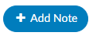

+++
title = 'Account Viewers'
weight = 52
+++

{}

## Code Summary

The Code Summary screen shows a summary of activity on the account and provides activity buttons to Claim Ownership, Show History, and Print Abstract (if a printer is configured). This viewer also provides information on Current Owner, First Coder, Last Saver, and Last Submitter. Users can expand the width of the Code Summary pane by clicking on the arrow in the top right of the pane. 

When the Code Summary link displays RED, there are [validation errors](https://dolbeysystems.github.io/fusion-cac-web-docs/administrative-user-guide/validation-management/) on the chart that must be 
resolved prior to submission.

## Account Information

The Account Information pane summarizes patient demographic information (based on custom system configuration) with data captured for purposes of state and/or registry reporting. Users can expand the width of the Code Summary pane by clicking on the arrow in the top right corner of the pane. To update data fields in the Account information pane, click on the blue button and select the appropriate selection from the drop-down menu.

### Unspecified Code Edit Flag

On April 1, 2022 CMS made the Unspecified Code Edit effective. This new edit is triggered when a code from the unspecified code list is assigned by a coder. It is the provider’s responsibility to determine if a more specific code from that subcategory is available in the medical record documentation by a clinical provider. 

If additional information to identify the laterality from the available medical record documentation by any other clinical provider is unable to be obtained, or there is documentation in the record indicating that the physician is clinically unable to determine the laterality because of the nature of the disease/condition, then the provider must enter that information into the remarks section. 
Specifically, the provider may enter “UNABLE TO DET LAT 1” to identify that they are unable to obtain additional information to specify laterality or they may enter “UNABLE TO DET LAT 2” to identify that the physician is clinically unable to determine laterality. If not entered, the claim will be returned.

Dolbey can support the addition of this field to your account information viewer and send the necessary information, known as the billing note, downstream if required. If this is something that you need, please reach out to the Dolbey SME Team at smeteam@dolbey.com. 

## Notes & Bookmarks

The Notes & Bookmarks becomes visible in the center pane after clicking on the hyperlink from the Navigation Pane.  This pane presents a summary and chronological history of all notes and bookmarks added to this account. Users can expand the width of the Code Summary pane by clicking on the arrow in the top right corner of the pane.

Notes can be added to the patient chart by clicking on the +Add Note button within the Notes & Bookmarks Pane. 

When notes or bookmarks are applied to the chart, the Notes and Bookmarks link in the Navigation pane will turn red.  

Account Notes also have formatting options for text. Highlighting the text displays a popup with formatting options displays. A user can now select text in those areas and can change the styles of text.

Users have the option to make notes publicly visible among all users by clicking on the checkbox. Even if an end user marks a note/bookmark as private, users with the role of administrator or manager can still see private comments. This feature allows for a manager to review a patient chart and if they do not want the existing public note to show in the account note, they can change an existing note private without putting in a new note.  Then they have to make it public, then switch it to private in order to have the account note blank. 

To keep your Comment box open while continuing to work on the chart, click on the Minimize Editor button. This will move a placeholder to the Accounts Action Bar. 

 
 

Users can add a bookmark to a document by highlighting the relevant word(s), phrase or location within the text and then right-clicking to open the Bookmark menu. 

From the Bookmark menu, select Bookmark to open the Note window to add your note for this bookmark.
Add the note for your bookmark in the Note text box, then click the checkmark button   to save the bookmark with your note for future reference.  Bookmarks within documents will have the bookmark icon. To view bookmarks from within a document, click on the green icon to open and view the bookmark note.

To review all bookmarks within a chart, go to Notes & Bookmarks in the Navigation Pane. All of the bookmarks within the chart are listed in the Notes & Bookmarks pane.

The **RED X ** button will delete the selected bookmark.
The **BLUE PENCIL** pencil button is used to edit a previously added bookmark.
The **GREEN PAPER** button will jump to the location where the bookmark was created.

## Physicians & Queries

## Addtional Viewers

> [!note] Optional Viewers
> The following viewers are part of optional
> [add-on modules](https://dolbeysystems.github.io/fusion-cac-web-docs/general-user-guide/add-on-modules/)
> and may not be used at all organizations. If you are unsure if a module is relevant to your
> organization, please contact your  supervisor. Organizations looking for more information on
> these modules should reach out to the Dolbey SME team via email (smeteam@dolbey.com).

##### Audit Viewer

The audit viewer displays when the account is opened by a user in the rold of Auditor. The audit viewer can be popped out onto a separate screen, allowing the auditor to have a screen for reviewing the chart. By selecting “Show All” codes in the unassigned code tree, the auditor is taken to the documents/documentation supporting that code.  This will help streamline the audit process. 

An account can have one or more audits added to it. By clicking "+ Add Audit," a new, blank audit worksheet will be created. These worksheets are numbered and displayed at the top of the audit viewer, along with a date stamp indicating when each worksheet was opened. The worksheet currently being viewed will be highlighted with a green background.

Data in the audit viewer is only intended for coder education and administrative staff to score how the coder is doing in a report card. The auditor will need to add the coder of record so that the coder of record, any auditor, or other user role that has been given access can view the audit worksheets. 

##### Denials Management

The denial management viewer displays on submitted accounts. Clicking on this viewer presents a form with several fields to be filled in when an account has been denied payment. 

Denial management tracking involves monitoring cases where a patient's submitted billing chart is rejected by the payer. Various reasons, such as medical necessity, code, or DRG assignment, could lead to these denials. This tool is designed to comprehensively record the specifics related to denial management and tracking. It is capable of documenting multiple denials for each chart, with the ability to log and categorize them for the purpose of tracking, managing workflows, and generating reports.

Mutiple denial sheets can be created within the viewer, if applicable. 

Sheets can be removed from the account by clicking on the red X to the right of each denial heading. For reporting within Account Search, a Denials drilldown is available. **This drilldown only reports on the first denial on the account**. 

The viewer has a multiselect entry for each denial.  The field is located above the Code(s) in Question entry. Clicking into the Root Causes field will cause a list to dropdown. Default options include: 

- Incorrect DX
- Incorrect PCS
- Incorrect PDX
- Incorrect POA
- Added DX
- Added PCS
- Removed DX
- Removed PCS

Options in the dropdown lists can be customized per organization by editing the appropriate mapping table in [mapping configuration](https://dolbeysystems.github.io/fusion-cac-web-docs/administrative-user-guide/mapping-configuration/).

- DenialType
- DenialStatus
- DenialOutcome
- DenialAppealRoute
- DenialReason
- DenialCodeChangeNeeded
- DenialDRGChangeNeeded

Each field (except Comments) can be added to [Grid Column Configuration](https://dolbeysystems.github.io/fusion-cac-web-docs/administrative-user-guide/grid-column-configuration/) for display in Account Search, these fields can also be used in workflow if necessary. 

##### ER E/M Viewer