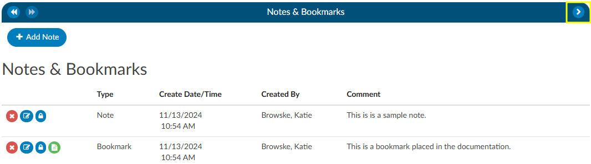
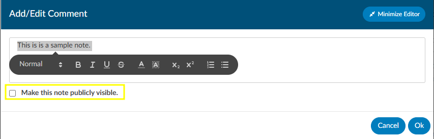
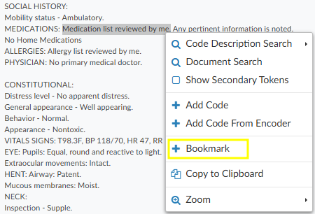
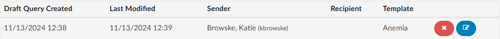
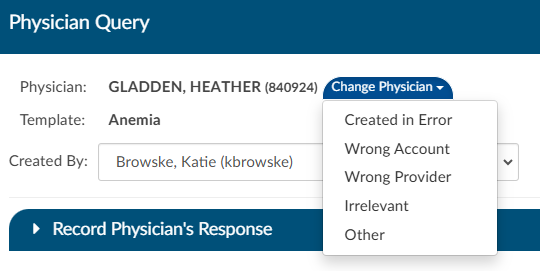
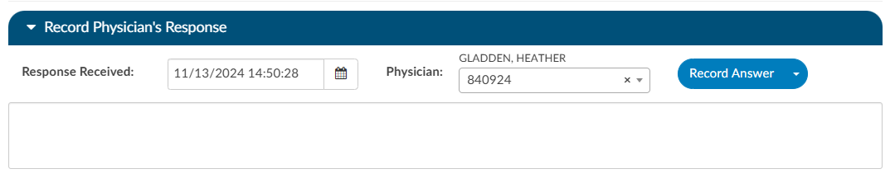

+++
title = 'Account Viewers'
weight = 52
+++

{}

## Code Summary

The Code Summary screen shows a summary of activity on the account and provides activity buttons to Claim Ownership, Show History, and Print Abstract (if a printer is configured). This viewer also provides information on Current Owner, First Coder, Last Saver, and Last Submitter. Users can expand the width of the Code Summary pane by clicking on the arrow in the top right of the pane. 

When the Code Summary link displays RED, there are [validation errors](https://dolbeysystems.github.io/fusion-cac-web-docs/administrative-user-guide/validation-management/) on the chart that must be 
resolved prior to submission.

## Account Information

The Account Information pane summarizes patient demographic information (based on custom system configuration) with data captured for purposes of state and/or registry reporting. Users can expand the width of the Code Summary pane by clicking on the arrow in the top right corner of the pane. To update data fields in the Account information pane, click on the blue button and select the appropriate selection from the drop-down menu.

### Unspecified Code Edit Flag

On April 1, 2022 CMS made the Unspecified Code Edit effective. This new edit is triggered when a code from the unspecified code list is assigned by a coder. It is the provider’s responsibility to determine if a more specific code from that subcategory is available in the medical record documentation by a clinical provider. 

If additional information to identify the laterality from the available medical record documentation by any other clinical provider is unable to be obtained, or there is documentation in the record indicating that the physician is clinically unable to determine the laterality because of the nature of the disease/condition, then the provider must enter that information into the remarks section. 
Specifically, the provider may enter “UNABLE TO DET LAT 1” to identify that they are unable to obtain additional information to specify laterality or they may enter “UNABLE TO DET LAT 2” to identify that the physician is clinically unable to determine laterality. If not entered, the claim will be returned.

Dolbey can support the addition of this field to your account information viewer and send the necessary information, known as the billing note, downstream if required. If this is something that you need, please reach out to the Dolbey SME Team at smeteam@dolbey.com. 

## Notes & Bookmarks

The Notes & Bookmarks becomes visible in the center pane after clicking on the hyperlink from the [Navigation Pane](https://dolbeysystems.github.io/fusion-cac-web-docs/general-user-guide/account-screen/#navigation-pane).  This pane presents a summary and chronological history of all notes and bookmarks added to this account. Users can expand the width of the Code Summary pane by clicking on the arrow in the top right corner of the pane.

Notes can be added to the patient chart by clicking on the +Add Note button within the Notes & Bookmarks Pane. 

When notes or bookmarks are applied to the chart, the Notes and Bookmarks link in the [Navigation Pane](https://dolbeysystems.github.io/fusion-cac-web-docs/general-user-guide/account-screen/#navigation-pane) will turn red.  

Account Notes also have formatting options for text. Highlighting the text displays a popup with formatting options displays. A user can now select text in those areas and can change the styles of text.

Users have the option to make notes publicly visible among all users by clicking on the checkbox. Even if an end user marks a note/bookmark as private, users with the role of administrator or manager can still see private comments. This feature allows for a manager to review a patient chart and if they do not want the existing public note to show in the account note, they can change an existing note private without putting in a new note.  Then they have to make it public, then switch it to private in order to have the account note blank. 

To keep your Comment box open while continuing to work on the chart, click on the Minimize Editor button. This will move a placeholder to the Accounts Action Bar. 

 
 

Users can add a bookmark to a document by highlighting the relevant word(s), phrase or location within the text and then right-clicking to open the Bookmark menu. 

From the Bookmark menu, select Bookmark to open the Note window to add your note for this bookmark.
Add the note for your bookmark in the Note text box, then click the checkmark button   to save the bookmark with your note for future reference.  Bookmarks within documents will have the bookmark icon. To view bookmarks from within a document, click on the green icon to open and view the bookmark note.

To review all bookmarks within a chart, go to Notes & Bookmarks in the Navigation Pane. All of the bookmarks within the chart are listed in the Notes & Bookmarks pane.

The **RED X ** button will delete the selected bookmark.
The **BLUE PENCIL** button is used to edit a previously added bookmark.
The **GREEN PAPER** button will jump to the location where the bookmark was created.

## Physicians & Queries

Within this viewer users can add physicians and change the staff function, if necessary. Users can expand the width of the Code Summary pane by clicking on the arrow in the top right corner of the pane.

### Editing Physicians

The bottom portion, ‘Account Physicians’, is pre-populated by the organization's registration system. Physicians can be added, changed, or removed if incorrect or missing. To add a physician, click on the ‘Add Physician’ button and begin typing in the physician’s last name to populate a list to choose from, then click add. Choose the staff function that fits the choosen physician. If it is a consulting physician enter, in the consultation date. 

To remove a physician that either you added or was sent incorrectly from the registration system click on the **RED X ** button to remove the physician. 

### Querying a Physician

To add a query to a physician that is listed, click on either the **BLUE ENVELOPE** icon next to the physician.

To query a physician not listed, click on +Add Query.
 

Add a physician if the physician did not auto fill by clicking on the ‘add physician’ button and begin typing in the last name. Then click on ‘Select Template’ to choose the query template you wish to use.  

If configured, users can see a co-signer field that allows assignment of a cosigner. The cosigner field is a field that can be sent in the outbound interface for the query. The receiving system can choose to use this process if the co-signer needs to receive the query after the main user answers, but before it gets returned to Dolbey.  When a physician query is created, a new "Cosigner" physician dropdown appears below the existing "Physician" dropdown. Filling in this field is optional. When the query is saved as a draft or sent outbound, the cosigner field will be saved with the query and sent as an additional recipient. In the grid inside the Physicians & Queries, the user may also choose to add "Cosigner" as a visible column.

#### Sending a Query

Write the query or fill out the template details as needed. 

Once completed, select from the reason dropdown why you are sending the query and above that field check the box if the query will affect final coding. 

Click “Send” to complete and send the query or click {}Save Draft{} if the query is not ready to be sent. If saved  as draft, a draft query section will appear that is separated from sent or closed queries. If a user has at least one draft, but no sent queries, the total drafts count on their personal dashboard will display as zero. 

 

Alternatively, for organizations who do not have a physician query interface **AND** do not create a physician query until a response is received, a query can be created and not sent.  When enabled, a physician query will show a {}Continue{} button in place of {}Send{}. Clicking the “Continue” button will refresh the query to open the physician response fields so that the query can then be closed.

###### Editing a Sent Query

The physician the query was sent *can* be changed after sending the query by opening the query and clicking {}Change Physician{}. A dropdown will appear so the user can select the reason the physician needs to be changed. 

#### Closing a Query 

When ready to close a query, whether that be to review a response and update the outcome or to cancel a query, can click the envelope icon. Upon clicking on this icon the query will open to display the response from the provider, if applicable. 

Once a query is opened and responded (or the user is recording the response on behalf of the physician), the responding physician and the date/time of the response can be editied. If the organization is manually closing queries, this information ensures that the management reports reflect accurate turnaround times. 

If an organization has choosen to collect shift reasons, a dialog box will appear upon selecting an outcome for the query.

##### Documenting Query Shift Reasons

Shift reasons can be categorized as either automatic or manual. If manual shift reasons are enabled, users will encounter a dialog box bafter closing a query.

 
 This dialog box will display the pre and post-query DRG (if applicable) along with options for shift reasons. These shift reasons can be chosen by the end user to explain the rationale behind the change in the DRG. It is important to note that changes in the DRG might occur for reasons unrelated to the query outcome. Please be aware that the shift reasons dialog is customizable, so each organization may offer different options than what is shown in the screenshot.

 >[!note] 
> If automatic shift reasons are categorized as either automatic or manual. The dialog box will only display if shift reasons are set to **manual**. Organizations looking to enable or disable the dialog box, should contact CAC Support (cacsupport@dolbey.com)

##### Query Impact

Upon initiation of the query, the user will see a {}Compute{} below the template name.  Click to compute the Pre-Query DRG, if not already showing. Clicking this button will use currently assigned codes on the chart to compute a DRG. Once the pre-query DRG is completed, users will follow the standard process to send the query.

When the query has been responded to, open the query to complete by clicking the envelope icon. Users will be able to compute a post-query DRG in order to capture impact. The previous DRG will auto-populate (unless the user added, deleted, or changed any codes, re-sequenced or changed the discharge disposition). If the pre-query DRG does not populate, it will need to be calculated again by clicking the {}Compute Pre-DRG{} below the template name. Users will now also see a {}Compute Post-DRG{} below the template name. 

Users can minimize the query as needed to add, delete, or otherwise change any codes before clicking compute.

### Placeholder Queries

Some organizaitions create a physcian query within Fusion CAC and then copy and paste it into a different system rather, then send them through an interface. Dolbey refers to this as a place holder query for reporting and transparencey. A feature can be enabled so that text entered into fields on the place holder query will no longer display in bold. To activate this option, please contact CAC Support (cacsupport@dolbey.com).

#### Quick Complete

The Quick Complete button is designed for sites that create placeholder queries **ONLY**.  This feature allows a user to log a query without sending it externally. The  user can assign a provider, template, reason, and both pre and post-DRG information along with closing the query with shift reasons all in one session. This quick complete button aims to streamline these actions into a single, integrated process. This feature is a **optional** and needs to be turned on. Contact CAC Support (cacsupport@dolbey.com) to enable this feature.

Once enabled, create a new physician query, and notice a new "Quick Complete" button in the footer. Clicking it will automatically save the query and reopen it with "Record Physician Response" expanded to record a physician's response. The "Quick Complete" button only appears on new queries, including queries opened from drafts. It will **not** appear if a query is edited or if a query's physician is changed.

### Query Status

The status of the query will display in the actions column on the query grid. The following are status options:

|Status    |Description                                                         |
|----------|--------------------------------------------------------------------|
|Open      | This query has been sent, but not yet responded to by the provider.|
|Answered  | This query has been sent and has received a response, but has yet to be closed by the end user.|
|Cancelled | This query has been cancelled by the end user. The status column will display the reason for the cancellation.|
|Closed    | This query has been closed by the end user. The status column will display the outcome of the query.|

>[!Note]Cancelling Queries
> Not all organizations support canceling physician queries.  Redirected queries may still need to be cancelled within the EMR; consult your {}supervisor to learn if additional steps need to be taken to cancel a query.

### Per User Settings

This grid will display information about when the query was created by whom, who it was sent to and if there was a reply and when. 
Columns can be reordered based on user preference. When moving around the columns in the Physician Queries grid and then clicking the Save Layout button, the columns and order will be saved for the Queries grid for all future accounts for that user.  Any other user will see the default layout.  Next to the Save Layout button is a Reset Filters button, this will take any custom layout and change it back to the default fields.  

If the organization chooses to use signatures when sending queries, automatic signatures can be addended to the query. Signatures can be editied within each user's profile.  

> [!note]
> Please refer to your {}supervisor for details as each organization has custom query templates and additional details surrounding queries.

## Addtional Viewers

> [!note] Optional Viewers
> The following viewers are part of optional
> [add-on modules](https://dolbeysystems.github.io/fusion-cac-web-docs/general-user-guide/add-on-modules/)
> and may not be used at all organizations. If you are unsure if a module is relevant to your
> organization, please contact your  supervisor. Organizations looking for more information on
> these modules should reach out to the Dolbey SME team via email (smeteam@dolbey.com).

##### Audit Viewer

The audit viewer displays when the account is opened by a user in the rold of Auditor. The audit viewer can be popped out onto a separate screen, allowing the auditor to have a screen for reviewing the chart. By selecting “Show All” codes in the unassigned code tree, the auditor is taken to the documents/documentation supporting that code.  This will help streamline the audit process. 

An account can have one or more audits added to it. By clicking "+ Add Audit," a new, blank audit worksheet will be created. These worksheets are numbered and displayed at the top of the audit viewer, along with a date stamp indicating when each worksheet was opened. The worksheet currently being viewed will be highlighted with a green background.

Data in the audit viewer is only intended for coder education and administrative staff to score how the coder is doing in a report card. The auditor will need to add the coder of record so that the coder of record, any auditor, or other user role that has been given access can view the audit worksheets. 

##### Denials Management

The denial management viewer displays on submitted accounts. Clicking on this viewer presents a form with several fields to be filled in when an account has been denied payment. 

Denial management tracking involves monitoring cases where a patient's submitted billing chart is rejected by the payer. Various reasons, such as medical necessity, code, or DRG assignment, could lead to these denials. This tool is designed to comprehensively record the specifics related to denial management and tracking. It is capable of documenting multiple denials for each chart, with the ability to log and categorize them for the purpose of tracking, managing workflows, and generating reports.

Mutiple denial sheets can be created within the viewer, if applicable. 

Sheets can be removed from the account by clicking on the red X to the right of each denial heading. For reporting within Account Search, a Denials drilldown is available. **This drilldown only reports on the first denial on the account**. 

The viewer has a multiselect entry for each denial.  The field is located above the Code(s) in Question entry. Clicking into the Root Causes field will cause a list to dropdown. Default options include: 

- Incorrect DX
- Incorrect PCS
- Incorrect PDX
- Incorrect POA
- Added DX
- Added PCS
- Removed DX
- Removed PCS

Options in the dropdown lists can be customized per organization by editing the appropriate mapping table in [mapping configuration](https://dolbeysystems.github.io/fusion-cac-web-docs/administrative-user-guide/mapping-configuration/).

- DenialType
- DenialStatus
- DenialOutcome
- DenialAppealRoute
- DenialReason
- DenialCodeChangeNeeded
- DenialDRGChangeNeeded

Each field (except Comments) can be added to [Grid Column Configuration](https://dolbeysystems.github.io/fusion-cac-web-docs/administrative-user-guide/grid-column-configuration/) for display in Account Search, these fields can also be used in workflow if necessary. 

##### ER E/M Viewer