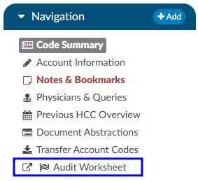
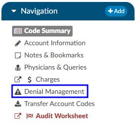
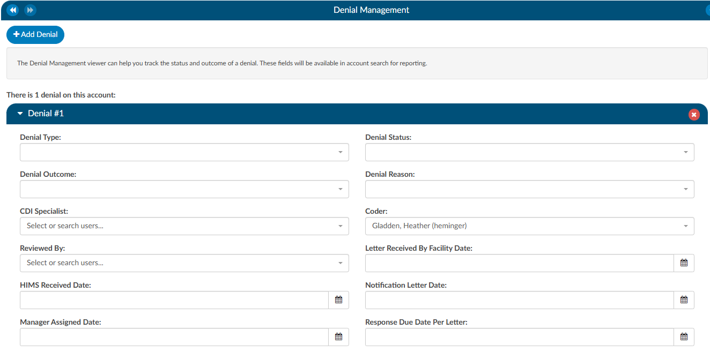
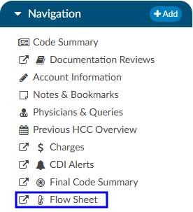
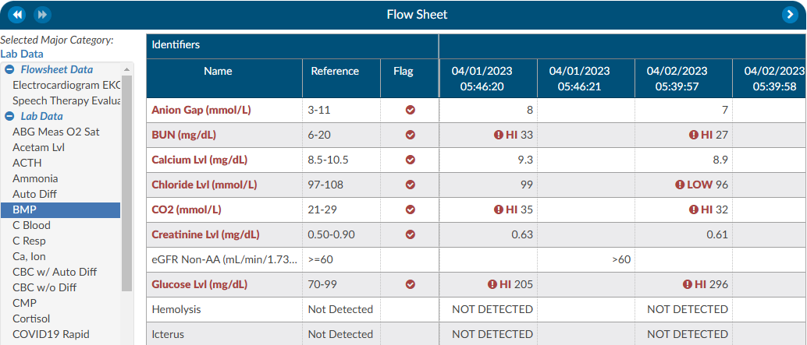
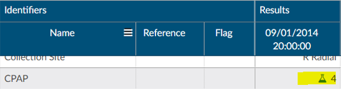
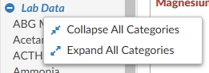

+++
title = 'Add-On Modules and Viewers'
weight = 30
+++

> [!note] Optional Viewers
> The following viewers are part of optional
> [add-on modules](https://dolbeysystems.github.io/fusion-cac-web-docs/general-user-guide/add-on-modules/)
> and may not be used at all organizations. If you are unsure if a module is relevant to your
> organization, please contact your  supervisor. Organizations looking for more information on
> these modules should reach out to the Dolbey SME team via email (smeteam@dolbey.com).
{}

## Audit Module

The audit viewer displays when the account is opened by a user in the rold of Auditor. The audit viewer can be popped out onto a separate screen, allowing the auditor to have a screen for reviewing the chart. By selecting “Show All” codes in the unassigned code tree, the auditor is taken to the documents/documentation supporting that code.  This will help streamline the audit process. 

An account can have one or more audits added to it. By clicking "+ Add Audit," a new, blank audit worksheet will be created. These worksheets are numbered and displayed at the top of the audit viewer, along with a date stamp indicating when each worksheet was opened. The worksheet currently being viewed will be highlighted with a green background.

Data in the audit viewer is only intended for coder education and administrative staff to score how the coder is doing in a report card. The auditor will need to add the coder of record so that the coder of record, any auditor, or other user role that has been given access can view the audit worksheets. 

The audit module allows for the role of an auditor within the application. The role of an "Auditor" has the same privileges as a "Coder" when it comes to account editing. More details on audit functionality can be found in the [Audit User Guide](https://dolbeysystems.github.io/fusion-cac-web-docs/auditor-user-guide/). 

## Denials Management (Viewer)

The denial management viewer displays on submitted accounts. Clicking on this viewer presents a form with several fields to be filled in when an account has been denied payment. 

Denial management tracking involves monitoring cases where a patient's submitted billing chart is rejected by the payer. Various reasons, such as medical necessity, code, or DRG assignment, could lead to these denials. This tool is designed to comprehensively record the specifics related to denial management and tracking. It is capable of documenting multiple denials for each chart, with the ability to log and categorize them for the purpose of tracking, managing workflows, and generating reports.

Mutiple denial sheets can be created within the viewer, if applicable. 

Sheets can be removed from the account by clicking on the red X to the right of each denial heading. For reporting within Account Search, a Denials drilldown is available. **This drilldown only reports on the first denial on the account**. 

The viewer has a multiselect entry for each denial.  The field is located above the Code(s) in Question entry. Clicking into the Root Causes field will cause a list to dropdown. Default options include: 

- Incorrect DX
- Incorrect PCS
- Incorrect PDX
- Incorrect POA
- Added DX
- Added PCS
- Removed DX
- Removed PCS

Options in the dropdown lists can be customized per organization by editing the appropriate mapping table in [mapping configuration](https://dolbeysystems.github.io/fusion-cac-web-docs/administrative-user-guide/mapping-configuration/).

- DenialType
- DenialStatus
- DenialOutcome
- DenialAppealRoute
- DenialReason
- DenialCodeChangeNeeded
- DenialDRGChangeNeeded

Each field (except Comments) can be added to [Grid Column Configuration](https://dolbeysystems.github.io/fusion-cac-web-docs/administrative-user-guide/grid-column-configuration/) for display in Account Search, these fields can also be used in workflow if necessary. 

More details on denial mamnagment functionality can be found in the [General User Guide](https://dolbeysystems.github.io/fusion-cac-web-docs/coding-user-guide/coding-a-patient-chart/account-viewers/denial-management-viewer/).

## Discrete Values (Viewer)

**This feature may not be supported by your organization's EMR vendor.** The discrete values show trending data or data that has values.  The most common examples of discrete values are lab values and vital signs. The viewer can be popped out into another window by clicking on a little square with an arrow pointing to the right in the navigation tree next to the viewer name.

An older style of discrete data can be displayed in a discrete values viewer. Tabs across the top of the screen display the categories of data. This displays each of the types of discrete data elements, which may vary by organization. 

The Discrete Values viewer has a Filter by Month box, listing the months that contain values. Selecting a month will highlight all the corresponding dates in the Filter by Date box. The resulting values will show in the viewing pane. The Normal and Abnormal tabs both have this functionality and are filtered separately. 

Discrete Values with a grey header are within normal limits. Each organization sends what is the reference point to determine what is normal and what is abnormal. If a header is display in red, it is considered abnormal by the organization. In addition to the header color, users can tell if the value is out of normal limits as there is a flag that indicates if the value is low vs. high. 

## ER E/M Module 

The ER E/M Viewer is an add-on module for any chart with a “Is Emergency” flag within the account properties.
If this module is turned on, any “Is Emergency” chart will have the “E/M Coding Worksheet” in the Navigation menu. 
There are several sections to the E/M Coding worksheet including:  E/M No Charge, E/M Level, Trauma, Critical Care, Medications, and Additional Charging. More details on ER E/M functionality can be found in the [General User Guide](https://dolbeysystems.github.io/fusion-cac-web-docs/coding-user-guide/coding-a-patient-chart/account-screen/#navigation-pane).

## Flow Sheet (Viewer)

**This feature may not be supported by your organization's EMR vendor.** The discrete values show trending data or data that has values.  The most common examples of discrete values are lab values and vital signs. The viewer can be popped out into another window by clicking on a little square with an arrow pointing to the right in the navigation tree next to the viewer name.

The flowsheet viewer is the most recent style of discrete data viewer. This viewer is organized much like a spreadsheet. Depending on configuration, users may see major categories on the left-hand side of the spreadsheet indicating if lab power forms could be vital signs. (There are many different options as each site is a little different.) Upon clicking on one of these items users will be presented with a grid to the right. That grid will have multiple columns, the first column being name. Hovering over the column name will display three little lines. Clicking on them, will allow the user to filter in order to narrow down the data. If any of those names appear in red that means that at least one of the data elements are outside of the normal limits if there is a range. 

To the right of the name, if applicable, is a reference column. This reference column will indicate if the value is within normal limits. This is data that the EMR system has sent to the CAC system. If the reference column is available, then to the right of that is a flag column. A checkmark in that field  also means  the value is out of the normal range. This column can also be filtered if the user wants to look at everything outside of the normal limits. Next to that field is a date and time column. The user may see multiple dates and times depending on how the data is organized and how frequently it is documented. If a discrete value on the Flowsheet viewer has a specimen, it will show as a beaker symbol in the Results column. Hovering over the symbol will provide the name and site of the specimen. 

Right clicking in the Major Category column will show a menu allowing the user to expand or collapse all categories. That configuration will be saved for all accounts that have the Flowsheet viewer, per user role.  Note that if a user collapses/uncollapses a major category in the pop out, it will not be seen on the main page until the user moves to a different viewer and back.

## Physician Coding/Single Path

Physician coders differ from hospital coders in that they will usually work for a doctor who specializes in a specific type of medicine. As a result, they typically code for just that specialty. These coders will only deal with a subset of the ICD10 code set. Within the CAC system, is built-in functionality to allow a physician coder to code charts just like hospital coding staff. The Single-Path coding role allows the user to code an account as a final coder *and* a physician coder simultaneously. When a Single Path user opens up the detail on a CPT code, they will see 2 separate fields for modifiers, and they can enter modifiers for both.

A Single Path role can also be changed in the Profile drop-down on the user name at the top of the  Account  Detail screen if another changeable profile role such as CDI, Coder, or Physician Coder is also present on the User Profile.  When adding or editing Modifiers in the Charges viewer, the Single Path user sees the Coder’s version of the viewer, so what is added will be viewable to both a coder and a Single Path user. The Physician Coder charges viewers are different and viewable only to them. 

## Quality Module

This module allows for the ability to identify PDI, PSI, Quality Measure PC-06 and the Elixhauser Measures. 

#### PSI Indicators

The PSI Module uses the PSI technical specification from Agency for Healthcare Research and Quality
U.S. Department of Health and Human Services from www.qualityindicators.ahrq.gov.

Fusion CAC uses the final codes assigned by coders along with other patient data that meet each PSI
guideline. Fusion CAC provides an indicator on the banner bar to a coder when codes coupled with
patient demographics meet a PSI guideline.

The PSI is reported in one of two
fields CDI PSI Indicator or PSI Indicator if identified by a coder. The indicator can be used for workflow
and/or reporting.

#### PDI Indicator

The PDI Module uses the PDI technical specification from Agency for Healthcare Research and Quality
U.S. Department of Health and Human Services www.qualityindicators.ahrq.gov.

The Pediatric Quality Indicators (PDIs) focus on potentially preventable complications and iatrogenic
events for pediatric patients treated in hospitals and on preventable hospitalizations among pediatric
patients, taking into account the special characteristics of the pediatric population.

The PDI is reported in one of
two fields CDI PDI Indicator or PDI Indicator if identified by a coder. The indicator can be used for
workflow and/or reporting.

#### PC-06 Indicator

The Quality Measure Module supports the PC06 measure and uses the Joint Commission technical
specification https://manual.jointcommission.org/releases/TJC2018B/MIF0393.html.

Fusion CAC uses the final codes assigned by coders along with other patient data that meet each PC-06
guideline. Fusion CAC provides an indicator on the banner bar to a coder when codes coupled with
patient demographics meet a PC-06 guideline. The indicator can be used for workflow and/or reporting.

#### Elixhauser Comorbidity Measure Indicator

The Elixhauser Comorbidity Index is a method of categorizing comorbidities of patients based on the
International Classification of Diseases (ICD) diagnosis codes. The indicator can be used for workflow
and/or reporting. 

