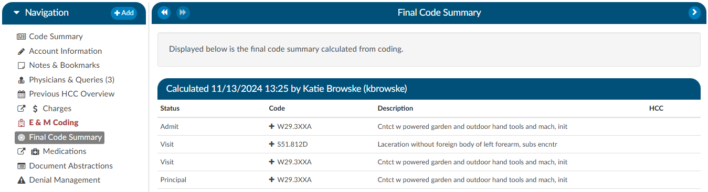

+++
title = 'Code Summary'
weight = 30
+++

{}

The Code Summary screen shows a summary of activity on the account and provides activity buttons to Claim Ownership, Show History, and Print Abstract (if a printer is configured). This viewer also provides information on Current Owner, First Coder, Last Saver, and Last Submitter. Users can expand the width of the Code Summary pane by clicking on the arrow in the top right of the pane. 

When the Code Summary link displays RED, there are [validation errors](https://dolbeysystems.github.io/fusion-cac-web-docs/administrative-user-guide/validation-management/) on the chart that must be 
resolved prior to submission.

### Final Coding Summary

The final code summary will display if the facility coders submit the chart. This provides transparency between CDI and physician coding teams (if also using Fusion CAC) as to what was coded.

Clicking on the header will expand the selection to display the codes that were coded and DRG/APC, if applicable. Any codes with a plus (+) sign indicates the code has not been added to the account. The plus (+) sign *does not indicate* that the code needs to be added. It is for the user to quickly add the code if they determine it is needed using coding judgment and supporting documentation.

### Physician Coding Summary

The physician code summary will display if the *physician coders* are also coding within Fusion CAC, and they submit the chart. This provides transparency between the facility and physician coding teams as to what was coded.

Clicking on the header will expand the selection to display the codes that were coded. Any codes with a plus (+) sign indicates the code has not been added to the account. The plus (+) sign *does not indicate* that the code needs to be added. It is for the user to quickly add the code if they determine it is needed using coding judgment and supporting documentation.

