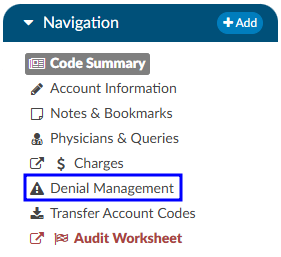

+++
title = 'Denial Management'
weight = 29
+++

{}

The denial management viewer displays on submitted accounts. Clicking on this viewer presents a form with several fields to be filled in when an account has been denied payment. 

Denial management tracking involves monitoring cases where a patient's submitted billing chart is rejected by the payer. Various reasons, such as medical necessity, code, or DRG assignment, could lead to these denials. This tool is designed to comprehensively record the specifics related to denial management and tracking. It is capable of documenting multiple denials for each chart, with the ability to log and categorize them for the purpose of tracking, managing workflows, and generating reports.

Mutiple denial sheets can be created within the viewer, if applicable. 

Sheets can be removed from the account by clicking on the red X to the right of each denial heading. For reporting within Account Search, a Denials drilldown is available. **This drilldown only reports on the first denial on the account**. 

The viewer has a multiselect entry for each denial.  The field is located above the Code(s) in Question entry. Clicking into the Root Causes field will cause a list to dropdown. Default options include: 

- Incorrect DX
- Incorrect PCS
- Incorrect PDX
- Incorrect POA
- Added DX
- Added PCS
- Removed DX
- Removed PCS

Options in the dropdown lists can be customized per organization by editing the appropriate mapping table in [mapping configuration](https://dolbeysystems.github.io/fusion-cac-web-docs/administrative-user-guide/mapping-configuration/).

- DenialType
- DenialStatus
- DenialOutcome
- DenialAppealRoute
- DenialReason
- DenialCodeChangeNeeded
- DenialDRGChangeNeeded

Each field (except Comments) can be added to [Grid Column Configuration](https://dolbeysystems.github.io/fusion-cac-web-docs/administrative-user-guide/grid-column-configuration/) for display in Account Search, these fields can also be used in workflow if necessary. 

More details on denial mamnagment functionality can be found in the [General User Guide](https://dolbeysystems.github.io/fusion-cac-web-docs/coding-user-guide/coding-a-patient-chart/account-viewers/denial-management-viewer/).