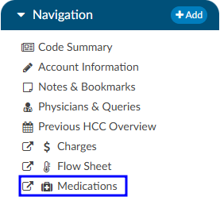
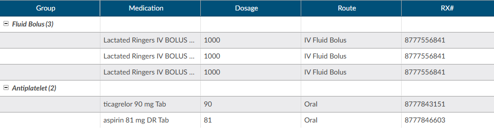

+++
title = 'Medications Viewer'
weight = 25

+++

A Medication Administration Record (MAR, or eMAR for electronic versions), commonly referred to as a drug chart, is the report that serves as a legal record of the drugs administered to a patient at a facility by a health care professional. The MAR is a part of a patient's permanent record on their medical chart. The health care professional signs off on the record at the time that the drug or device is administered. Common information collected includes:
- Medication
- Dosage
- Route
- Start and End Date/Time
- Status

