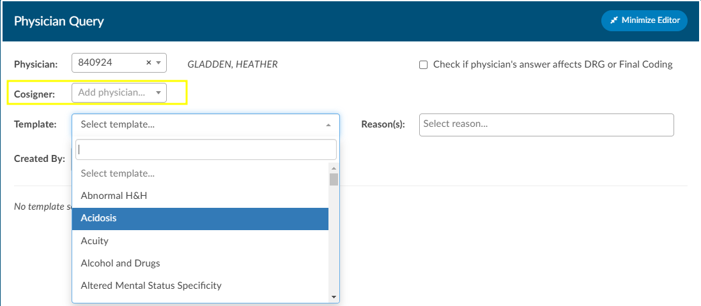
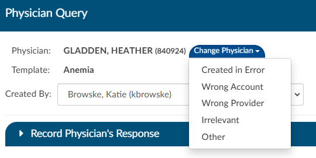
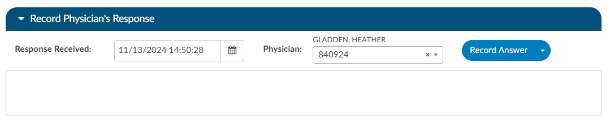
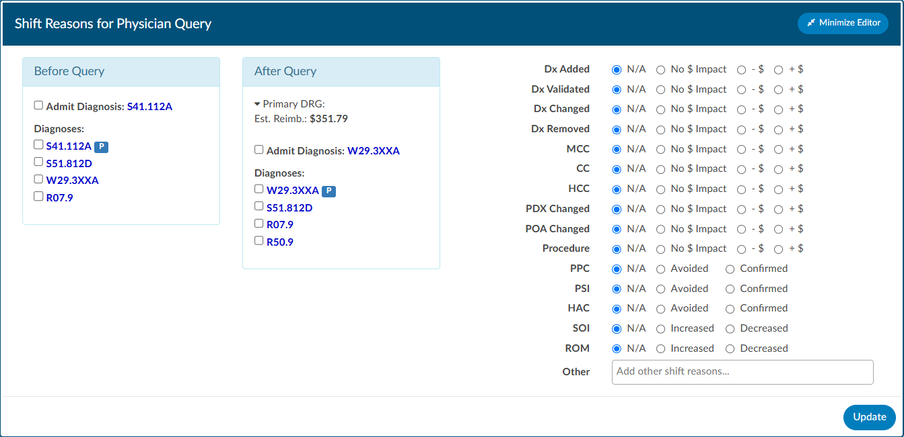

+++
title = 'Physicians & Queries'
weight = 30
+++

{}

Within this viewer users can add physicians and change the staff function, if necessary. Users can expand the width of the Code Summary pane by clicking on the arrow in the top right corner of the pane.

### Editing Physicians

The bottom portion, ‘Account Physicians’, is pre-populated by the organization's registration system. Physicians can be added, changed, or removed if incorrect or missing. To add a physician, click on the ‘Add Physician’ button and begin typing in the physician’s last name to populate a list to choose from, then click add. Choose the staff function that fits the choosen physician. If it is a consulting physician enter, in the consultation date. 

To remove a physician that either you added or was sent incorrectly from the registration system click on the **RED X ** button to remove the physician. 

### Querying a Physician

To add a query to a physician that is listed, click on either the **BLUE ENVELOPE** icon next to the physician.

To query a physician not listed, click on +Add Query.
 

Add a physician if the physician did not auto fill by clicking on the ‘add physician’ button and begin typing in the last name. Then click on ‘Select Template’ to choose the query template you wish to use.  

If configured, users can see a co-signer field that allows assignment of a cosigner. The cosigner field is a field that can be sent in the outbound interface for the query. The receiving system can choose to use this process if the co-signer needs to receive the query after the main user answers, but before it gets returned to Dolbey.  When a physician query is created, a new "Cosigner" physician dropdown appears below the existing "Physician" dropdown. Filling in this field is optional. When the query is saved as a draft or sent outbound, the cosigner field will be saved with the query and sent as an additional recipient. In the grid inside the Physicians & Queries, the user may also choose to add "Cosigner" as a visible column.

#### Sending a Query

Write the query or fill out the template details as needed. 

Once completed, select from the reason dropdown why you are sending the query and above that field check the box if the query will affect final coding. 

Click “Send” to complete and send the query or click {}Save Draft{} if the query is not ready to be sent. If saved  as draft, a draft query section will appear that is separated from sent or closed queries. If a user has at least one draft, but no sent queries, the total drafts count on their personal dashboard will display as zero. 

 

Alternatively, for organizations who do not have a physician query interface **AND** do not create a physician query until a response is received, a query can be created and not sent.  When enabled, a physician query will show a {}Continue{} button in place of {}Send{}. Clicking the “Continue” button will refresh the query to open the physician response fields so that the query can then be closed.

###### Editing a Sent Query

The physician the query was sent *can* be changed after sending the query by opening the query and clicking {}Change Physician{}. A dropdown will appear so the user can select the reason the physician needs to be changed. 

#### Closing a Query 

When ready to close a query, whether that be to review a response and update the outcome or to cancel a query, can click the envelope icon. Upon clicking on this icon the query will open to display the response from the provider, if applicable. 

Once a query is opened and responded (or the user is recording the response on behalf of the physician), the responding physician and the date/time of the response can be editied. If the organization is manually closing queries, this information ensures that the management reports reflect accurate turnaround times. 

If an organization has choosen to collect shift reasons, a dialog box will appear upon selecting an outcome for the query.

##### Documenting Query Shift Reasons

Shift reasons can be categorized as either automatic or manual. If manual shift reasons are enabled, users will encounter a dialog box bafter closing a query.

 
 This dialog box will display the pre and post-query DRG (if applicable) along with options for shift reasons. These shift reasons can be chosen by the end user to explain the rationale behind the change in the DRG. It is important to note that changes in the DRG might occur for reasons unrelated to the query outcome. Please be aware that the shift reasons dialog is customizable, so each organization may offer different options than what is shown in the screenshot.

 >[!note] 
> If automatic shift reasons are categorized as either automatic or manual. The dialog box will only display if shift reasons are set to **manual**. Organizations looking to enable or disable the dialog box, should contact CAC Support (cacsupport@dolbey.com)

##### Query Impact

Upon initiation of the query, the user will see a {}Compute{} below the template name.  Click to compute the Pre-Query DRG, if not already showing. Clicking this button will use currently assigned codes on the chart to compute a DRG. Once the pre-query DRG is completed, users will follow the standard process to send the query.

When the query has been responded to, open the query to complete by clicking the envelope icon. Users will be able to compute a post-query DRG in order to capture impact. The previous DRG will auto-populate (unless the user added, deleted, or changed any codes, re-sequenced or changed the discharge disposition). If the pre-query DRG does not populate, it will need to be calculated again by clicking the {}Compute Pre-DRG{} below the template name. Users will now also see a {}Compute Post-DRG{} below the template name. 

Users can minimize the query as needed to add, delete, or otherwise change any codes before clicking compute.

### Placeholder Queries

Some organizaitions create a physcian query within Fusion CAC and then copy and paste it into a different system rather, then send them through an interface. Dolbey refers to this as a place holder query for reporting and transparencey. A feature can be enabled so that text entered into fields on the place holder query will no longer display in bold. To activate this option, please contact CAC Support (cacsupport@dolbey.com).

#### Quick Complete

The Quick Complete button is designed for sites that create placeholder queries **ONLY**.  This feature allows a user to log a query without sending it externally. The  user can assign a provider, template, reason, and both pre and post-DRG information along with closing the query with shift reasons all in one session. This quick complete button aims to streamline these actions into a single, integrated process. This feature is a **optional** and needs to be turned on. Contact CAC Support (cacsupport@dolbey.com) to enable this feature.

Once enabled, create a new physician query, and notice a new "Quick Complete" button in the footer. Clicking it will automatically save the query and reopen it with "Record Physician Response" expanded to record a physician's response. The "Quick Complete" button only appears on new queries, including queries opened from drafts. It will **not** appear if a query is edited or if a query's physician is changed.

### Query Status

The status of the query will display in the actions column on the query grid. The following are status options:

|Status    |Description                                                         |
|----------|--------------------------------------------------------------------|
|Open      | This query has been sent, but not yet responded to by the provider.|
|Answered  | This query has been sent and has received a response, but has yet to be closed by the end user.|
|Cancelled | This query has been cancelled by the end user. The status column will display the reason for the cancellation.|
|Closed    | This query has been closed by the end user. The status column will display the outcome of the query.|

>[!Note]Cancelling Queries
> Not all organizations support canceling physician queries.  Redirected queries may still need to be cancelled within the EMR; consult your {}supervisor to learn if additional steps need to be taken to cancel a query.

### Per User Settings

This grid will display information about when the query was created by whom, who it was sent to and if there was a reply and when. 
Columns can be reordered based on user preference. When moving around the columns in the Physician Queries grid and then clicking the Save Layout button, the columns and order will be saved for the Queries grid for all future accounts for that user.  Any other user will see the default layout.  Next to the Save Layout button is a Reset Filters button, this will take any custom layout and change it back to the default fields.  

If the organization chooses to use signatures when sending queries, automatic signatures can be addended to the query. Signatures can be editied within each user's profile.  

> [!note]
> Please refer to your {}supervisor for details as each organization has custom query templates and additional details surrounding queries.
