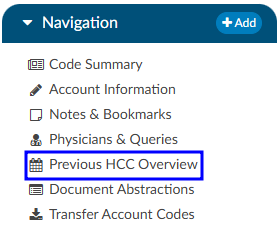
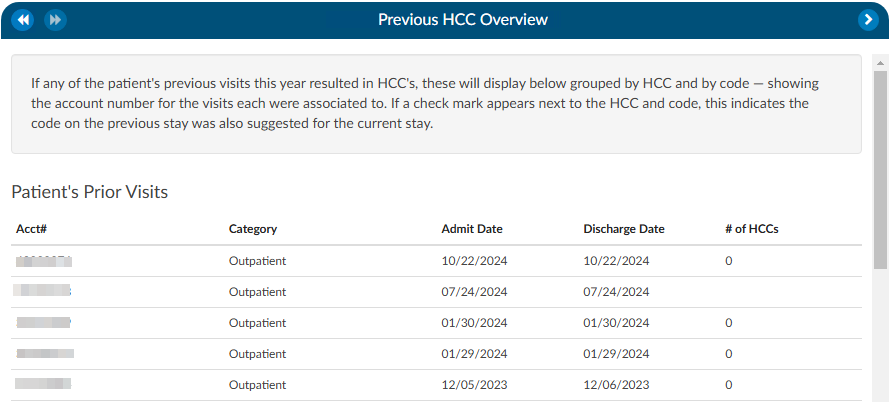
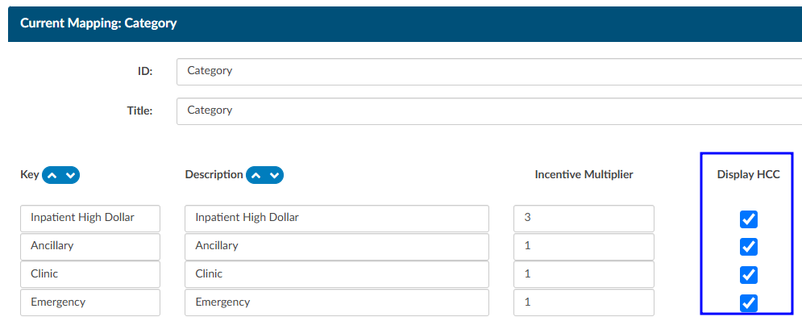

+++
title = 'Previous HCC'
weight = 30
+++

{}

The Previous HCC Overview will display the HCC history to show for both the current and prior year. When HCCs are enabled, these will display grouped by HCC category and by code — showing the account number and MRN for the visits each were associated to. 

If a check mark appears next to the HCC category and code, this indicates the code on the previous stay was also suggested for the current stay. If the patient chart currently being coded has codes that result in HCCs once they are added to the assigned code tree the code will display with an ‘H’ next to the code. By hovering over the ‘H’ icon, the HCC category will display.

It is recommended to turn HCCs on for all patient types to capture a more complete picture of HCCs. HCCs will be collected once HCCs have been enabled in the mapping table. To enable HCCs, check the box in the Category mapping table.

As a reminder, this will not capture data prior to turning this feature on in the mapping table.