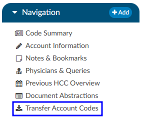
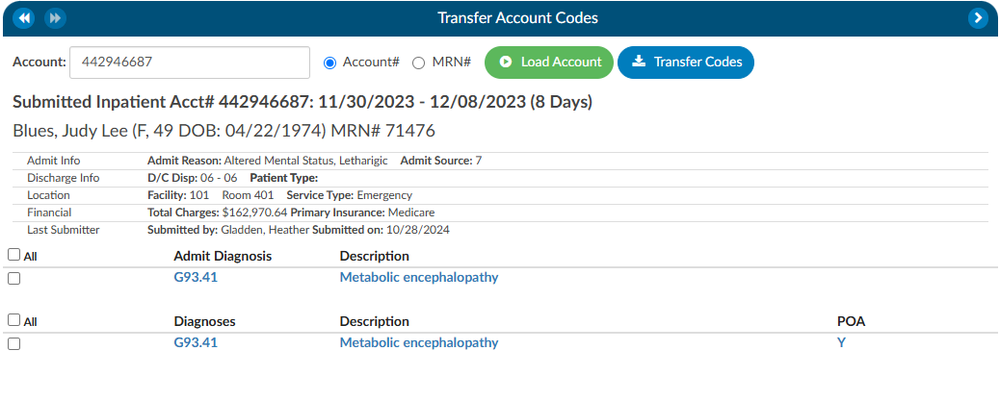

+++
title = 'Transfer Account Codes'
weight = 31
+++

Transfer codes can be used to help combine account codes into one encounter. Most sites leverage the ADT to combine the actual account, however, there are times it is necessary to copy codes from one encounter to another.

If a patient has two different accounts and the coder has already done work on each of the accounts, the Transfer Codes feature can be an easy way to post codes  when you’re within one account and want to search in another account, and have the ability to open that other account and see the codes. 

To transfer codes, type in the account number, then click load account.  Once the account is loaded, use the check boxes to the left of the codes to choose which codes will transfer. Once the needed codes , select “Transfer Codes” and the codes you selected will be added to the “assigned code” tree that is on the current account. The Account number and MRN number show with radio buttons.  When a user clicks on the MRN radio button, the MRN of that opened account will default in.
