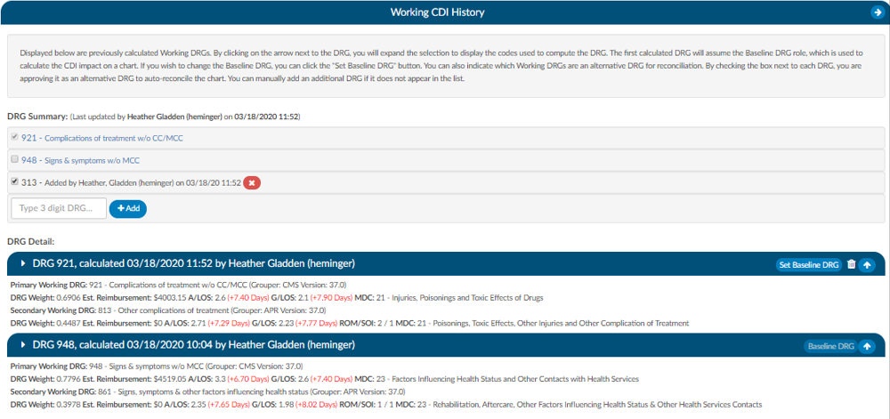
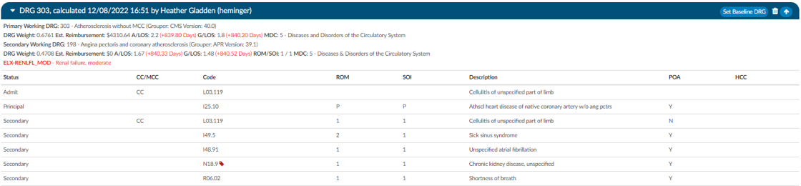

+++
title = 'Working CDI History'
weight = 25
+++

The working CDI History can be used to look at historical working DRG calculations. The coders cannot edit this information, but they can review the data.

The first calculated DRG will assume the Baseline DRG role, which is used to calculate the CDI impact on a chart. Users wishing to change the Baseline DRG, can click the "Set Baseline DRG" button. 

Users can also indicate which Working DRGs are an alternative DRG for reconciliation. By checking the box next to each DRG, users are approving it as an alternative DRG to auto-reconcile the chart. Users can manually add an additional DRG if it does not appear in the list.

Clicking on the arrow prior to the DRG information will expand the selection to display the codes that went into the DRG and the sequence. Any codes with a plus sign indicates the code has not been added to the account. The plus sign does not indicate that the codes needs to be added. It simply allows the user to quickly add the code if they have determined it is vaild using their coding judgment and supporting documentation. If applicable, the code’s HCC designation will show the HCC number and its version.

