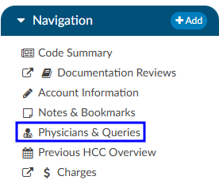
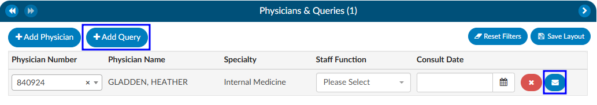
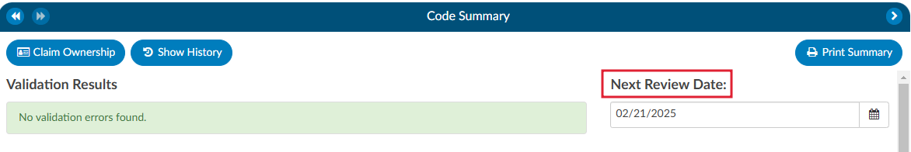
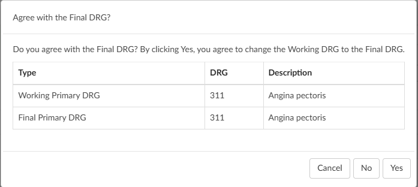

+++
title = 'CDI Reviews'
weight = 10
+++

Statistics can be tracked using the CDI Personal Dashboard. The CDI Dashboard includes data for Today and This Week only, and data is based on the current week. This also provides the CDI Specialist (CDS) with DRG and reconciliation data.

## Initial Review

An initial review is a case that has never been reviewed by a CDS in Fusion CAC. A CDI review for inpatient charts must have a working DRG associated to be considered "reviewed". If there is no DRG then the patient is considered new.

When a CDS creates a [Baseline DRG](https://dolbeysystems.github.io/fusion-cac-web-docs/cdi-user-guide/baseline-drg/) (the first Working DRG), edits the account - causing the Working DRG to be cleared - and saves the account without computing a new Working DRG, the Baseline DRG creation also counts as an initial review.

The CDS will review the patient chart documentation and assign any codes necessary to calculate a working and/or [baseline DRG](https://dolbeysystems.github.io/fusion-cac-web-docs/cdi-user-guide/baseline-drg/). The CDS may see more codes than are necessary to calculate the DRG(s). Codes displayed on the chart are all the suggested diagnosis and procedures codes to provide a better picture of how coding would look at this chart. Any codes that are not needed for calculation of the DRG can be ignored. 

>[!Note] 
>The **system does not take the place of a Coder**; this is the computer’s best guess at how Coders would have coded the chart

While reviewing, if the CDS has notes they wish to add to the chart they can add an ‘Initial CDI Worksheet’. The CDS worksheet can be customized per organizational needs and preferences. This section outlines the initial default worksheet *prior* to customization.

The CDI worksheet *can* include any notes that are needed such as:

- Medical History
- Labs/Procedures
- Medications
- Clinical Indicators

## Creating a Query

If a physician query opportunity is identified during an intiail review or any subsequent reviews, the CDS should query the physician by sending an electronic query through the [Physicians & Queries](https://dolbeysystems.github.io/fusion-cac-web-docs/general-user-guide/account-screen/account-viewers/physicians-and-queries/) viewer in the [Navigation](http://localhost:1313/fusion-cac-web-docs/general-user-guide/account-screen/) tree. 

In the [Physicians & Queries](https://dolbeysystems.github.io/fusion-cac-web-docs/general-user-guide/account-screen/account-viewers/physicians-and-queries/) viewer, if the provider the user wants to query is listed on the page they can click on the **BLUE ENVELOPE** icon. If the provider is not listed, they should click on the {}+Add Query{} button. Either option will take the user to the same place; however selecting "+Add Query" requires the user to manually enter in the provider they wish to query. 

### Query Components:

- **Physician** - Search for the desired physician using either the physican's last name or physican number.
- **Template** - Select the appropriate query template from the dropdown list.
- **Reason(s)** - Choose the appropriate reason(s) for sending the query.
- **Query Body** - Fill out the selected query template as needed.
- **Finalize** - Once completed, click the {}Send to Physician{} button to send the query to the physician.

>[!Info] 
>Finalizing a query may differ between organizations. Be sure to check with your {} supervisor for best practices observed by your facility. 

## Follow-up

A CDI follow-up review is a case that has already been reviewed at least once by a CDS within Fusion CAC. A CDI review for inpatient charts *must* have a working DRG associated to be considered reviewed. If no DRG then the patient is considered new. A follow-up review is a subsequent review of the first. The default interval for review is every 24hrs until the patient is discharged; however, CDI staff can override this interval by changing the next review date on the [Code Summary](https://dolbeysystems.github.io/fusion-cac-web-docs/general-user-guide/account-screen/account-viewers/code-summary/) viewer.

A CDI user can change the interval that the chart is routed back to a queue. Changing the calendar date in the "Next Review Date" field to a future date will tell the chart to not route back to the “Follow-up Review” queue until the current calendar date matches the date selected by the user. A CDS can complete as many follow-up reviews as needed.

## Reconciliation

After discharge, the Coder will assign a Final DRG. How the organization has choosen to set up workflow will determine what happens after the Coder clicks the {}Submit{} button. Commonly, organizations choose for charts to flow into a reconciliation queue for a CDI team member to review if the last known working DRG and the final DRG do not match. When the Coder clicks on the {}Submit{} button, the chart is either:
* sent outbound and goes to the reconciliation queue. If the Coding DRG needs changed it will need to be resubmitted; OR
* is **NOT** sent outbound until CDI reviews the chart and reconciles. 

>[!Note]Reconciliation Options
There are other options that can occur for reconciliation when a Coder submits an account; however, these are the two most common workflow paths. 

In the event the DRGs do not match, the CDS will see an active {}Reconcile{} button instead of the usual grayed out {}Submit{} button.

Clicking on the {}Reconcile{} button will bring up a window displaying the DRG difference.

From here the CDS has 3 options:

* **Cancel** will take the user back to the account screen where they can make any coding adjustments or send a Physician Query.
* **No** will result in the account being closed and the CDS willbe taken back to the Account List. *The user has not agreed with the code.* 
* **Yes** will result in the Working DRG being automatically changed to match the Final DRG. The account will close and the CDS will be taken back to the Account List.

>[!Note] Outpatient CDI
>Organizations with users performing CDI on outpatient charts will meet with the Dolbey SME Team to set up outpatient specific workflow for their CDI team.

## Receiving Credit for Reviews

| Review Type               | Details |
| ------------------------- | ------- |
| **Initial Review**        | For Inpatient charts, this is the first time a Working DRG is computed and saved on a chart by a user with the role of CDI. For outpatient charts, this is the first time a chart is opened and saved by a user with the role of CDI.
| **Follow-up Review**      | For inpatient charts, each time a chart is accessed after the initial review, a Working DRG is calculated and saved by a user with the CDI role. However, each chart is only counted once per day. For outpatient charts, the count is recorded the first time a chart is opened and saved by a CDI user, with each chart also being counted only once per day.|
| **Reconciliation**        | Reconciliation can only happen one (1) time per chart, so passing the account back and forth does not count. |
| **Query Completion**      | This is counted as a Subsequent or Follow-up Review. |
| **Documentation Reviews** | If your site conducts different types of CDI reviews or needs to track management reporting in a customized way, there are reports available for documentation reviews that differ from our default tracking. You can use the [Documentation Review Viewer](https://dolbeysystems.github.io/fusion-cac-web-docs/general-user-guide/account-screen/account-viewers/documenation-reviews/) to monitor reviews by topic. Other organizations have utilized this tool when their CDI team conducts utilization management-style reviews that do not fit the standard initial or follow-up review process. |

### Documentation Reviews

If an organization does different styles of CDI reviews, or want to track management reporting different than default tracking, the [Documentation Reviews](https://dolbeysystems.github.io/fusion-cac-web-docs/general-user-guide/account-screen/account-viewers/documenation-reviews/) viewer can be used to track reviews by topic. Organizations have used this if the CDI team would like to do a utilization management type review and it doesn’t fit the typical initial or follow-up review. 

By default, documentation reviews have a free form text field. Organizations can also create forms within the [Worksheet Designer](https://dolbeysystems.github.io/fusion-cac-web-docs/administrative-user-guide/tools/worksheet-designer/) for each of these reviews.

Custom management reports are built into the application to report out on specific reviews. The CDI Management and CDI Personal Dashboard will also change to accommodate these custom reviews. Organizations that do not have documentation reviews enabled will have custom review content hidden as it is not appliable. 

If an organization does not have documentation reviews enabled and they wish to track reviews differently, they should contact the Dolbey SME Team (smeteam@dolbey.com) for a demonstration.
