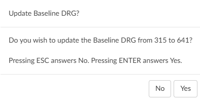

+++
title = 'Baseline DRG'
weight = 70
+++

The baseline DRG is used for reporting CDI program impact. 

>[!Note] Not Used By All Organizations 
>This reporting style may not be used by all organizations; however, the Fusion CAC system accommodates for it should an organization choose to use it. Users should speak with their {} management team if there are questions about how their facility tracks impact. 

The Baseline DRG is defined as the DRG that would have been coded and billed if no CDI specialist reviewed the chart. Organizations can report the impact of a CDI specialist by measuring the difference between the Baseline DRG and the Final Billed DRG.

There are two seperate styles of impact that can be reported:

1. **Chart Impact** - postivie, negative, or neutral
2. **Query Impact** - can be positive regardless of chart impact

Fusion CAC measures impact on the last known Working *and* Final DRGs, readjusting as needed, to accurately track impact throughout the patient stay.

While Baseline DRG may seem like a simple concept, it can at times be difficult to determine. Here is
an example:

1.  A patient is admitted through the ER after presenting with *undiagnosed abdominal pain*, which
would result in {} with an estimated reimbursed of {}.
2. After further testing, it is revealed that the abdominal pain is the result of *acute cholecystitis*; this
changes the {} (disorders of the biliary tract **without complication**) with an estimated
reimbursement of {}.
3. CDI documents an increased creatinine and a decreased glomerular filtration rate and queries
the physician regarding the patient’s renal status. If the doctor provides proper documentation,
it could be possible to assign a code indicating a *complication for Stage IV chronic kidney disease*, which would
result in {} (disorders of the biliary tract **with CC**) with an estimated reimbursement of {}.
4. The patient undergoes a *laparoscopic cholecystectomy*, changing the DRG to {} (laparoscopic
cholecystectomy with CC) with an estimated reimbursement of {}.
5. Next, the patient develops shortness of breath, and the consulting cardiologist documents
*acute-on-chronic congestive heart failure*, changing the DRG to {} (laparoscopic
cholecystectomy **with MCC**) with an estimated reimbursement of {}.

In the example above, the Baselin DRG of {}, which is the first listed, would be readjusted to {} once the patient goes to surgery. If the patient had not undergone surgery the Baseline DRG would have remained {}. This would be the **Chart Impact**: Difference between Baseline DRG {} and Final DRG {} = **$0**. 

Because CDI queries are counted separately, the CDI Impact would not be lost. This would be the **Query Impact**: Difference between {} and {} = **$2,289**

The above is how *some* organizations choose to do report impact.

### Baseline DRG Reminder

To remind the user that the Baseline DRG may need to be updated, a feature can be enabled to display a message when a CDI user saves a chart.

Dolbey recommeneds to only move the Baseline DRG when it needs adjusted, such as a patient going in for surgery. Constantly updating the Baseline DRG will result in little to no impact.

