+++
title = 'CDI/Clinical Alerts'
weight = 50
+++

The software has a feature called CDI/Clinical Alerts which are automated messages generated by the software
that can be used to prioritize CDI workflow. CDI/Clinical Alerts are used to detect potential inaccuracies,
inconsistencies, and/or discrepancies in clinical documentation. These Alerts help CDI teams to prioritize
the charts based on potential query opportunities available.

The software provides real-time Alerts when potential query opportunities are identified. Which will
then allow CDI staff to prioritize charts based upon those potential opportunities.

## What is a CDI/Clinical Alerts Topic?

CDI/Clinical Alert Topics are the diagnosis that is being targeted by the Alert. The Topic encompasses a broad
range of diagnoses that address various issues being targeted by the system. These diagnoses then
branch out into more specific types known as Alerts. These are based on the type of issue being
targeted.

## What is a CDI/Clinical Alerts Message?

The Alert message is a specific message that details what is missing, incomplete, and/or inaccurate
documentation that is missing with the Diagnosis/Topic that is being targeted.

## CDI/Clinical Alerts Types

CDI/Clinical Alerts branch out into four (4) types of Alerts.

| Alert Type                                      | Description |
| ----------------------------------------------- | ----------- |
| No Documentation but, Clinical Indicators   | This Alert type is when the provider did not document a diagnosis but, there are clinical indicators that support “Possible Diagnosis”.|
| Documentation but lack of Clinical Indicators   | This is where the provider documented the diagnosis but there is a lack of clinical indicators that support the diagnosis. *For example, Sepsis was documented by the provider but it's not supported by clinical indicators.* This Alert helps to ensure that diagnoses are audit proof, ensuring that the supporting evidence required for a proper diagnosis validation is present within the patient's chart. |
| Documentation but Not Fully Specified           | This is where the provider documented a diagnosis but, it was not documented to its full specificity. *For example, Heart Failure Unspecified: the diagnosis is not documented to the full specificity.* This CDI/Clinical Alert is helpful for ensuring that diagnoses are documented to their full extent in order to combat denials. |
| Conflicting Diagnosis                           | This alert detects instances where two or more fully specified versions of a diagnosis may conflict. *For example, if one provider documents Acute Diastolic Heart Failure in one section of a patient’s record, while another records Acute on Chronic Systolic Heart Failure elsewhere, the alert flags the discrepancy.* By ensuring diagnostic consistency, this alert helps maintain an accurate clinical picture, enabling all care providers to deliver the best possible care. |

> [!info] Additional Configuration Required
In order to set up CDI/Clinical Alerts, reach out to the SME Team (smeteam@dolbey.com) for
assistance. There is a module that must be deployed in conjunction with set up within the workflow
management editor.

## Viewing CDI/Clinical Alerts

To access and view CDI/Clinical Alerts within a patient's chart, locate them in the 
[Navigation](https://dolbeysystems.github.io/fusion-cac-web-docs/general-user-guide/account-screen/) tree and click on the "CDI/Clinical Alerts" viewer. This will make the viewer display in the middle of the screen. There is also a box with an arrow next to "CDI/Clinical Alerts" that will allow the user to pop-out the viewer in a different tab. Doing this gives the user the ability to move the tab to a different monitor, if desired. 

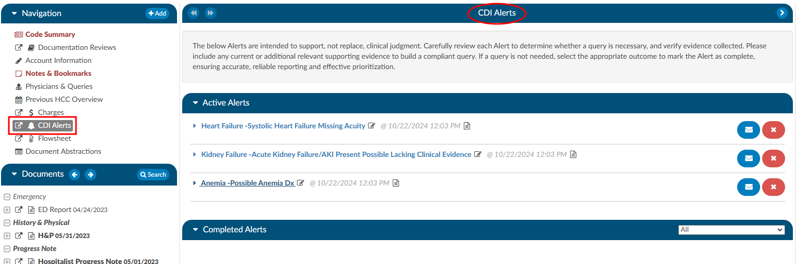

## Navigating the CDI/Clinical Alerts Viewer

In the CDI/Clinical Alerts viewer there are two headings in the dark blue bars which include:
1. [Active Alerts](#active-alerts)
2. [Completed Alerts](#completed-alerts) 

Clicking on either of these headings will expand or collapse the section. Within each section are the actual Alerts that were triggered for the current account that is opened.

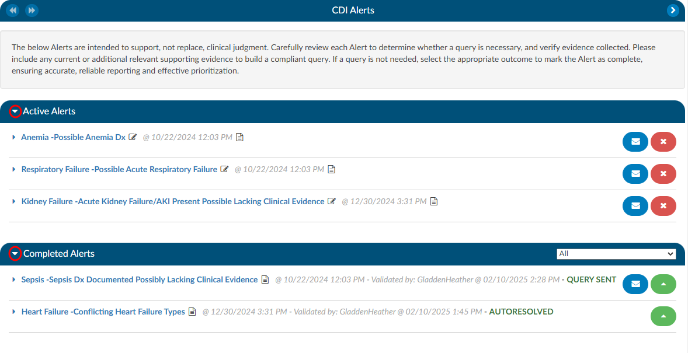

The Active Alerts heading bar also contains two buttons:

- **Add** - Manually adds a CDI/Clinical Alert to the account. See [Manually Adding a CDI/Clinical Alert](#manually-adding-a-cdiclinical-alert).
- **Close All** - Closes every active Alert on the account at once. See [Closing All Active Alerts](#closing-all-active-alerts).

### Active Alerts

The section “Active Alerts” are Alerts that the system found and no action has been taken to resolve them. 

There are three parts to an Alerts title to observe:
1. **Alert Topic** - This corresponds to a diagnosis.
2. **CDI/Clinical Alerts Message** - This is a brief description of what the system found to be missing, incomplete, or possibly inaccurate and corresponds to the Topic.
3. **Date and Time** - This is the date and time when the system found evidence for the alert to trigger. This information is tracked for reporting to see how quickly the system is triggering an alert.

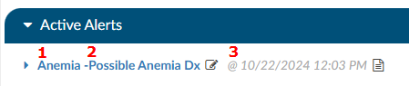

### Manually Adding a CDI/Clinical Alert

CDI Specialists can add a CDI/Clinical Alert to an account even when the system has not identified that topic. This allows the CDS to gather evidence in the Alert and carry it into a query, rather than copying and pasting information manually.

To add an Alert, click the {}Add{} button next to the Active Alerts heading and select a topic from the list. The topics available are set up by your organization.

A manually added Alert displays **Manually added** beside its name, along with a person-and-plus icon.

If the system later identifies the same topic on the account, it creates a separate automated Alert. The automated Alert may include additional evidence and subcategory information.

To remove a manually added Alert that was added in error, close it using the **Created by Accident** reason. See [Manual CDI Alert Closure Reasons](#manual-cdi-alert-closure-reasons).

> [!info] Additional Configuration Required
> Please contact Support to enable this feature. Once enabled, the list of topics available to add is managed in [Mapping Configuration](https://dolbeysystems.github.io/fusion-cac-web-docs/administrative-user-guide/tools/mapping-configuration/#cdiclinical-alert-topics-cdialerttopicheaders).

### Completed Alerts

The section “Completed Alerts” are Alerts that have been closed in one of the following manners:
1. Auto-Resolve by the system
2. CDS initiates a query
3. CDS clicks on the **RED X ** next to the Alert
4. CDS clicks the **Close All** button in the Active Alerts heading
 
When choosing to close the Alert, the CDS will be presented with a "Close Alert" dialog box to select why they are closing the alert.

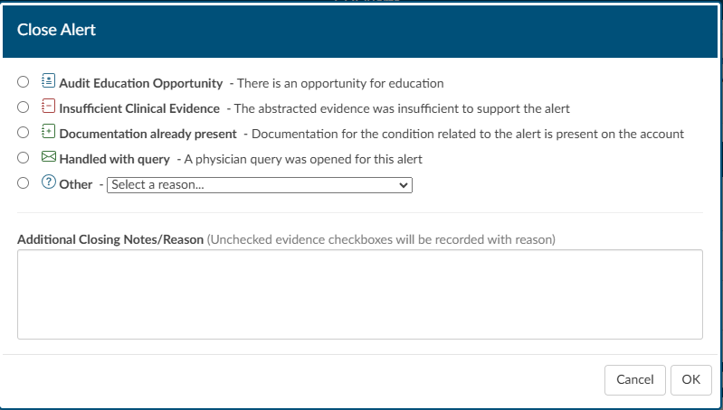

The date and time stamp in the title of the Alert will indicate when the Alert was closed, and by whom. The title will also display text that depicts how the Alert was closed. 

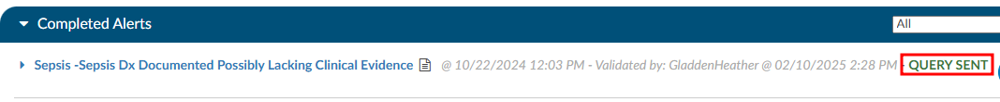

### CDI/Clinical Alerts Notes

Next to each of the Alerts in either the Active or Completed Alerts section is a paper icon.

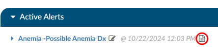

When clicked, this icon will launch a notes page. This can be used by a CDS to leave a note if they do not feel the Alert currently has enough evidence to build a query, but also shouldn't be ruled out as it could trend towards the diagnosis alerted. Once a note is typed in it will leave the date and time as well as the CDS name so if another CDS enters the chart, they will be able to clearly see who chose to monitor the Alert at this time and why.

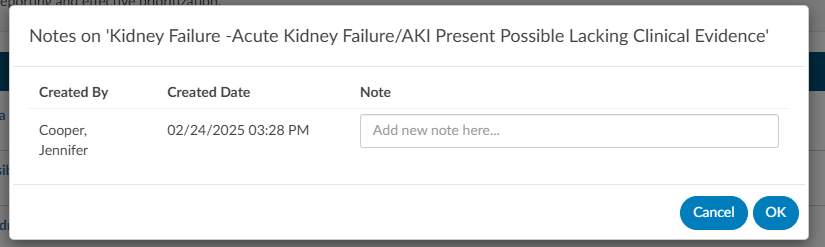

Upon adding the note the paper icon will turn **RED  **, notifying the next user that is reviewing the CDI Alerts that there is a note present on the Alert.

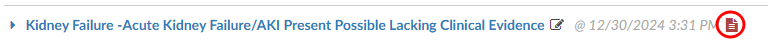

### CDI/Clinical Alerts Editor Function

Adjacent to the Alert message, there is a pencil icon. Clicking it opens the Evidence Editor, where the CDS can rearrange evidence using drag and drop to match their querying needs.

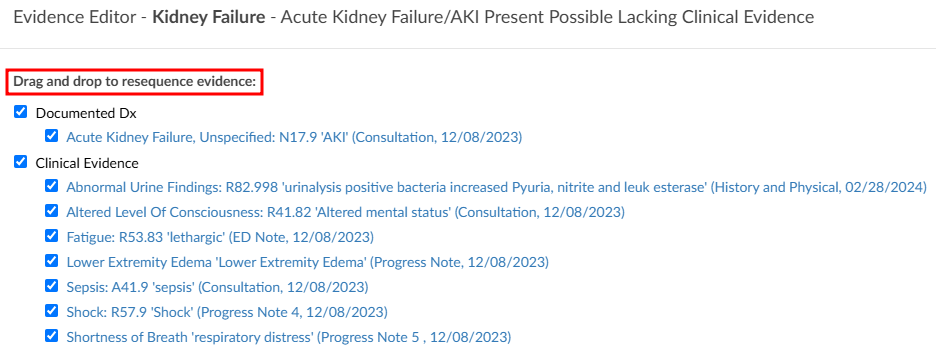

**Adding subheadings:** Evidence is organized under subheadings such as Clinical Evidence, Laboratory Studies, and Vital Signs. If a needed subheading is not shown, click {}Add{} in the Evidence Editor and select it from the list. Once added, the subheading can be dragged to a new position, and evidence can be moved into it or added to it from an abstraction, discrete value, or medication.

> [!info] Additional Configuration Required
> Please contact Support to enable adding subheadings. Once enabled, the list of subheadings available to add is managed in [Mapping Configuration](https://dolbeysystems.github.io/fusion-cac-web-docs/administrative-user-guide/tools/mapping-configuration/#cdiclinical-alert-subheadings-cdialerttopicsubheaders).

Alert topic names cannot be edited in the Evidence Editor.

### Reviewing Clinical Evidence

Each CDI/Clinical Alert contains clinical evidence extracted from the patient's chart. There are four different
types of evidence that can be extracted. 
1. Words and phrases within documentation such as signs and symptoms, and medications. 
2. Value abstractions from the documentation such as vital signs or laboratory findings within physical documents. 
3. Code abstractions from documentation.
4. Discrete values such as laboratory studies and vital signs found in the flowsheets, medications from the medication viewer and other flowsheet data. 

The evidence in the Alerts are linked to documents within the patient's chart, via a blue hyperlink, ensuring that the CDS directly connects to the relevant document associated with the Alert. This feature is especially useful for referencing specific documents that may be crucial to a particular Alert. The evidence is systematically categorized into sections such as Laboratory Studies, Clinical Evidence, Vital Signs, and Intake & Output Data.

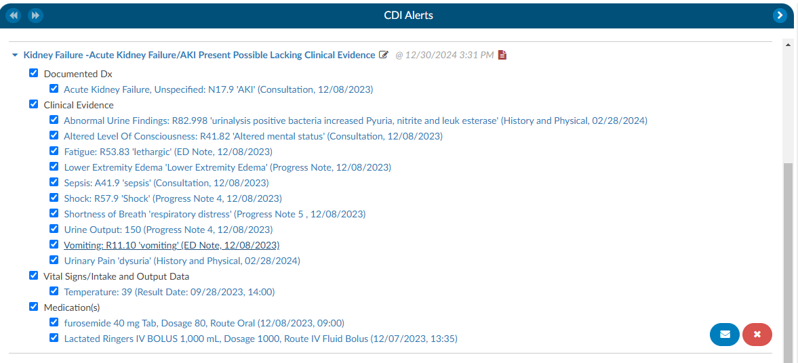

After the abstraction process, there will be words or phrases in quotes—these represent the terms the engine identified within the documentation or values. If the data is derived from a document, the document name and date are displayed; if obtained from flowsheets, the result date and time are shown.

For medication discrete abstraction, key details such as the medication name, dosage, route, and administration date and time are presented, ensuring essential context is provided.

When selecting evidence with a document type and date, a hyperlink will direct the CDS to the exact location in the document where the abstraction was found, with the relevant text highlighted in yellow. Additionally, there will be green highlights within the documentation, marking abstractions specific to CDI/Clinical Alerts. These function similarly to code abstractions but are tailored for CDI rules.

Hovering over a green-highlighted abstraction will display which Alert the evidence is associated with, especially when multiple Alerts are present.

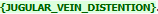

When clicking on a hyperlinked evidence that is followed by result date and time, indicating a discrete
value abstracted from the flowsheets, it will automatically take the CDS to the corresponding location in the
flowsheets and highlight the respective row.

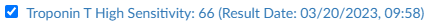

Another noteworthy capability within Clinical Evidence is the ease with which a CDS can incorporate
additional evidence. While reviewing documentation and flowsheets, if a CDS identifies items deemed
crucial for inclusion in the CDI/Clinical Alerts as supporting evidence for a query, they can effortlessly highlight
words or phrases in a document, up to a maximum of 1000 characters, and perform a right-click. This
action triggers a menu presenting various options, including one that reads "Copy to CDI Alert." Clicking
on this option reveals a pop-out menu displaying available Alerts to which the evidence can be added.

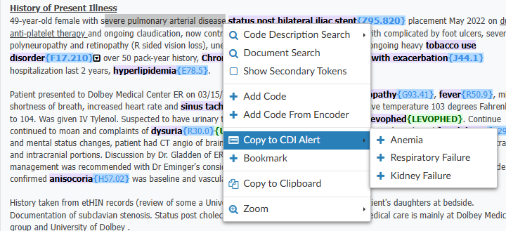

Upon selecting the desired Alert, the system opens the [Evidence Editor](#cdiclinical-alerts-editor-function), allowing the CDS to specify
where the evidence should be attached. If the CDS clicks on existing evidence, the new evidence will be
attached below it. Once the evidence is copied over, the system provides details such as the evidence itself, the name of the document, and the date. For Laboratory Studies, it includes the result date and time.

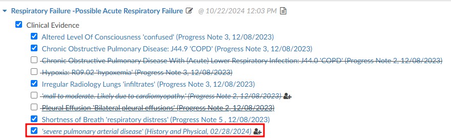

After incorporating the evidence into the designated alert, any highlighted evidence will be displayed in
the document in purple, accompanied by the phrase "MANUALLY_ADDED" in green at the end. This
informs the user that the evidence was added manually. Similar to other evidence, hovering over the
green-highlighted section will provide information about the CDI/Clinical Alert to which the item was applied.

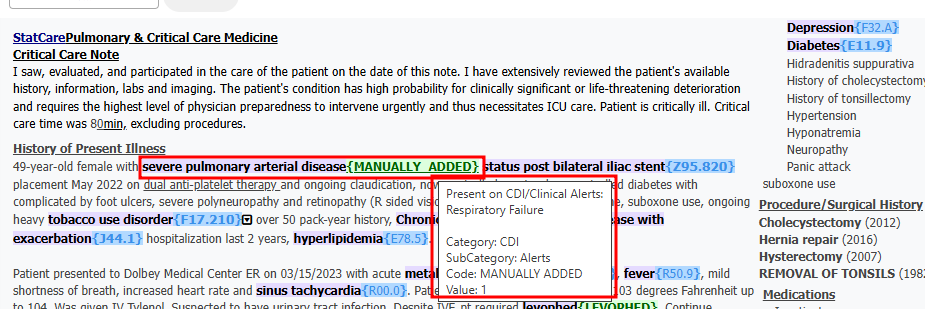

When going back to the CDI/Clinical Alerts viewer there will be check boxes present next to the evidence
which serves two purposes. First, when a query is initiated, any evidence marked with a check mark will
be automatically copied to the clipboard allowing the CDS to conveniently paste the evidence into the query. This
copying action occurs when clicking on the **BLUE ENVELOPE** icon.

Second, unchecking any of the clinical evidence will put a strike through the text and it will prevent it
from being copied over. Additionally, any unchecked evidence will be reported back to Dolbey's Clinical
Team if an Alert is closed due to it having invalid clinical indicator, insufficient clinical evidence, or
documentation is already present.

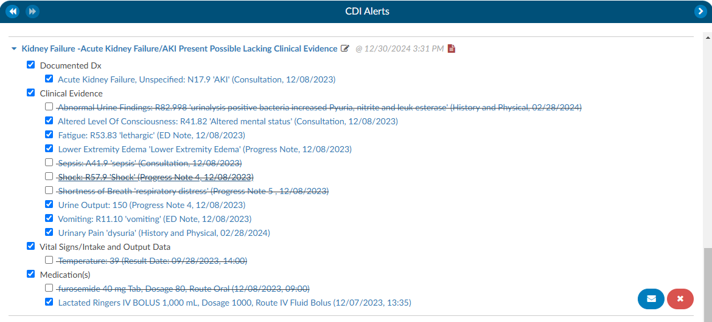

### How to initiate a Query

In the right-hand corner of the Alert is a **BLUE ENVELOPE** icon next to a **RED X ** icon. Clicking on the **BLUE ENVELOPE** will launch the CDS into a query template.

#### Query

A query template will autoload for the specific Alert that is being queried. These templates can be set by the management staff specific to each organization.

The evidence previously examined on the Alerts viewer page can now be effortlessly incorporated into
the query. When the query button is pressed, the selected evidence will be automatically copied to the
clipboard. This can be pasted using a simple process, either by pressing the "ctrl" and "v" keys, the
standard Windows keyboard shortcut for pasting, or by performing a right-click and choosing the paste
option. After the query is submitted, the corresponding CDI/Clinical Alert will transition from the Active Alerts
section to the Completed Alerts section.

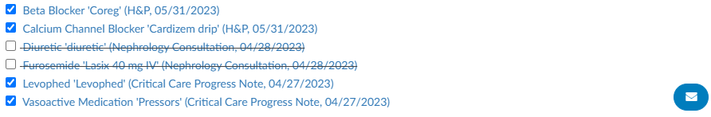

If a query created from an Alert is later cancelled, the Alert is no longer linked to that query. To send a new query, click the **BLUE ENVELOPE** icon on the completed Alert. A new, blank query opens, and the new query is linked to the Alert so its impact is assigned correctly.

## Autoresolve

The Alerts have the ability to autoresolve themselves if documentation comes in that would satisfy the
Alert. Once an Alert is Autoresolved it will move to the Completed Alert section. This will ensure that only Alerts that require attention are active for the CDS. 

## Closing Alerts without Querying

If it is determined that an Alert can be closed without initiating a query, a CDS can click on the **RED X ** and the CDS will be presented with a "Close Alert" dialog box to select why they are closing the alert (see the [Completed Alerts](#completed-alerts) section of this page). 

## Closing All Active Alerts

When a chart is fully optimized and no further CDI action is needed, all active Alerts can be closed at once.

1. Click the {}Close All{} button at the right side of the Active Alerts heading.
2. A confirmation message explains that all Alerts will be closed as **Chart Optimized**, meaning they are working as intended and do not need tuning review.
3. Click **OK to Close All** to close the Alerts, or click **Cancel** to return to the viewer.

If any Alert is not working as intended, click **Cancel** and close that Alert individually with the appropriate reason. Closing each Alert with an accurate reason helps Dolbey's tuning team.

Closed Alerts move to the Completed Alerts section and display **CHART OPTIMIZED** next to the date, time, and user who closed them.

## Best Practices for Closing CDI/Clinical Alerts

The goal of this process is to ensure that end users provide actionable feedback directly within the CDI Alerts viewer. This helps streamline communication, create a consistent feedback loop, and provide a clear picture of system performance.

**When reviewing an alert, the user should:**

- Assess the clinical evidence included in the alert.

- Uncheck any inaccurate markers before closing the alert.

- Select the appropriate closure reason from the list below.

**End users have two ways to provide feedback on an alert:**

1. Close a CDI Alert, or

2. Issue a Query.

### Manual CDI Alert Closure Reasons

**Clinical Audit Education Opportunity:**

Indicates an opportunity for education when a CDI Specialist closes an alert as “Insufficient” but should have instead issued a query. Managers can click the green “Reopen” button, reopen the case, and update the closure reason to “Education”.

> [!info] Important
> This closure reason is for Managers only. CDI Specialists should not select this option.

**Insufficient Clinical Evidence:**

Indicates the abstracted clinical evidence is not sufficient to support the alert. In your opinion, the evidence does not justify the alert and it should not have triggered. The method of closure helps the tuning team identify alerts that may need refinement to improve accuracy.

Example: A patient chart triggers a bleeding alert because the patient is on anticoagulation therapy. However, the medication is being used to treat atrial fibrillation (Afib), not active bleeding. In this case, select Insufficient Clinical Evidence and include a short comment explaining why.

**Documentation Already Present:**

To be used when the diagnosis is already documented in the chart, whether or not it has a corresponding code. This method identifies cases where tuning or auto-resolution processes may need optimization.

Example(s):

1. The diagnosis is documented and coded, but the alert failed to auto-resolve.
2. The specialist manually adds the code, indicating that the system’s tuning logic may need adjustment.

**Handled with Query:**

For when a physician query was placed before the alert was reviewed to indicate the alert correctly identified a valid issue, but it was already being addressed. This type of closure confirms that the alert was accurate, but action was taken independently.

Example: The CDI specialist noticed the same clinical concern and issued a query before the alert triggered.

When **Handled with Query** is selected, an **Associated Query** dropdown appears. Select the query that was sent for this Alert. Each query in the list shows its date and time, query template, physician name, and, when applicable, the Query For value. If the query has not been created yet, select **Create New Query**. A query must be selected before the Alert can be closed.

**Other:**

Used when the alert is closed for reasons unrelated to its accuracy or CDI performance. The below can be customized in the mapping table thus your organization may have different or additional options than shown below. This closure method should be used when the chart no longer requires a query or the reason does not fall into one of the previous categories.

Dropdown Options:

- *Alert Triggered but Queried for a Different Clinical Condition* - Use when the alert led to identifying and querying for a different condition.

- *Chart Optimized for the Billing DRG* - Use when the alert was correct, but the chart is already optimized and no query is necessary.

- *Coding Guidance Prohibits Coding of the Condition* - Use when the alert triggered from data that cannot be coded due to coding rules or exclusions.

- *Condition or Diagnosis Is a Tuning Concern* - Use when the alert triggered incorrectly because of an abstracting or coding error.

**Created by Accident:**

Available only for manually added Alerts. Use this reason to remove an Alert that was added in error.

> [!info] Note
> The Insufficient Clinical Evidence, Documentation Already Present, and Other reasons are not available for manually added Alerts.

**Adding Comments:**

Comments are optional, but encouraged. Users can add free-text comments when closing an alert to provide context for why the alert was closed. These comments help Dolbey’s development and tuning teams understand user perspectives and identify patterns or potential system improvements.