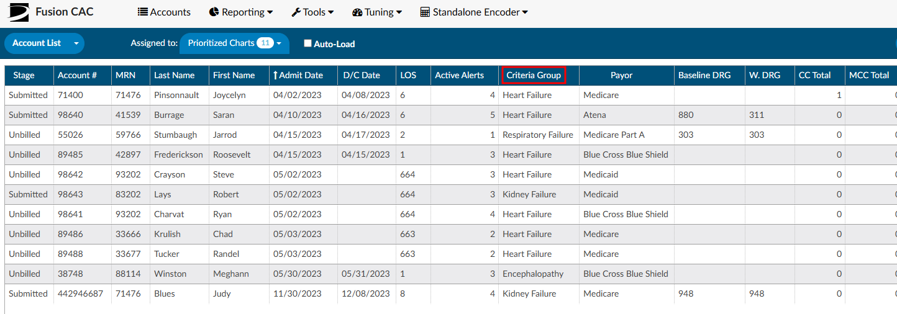

+++
title = 'Chart Prioritization'
weight = 50
+++

Once CDI/Clinical Alerts are enabled, within the workgroup there is a column named “Criteria
Group”. The name of this field may vary depending on the organization's setup. If it is not visible, review [Grid Column Configuration](https://dolbeysystems.github.io/fusion-cac-web-docs/administrative-user-guide/tools/grid-column-configuration/) to determine whether it is displayed or labeled differently.

These criteria groups identify potential query opportunities based on algorithmic analysis. Once the algorithms meet the necessary criteria to trigger a CDI Alert, the alert is matched within the workflow. If it is the only alert present, it will be displayed as the “Criteria Group.”

In cases where multiple Alerts match during workflow execution, the displayed Criteria Group name will
be determined by the hierarchical list. This hierarchical list is established by an organization's management team
using the workflow management editor. The management team has the ability to rearrange the order of
the Alerts based on priority and initiatives at each organization, ensuring the Alerts are organized from
highest to lowest priority.

There is also a second grid column called “Active Matched Criteria Groups”. This column will display the
actual number of active CDI/Clinical Alerts on each account, regardless of the Alert being matched to something first as it goes thorugh workflow list. This column represents the total number of “potential” query opportunities in a patient chart.

The columns “Criteria Group” and “Active Matched Criteria Groups” are available for prioritizing the worklist. Of these, “Active Matched Criteria Groups” is particularly valuable, as it helps focus efforts on charts that require the most significant improvement. Utilizing this column allows for more effective resource allocation and workflow prioritization.

It’s important to note that the only Alerts that affect the Priority Criteria Group name and number of
Active Matched Criteria Groups are Active Alerts. Once an Alert is closed it will not be used in these
columns for prioritization. This helps to make sure charts with the most priority are getting in
front of the CDI Team. As Alerts are closed these numbers will be updated in real time.