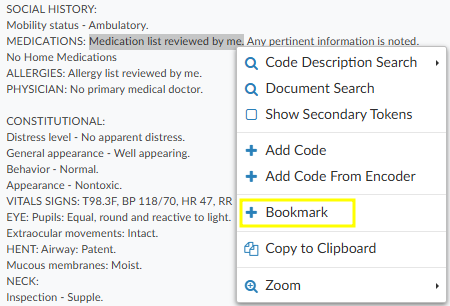

+++
title = 'Notes & Bookmarks'
weight = 22
+++

{}

The Notes & Bookmarks becomes visible in the center pane after clicking on the hyperlink from the [Navigation](https://dolbeysystems.github.io/fusion-cac-web-docs/general-user-guide/account-screen/#navigation-pane) tree.  This tree presents a summary and chronological history of all notes and bookmarks added to an account. Users can expand the width of the Code Summary tree by clicking on the arrow in the top right corner of the tree.

## Notes

Notes can be added to the patient chart by clicking on the +Add Note button within the Notes & Bookmarks viewer. 

When notes or bookmarks are applied to the chart, the Notes and Bookmarks link in the [Navigation](https://dolbeysystems.github.io/fusion-cac-web-docs/general-user-guide/account-screen/#navigation-pane) tree will turn red.  

Account Notes also have formatting options for text. Highlighting the text displays a pop-up with formatting options. A user can now select text in those areas and can change the styles of text.

Users have the option to make notes publicly visible among all users by clicking on the checkbox. Even if an end user marks a note/bookmark as private, users with the role of administrator or manager can still see private comments. This feature allows for a manager to review a patient chart and if they do not want the existing public note to show in the account note, they can change an existing note to private without putting in a new note.  Then they have to make it public, then switch it to private in order to have the account note blank. 

To keep your Comment box open while continuing to work on the chart, click on the Minimize Editor button. This will move a placeholder to the Accounts Action Bar. 

 
 
## Bookmarks

Users can add a bookmark to a document by highlighting the relevant word(s), phrase or location within the text and then right-clicking to open the Bookmark menu. 

From the Bookmark menu, select Bookmark to open the Note window to add your note for this bookmark.
Add the note for your bookmark in the Note text box, then click the checkmark button   to save the bookmark with your note for future reference.  Bookmarks within documents will have the bookmark icon. To view bookmarks from within a document, click on the green icon to open and view the bookmark note.

To review all bookmarks within a chart, go to Notes & Bookmarks in the Navigation tree. All of the bookmarks within the chart are listed in the Notes & Bookmarks viewer.

The **RED X** button will delete the selected bookmark.
The **BLUE PENCIL** button is used to edit a previously added bookmark.
The **GREEN PAPER** button will jump to the location where the bookmark was created.
