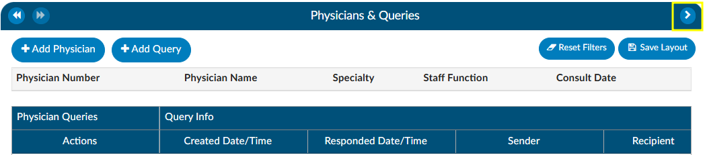
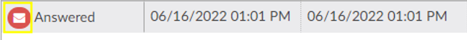

+++
title = 'Physicians & Queries'
weight = 23
+++


{}

Within this viewer users can add physicians and change the physician's staff function, if necessary. They can also intiaiate the physician query process in this viewer. Users can expand the width of the Physicians & Queries pane by clicking on the arrow in the top right corner of the pane.



## Adding/Editing Physicians

The are several fields that are pre-populated by the organization's registration system including "Physician Number", "Physician Name", "Specialty" and "Staff Function". Physicians can be added, changed, or removed if incorrect or missing. To add a physician, click on the {}+Add Physician{} button and begin typing in the physician’s last name to populate the correct physician. Choose the staff function that fits the chosen physician. If it is a consulting physician, also enter the consultation date. 


To remove a physician that either you added or was sent incorrectly from the registration system click on the **<span style="color:#a00">RED X </span>** button to remove the physician. 

## Querying a Physician

### Adding a Query

There are two ways to add a query to a physician that is listed. The first is to click on the **<span style="color:#0000FF">BLUE ENVELOPE</span>** icon next to the physician.


The second way is to click on {}+Add Query{}. This would also be how to query a physician that is not already listed.

When a physician is listed, the query will auto-populate the physician name. If a physician was not already listed, simply begin typing in the last name in the "Physician" field by entering two or more characters to find the correct physician name.

 If configured, users can see a cosigner field that allows assignment of a cosigner. The cosigner field is a field that can be sent in the outbound interface for the query. The receiving system can choose to use this process if the cosigner needs to receive the query after the main recipient answers, but before it gets returned to Fusion CAC.  When a physician query is created, a new "Cosigner" physician dropdown appears below the existing "Physician" dropdown. Filling in this field is optional. When the query is saved as a draft or sent outbound, the cosigner field will be saved with the query and sent as an additional recipient. In the grid inside the Physicians & Queries, the user may also choose to add "Cosigner" as a visible column.

 Continue through the query build by selecting the query template. 


Write the query or fill out the template details as needed. 


Once completed, select from the reason dropdown why the query is being sent, and above that field, check the box if the query will affect final coding.

>[!Note] Checkbox 
The checkbox "Check if physician's answer affects DRG or Fincal Coding" will not be visible to providers.

#### Query Impact Codes

Before sending the query, the user will see a {}Compute{} button below the template name.  When this is clicked, a Edit Query Impact Codes dialog box will open. Here, the user can add or remove assigned codes that should be associated with the DRG when they compute the Pre-DRG. Clicking on the {}Overwrite All Codes{} button will associate all of the assigned codes. Once the pre-query DRG is completed users will follow the standard process to [send the query](https://dolbeysystems.github.io/fusion-cac-web-docs/general-user-guide/account-screen/account-viewers/physicians-and-queries/#sending-a-query).


Prior to [closing a query](https://dolbeysystems.github.io/fusion-cac-web-docs/general-user-guide/account-screen/account-viewers/physicians-and-queries/#closing-a-query), when the query has been responded to, open the query to complete it by clicking the **<span style="color:#a00">RED ENVELOPE </span>** icon. Users will be able to compute a Post-DRG in order to capture impact. The previous DRG will auto-populate (unless the user added, deleted, or changed any codes, re-sequenced or changed the discharge disposition). If the Pre-DRG does not populate, it will need to be calculated again by clicking the {}Compute{} button next to the Pre-DRG. Users will now also see a {}Compute{} button for a Post-DRG below the template name. Users can minimize the query as needed to add, delete, or otherwise change any codes before clicking compute.


### Sending a Query

Click {}Send to Physician{} to complete the query and send it, or click {}Save Draft{} if the query is not ready to be sent. If the query is saved as a draft, a draft query section will appear that is separate from sent or closed queries. If a user has at least one draft, but no sent queries, the total drafts count on their personal dashboard will display as zero. 


 

Alternatively, for organizations who do not have a physician query interface **AND** do not create a physician query until a response is received, a query can be created and not sent.  When enabled, a physician query will show a {}Continue{} button in place of {}Send{}. Clicking {}Continue{} will refresh the query to open the physician response fields so that the query can then be closed.

### Editing a Sent Query

The physician the query was orginally sent to *can* be changed after sending the query by opening the query and clicking {}Change Physician{}. A dropdown will appear so the user can select the reason the physician needs to be changed. 


### Closing a Query 

To close a query—whether to review a response and update the outcome or to cancel it—simply click the **<span style="color:#a00">RED ENVELOPE</span>** icon. If a response from the provider is available, clicking the icon will open the query to display it.



 The user can then choose how to close the query using options in the screenshot below. 


### Query Response Show Diff

The physician query has a "Show Diff" toggle above physician query responses in the Physician Query dialog. Clicking it will show additional text in blue highlighting and deleted text in red highlighting. When the diff is shown, the button changes to "Hide Diff," which when clicked will show the unaltered response.


>[!Note] Diff Logic 
If your organization has an interface that imports the physicians response, the diff logic may report false positives and false negatives, like changes from double quotes to single quotes or the addition/deletion of blank lines.

Once a query is opened and responded (or the user is recording the response on behalf of the physician), the responding physician and the date/time of the response can be editied. If the organization is manually closing queries, this information ensures that the management reports reflect accurate turnaround times. 


If an organization has choosen to collect shift reasons, a dialog box will appear upon selecting an outcome for the query.

### Documenting Query Shift Reasons

Shift reasons can be categorized as either automatic or manual. If manual shift reasons are enabled, users will encounter a dialog box after closing a query.


 
 This dialog box will display the pre and post-query DRG (if applicable) along with options for shift reasons. These shift reasons can be chosen by the end user to explain the rationale behind the change in the DRG. It is important to note that changes in the DRG might occur for reasons unrelated to the query outcome. Please be aware that the shift reasons dialog is customizable, so each organization may offer different options than what is shown in the screenshot.

 >[!Note] Automatic vs Manual Shift Reasons
> The dialog box will only display if shift reasons are set to **manual**. Organizations looking to enable or disable the dialog box, should contact CAC Support (cacsupport@dolbey.com)

### Placeholder Queries

Some organizaitions create a physcian query within Fusion CAC and then copy and paste it into a different system rather then send them through an interface. Dolbey refers to this as a place holder query for reporting and transparencey. A feature can be enabled so that text entered into fields on the place holder query will no longer display in bold. To activate this option, please contact CAC Support (cacsupport@dolbey.com).

#### Quick Complete

The Quick Complete query feature is designed for sites that create placeholder queries **ONLY**.  This feature allows a user to log a query without sending it externally. The  user can assign a provider, template, reason, and both pre and post-DRG information along with closing the query with shift reasons all in one session. This quick complete feature aims to streamline these actions into a single, integrated process. This feature is **optional** and needs to be turned on. Contact CAC Support (cacsupport@dolbey.com) to enable this feature.

Once enabled, create a new physician query, and notice a new {}Quick Complete{} button in the footer. Clicking it will automatically save the query and reopen it with "Record Physician Response" expanded to record a physician's response. The {}Quick Complete{} button only appears on new queries, including queries opened from drafts. It will **not** appear if a query is edited or if a query's physician is changed.

### Query Status

The status of the query will display in the actions column on the query grid. The following are status options:

|Status    |Description                                                         |
|----------|--------------------------------------------------------------------|
|Open      | This query has been sent, but not yet responded to by the provider.|
|Answered  | This query has been sent and has received a response, but has yet to be closed by the end user.|
|Canceled | This query has been canceled by the end user. The status column will display the reason for the cancellation.|
|Closed    | This query has been closed by the end user. The status column will display the outcome of the query.|

>[!Note]Canceling Queries
> Not all organizations support canceling physician queries.  Redirected queries may still need to be canceled within the EHR. Consult your {}supervisor to learn if additional steps need to be taken to cancel a query.

### Per User Settings

This grid will display key details about the query, including the creator, recipient, creation date, reply status, and response timestamp. Columns can be reordered based on user preference. When moving around the columns in the Physician Queries grid and then clicking the {}Save Layout{} button, the columns and order will be saved for the Queries grid for all future accounts for that user.  Any other user will see the default layout.  Next to the Save Layout button is a {}Reset Filters{} button, this will take any custom layout and change it back to the default fields.  

If the organization chooses to use signatures when sending queries, automatic signatures can be addended to the query. Signatures can be editied within each [user's profile](https://dolbeysystems.github.io/fusion-cac-web-docs/administrative-user-guide/tools/user-management/).  


> [!note]
> Please refer to your {}supervisor for details as each organization has custom query templates and additional details surrounding queries.

## Calculating Query Impact

```
Query Impact = Pre-Query Working DRG Weight – Post-Query Working DRG Weight
```

Query impact is calculated using the Working DRG calculated within the same session in which the physician query was created. Once the physician replies to the query, the CDI will [close the query](https://dolbeysystems.github.io/fusion-cac-web-docs/general-user-guide/account-screen/account-viewers/physicians-and-queries/#closing-a-query). During the session the query was closed, the system will then capture the Working DRG that was calculated. A session is closed by saving the chart.

If a physician query shifts the assigned DRG, diagnosis, procedures, CC/MCC/HAC/ROM/SOI or Quality
metrics, the shift reason is automatically calculated by the system. The shift reason is captured by looking at the difference between the last Working DRG and the current Working DRG as well as the Code Sets difference in the most current Working DRG. Code sets will be automatically captured for reporting.