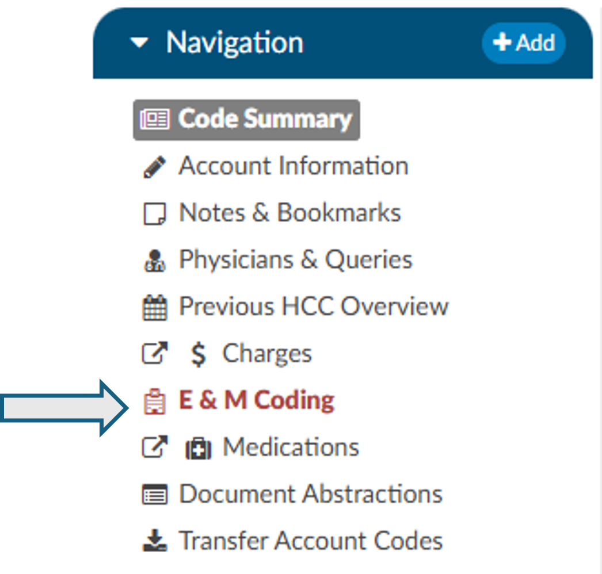

+++
title = 'Add-On Modules'
weight = 51
+++

Not all organizations will use all of these modules. If you are unsure if a module is relevant to your organization, please contact your {} supervisor. Organizations looking for more information on these modules should reach out to the Dolbey SME team via email (smeteam@dolbey.com). 

{}

## Audit Module

The audit module allows for the role of an auditor within the application. The role of an "Auditor" has the same privileges as a "Coder" when it comes to account editing. The auditor can route an account directly to the coder that last submitted (which triggers a save and close), and the coder can rebut and route an account back to the audit (which also triggers a save and close). More details on audit functionality can be found in the [Audit User Guide](https://dolbeysystems.github.io/fusion-cac-web-docs/auditor-user-guide/). 

## Denials Management 

This tool is designed to comprehensively record the specifics related to denial management and tracking. Denial management tracking involves monitoring cases where a patient's submitted billing chart is rejected by the payer. Various reasons, such as medical necessity, code, or DRG assignment, could lead to these denials. It is capable of documenting multiple denials for each chart, with the ability to log and categorize them for the purpose of tracking, managing workflows, and generating reports. More details on denial mamnagment functionality can be found in the [General User Guide](https://dolbeysystems.github.io/fusion-cac-web-docs/coding-user-guide/coding-a-patient-chart/account-viewers/denial-management-viewer/).

## ER E/M Module 

The ER E/M Viewer is an add-on module for any chart with a “Is Emergency” flag within the account properties.
If this module is turned on, any “Is Emergency” chart will have the “E/M Coding Worksheet” in the Navigation menu. 
There are several sections to the E/M Coding worksheet including:  E/M No Charge, E/M Level, Trauma, Critical Care, Medications, and Additional Charging. More details on ER E/M functionality can be found in the [General User Guide](https://dolbeysystems.github.io/fusion-cac-web-docs/coding-user-guide/coding-a-patient-chart/account-screen/#navigation-pane).

## Physician Coding/Single Path

Physician coders differ from hospital coders in that they will usually work for a doctor who specializes in a specific type of medicine. As a result, they typically code for just that specialty. These coders will only deal with a subset of the ICD10 code set. Within the CAC system, is built-in functionality to allow a physician coder to code charts just like hospital coding staff. The Single-Path coding role allows the user to code an account as a final coder *and* a physician coder simultaneously. When a Single Path user opens up the detail on a CPT code, they will see 2 separate fields for modifiers, and they can enter modifiers for both.

A Single Path role can also be changed in the Profile drop-down on the user name at the top of the  Account  Detail screen if another changeable profile role such as CDI, Coder, or Physician Coder is also present on the User Profile.  When adding or editing Modifiers in the Charges viewer, the Single Path user sees the Coder’s version of the viewer, so what is added will be viewable to both a coder and a Single Path user. The Physician Coder charges viewers are different and viewable only to them. 

## Quality Module

This module allows for the ability to identify PDI, PSI, Quality Measure PC-06 and the Elixhauser Measures. 

#### PSI Indicators

The PSI Module uses the PSI technical specification from Agency for Healthcare Research and Quality
U.S. Department of Health and Human Services from www.qualityindicators.ahrq.gov.

Fusion CAC uses the final codes assigned by coders along with other patient data that meet each PSI
guideline. Fusion CAC provides an indicator on the banner bar to a coder when codes coupled with
patient demographics meet a PSI guideline.

This PSI indicator displays in the banner bar under the compute button. The PSI is reported in one of two
fields CDI PSI Indicator or PSI Indicator if identified by a coder. The indicator can be used for workflow
and/or reporting.

#### PDI Indicator

The PDI Module uses the PDI technical specification from Agency for Healthcare Research and Quality
U.S. Department of Health and Human Services www.qualityindicators.ahrq.gov.

The Pediatric Quality Indicators (PDIs) focus on potentially preventable complications and iatrogenic
events for pediatric patients treated in hospitals and on preventable hospitalizations among pediatric
patients, taking into account the special characteristics of the pediatric population.

This PDI indicator displays in the banner bar under the compute button. The PDI is reported in one of
two fields CDI PDI Indicator or PDI Indicator if identified by a coder. The indicator can be used for
workflow and/or reporting.

The algorithm for the PDI on if it applied or not is within the code summary pane.

#### PC-06 Indicator

The Quality Measure Module supports the PC06 measure and uses the Joint Commission technical
specification https://manual.jointcommission.org/releases/TJC2018B/MIF0393.html.

Fusion CAC uses the final codes assigned by coders along with other patient data that meet each PC-06
guideline. Fusion CAC provides an indicator on the banner bar to a coder when codes coupled with
patient demographics meet a PC-06 guideline. The indicator can be used for workflow and/or reporting.

This field indicator displays in the banner bar under the compute button as shown below.

#### Elixhauser Comorbidity Measure Indicator

The Elixhauser Comorbidity Index is a method of categorizing comorbidities of patients based on the
International Classification of Diseases (ICD) diagnosis codes. The indicator can be used for workflow
and/or reporting. This field indicator displays in the banner bar under the compute button as shown
below.

