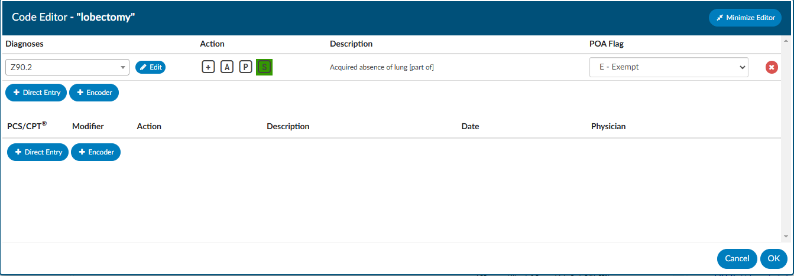
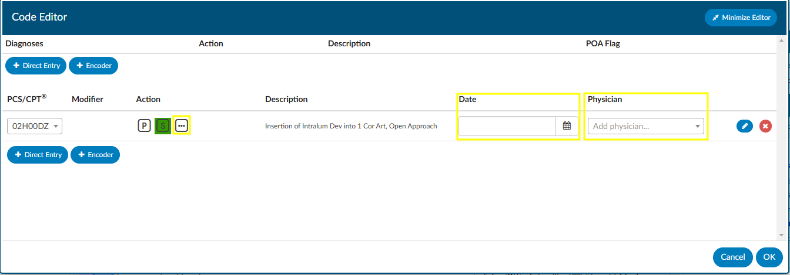
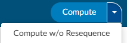
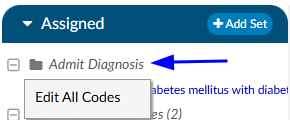
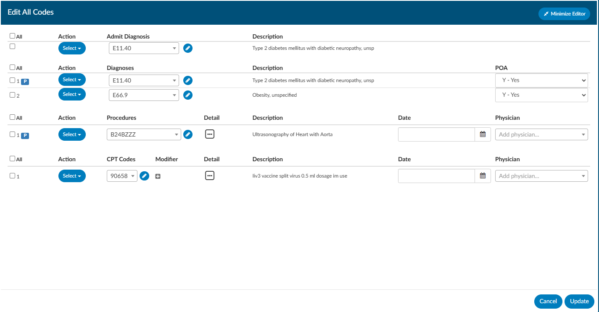
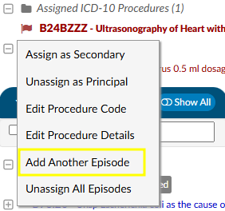

+++
title = 'Editing Codes'
weight = 12
+++

{}

To edit an existing or suggested code, left click on the code to bring up the encoder and Code Editor windows.  If the user is set up with dual monitors, the encoder window can be moved to the second monitor to remain open as they work through validation of each the engine suggested codes. From the Code Editor window, users can update codes from the code drop-down menu, via Direct Entry, or Encoder.  The POA indicator and code status (Admit, Principal, or Secondary) can also be updated in the Code Editor.

To change a code, place the curser in the drop-down box where the code to be changed is displayed. Code parts, such as the code extension, can be edited instead of removing the whole thing.

Users have the option to minimize and restore the Code Editor window to continue viewing documents or other areas of the chart as they are working to complete additional details for the procedure code.

|Code Editor Icon|Description|
|----------------|-----------|
||This button launches the encoder for the existing code|
||Adds a new line for direct entry of additional codes|
||Launches the encoder for selection of a code|
||Saves any changes for the current session of Code Editor|
||Closes window without saving changes from the current session of Code Editor|
||Deletes the selected code from the chart|
||Minimizes Code Editor window so that the main screen can be viewed|
||Restores the Code Editor window to full size for review and completion|

### Adding Procedure Code Data

Procedure codes typically require additional information such as Physician and Date of Service for the procedure indicated along with procedure details. These fields are configured according to facility requirements and may look different per organization.

To enter in a date and physician to the procedure codes, right-click on the procedure code and then select Edit Procedure Info from the menu. After selecting a procedure code, the Code Editor window for the selected procedure code will open.

##### Add Procedure Date

To enter the procedure date, start entering the date in MM/DD/YYYY format or click on the calendar to select the procedure date. 

##### Add Physician

To add the physician, click into the **Add physician…** drop-down menu. Start entering the name of the physician who completed the procedure, then select the physician’s name to complete this field. At least 3 characters of the physician’s last name are needed to view the drop-down listing. Continue entering characters of the physician’s last name to narrow the listing of physicians to choose from. 
##### Add Additional Procedure Details

Click on the ellipsis {}...{} button under the Action heading. 

Users have the option to minimize and restore the Code Editor window to continue viewing documents or other areas of the chart as they are working to complete additional details for the procedure code.

### Code Sequencing

There are multiple ways to re-sequence codes that have been validated and added to a chart. Dolbey's recommendation is to re-sequence codes using the existing encoder. 

##### Code Sequencing and Grouping with Encoder
 
After clicking the Compute button, all patient demographic information and validated codes are uploaded to the existing encoder. 

Use the encoder to re-sequence codes, complete grouping, and complete the encoder session to return the computed grouping and re-sequenced codes to Fusion CAC. From here you will be directed to the Code Summary page for review of Validation Results (and resolution or errors), Assigned Diagnosis Codes, and Assigned Procedure Codes.

##### Code Sequencing with CAC

If grouping and billing edits are not required, codes can be re-sequenced by dragging and dropping codes within the Assigned Codes Pane.
Left click and hold the code to be re-sequenced, then move it to the new sequence location and release.

>[!Note] **TruCode** users have the option to perform an encoder calculation *without* automatically resequencing the assigned codes on an as-needed basis. In the dropdown menu on the right-side of the "Compute" button, the "Compute w/o Resequence" menu will perform the encoder computation but leave all diagnosis codes in their original position. This feature will enable sites to re-sequence codes above a certain position.

### Computing a DRG/Grouping

Use the Compute button to launch the encoder and proceed with confirmation of codes and sequencing to complete grouping and return the computed grouping and codes to Fusion CAC.
 
### Mass Editing Codes

Mass editing of codes can be accessed by right clicking and selecting “Edit All Codes” on any of the code headers such as assigned diagnosis, assisted procedures, admit diagnosis. 

Each code has a checkbox, and each section has an ‘ALL’ checkbox. If the user clicks the All checkbox, a checkmark will appear in all codes under it.  Any change made to one of those checked codes will be reflected in all other checked codes.  

The CPT code section has a Modifier column with a plus sign.  Clicking the plus will open up the details window to add/change Modifier, plus other items that are included in that window.  Clicking on the ellipsis symbol next to the Episode field will also open the details. The user can add up to 4 modifiers, unless they are using the 3M™ Coding and Reimbursement System (CRS) then they will be able to add up to 5 modifiers.
 

>[!Note] that you can update PCS and CPT codes together. If there is a check mark, the change will be made to both the CPT and the Procedure Code.  When both CPT and Procedure are selected together, only the Physician and Date can be changed.    

### Add Another Episode

Right clicking on a procedure allows the user to add another instance of the same procedure without needing to duplicate the effort of recoding the procedure.

 From Edit Procedure Info, you can also update additional information for the selection of procedure codes to add procedure date, add physician, and update additional details such as
 - Anesthesiologist
 - Anesthesia Type
 - Tissue Sample
 - Procedure Location
 - Minutes)

These fields are configured according to facility requirements and may look different per organization.
