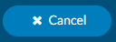
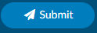
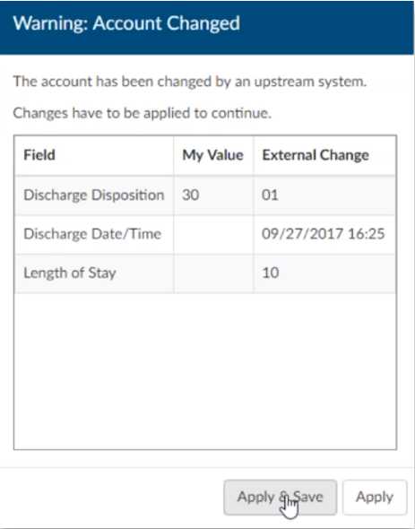
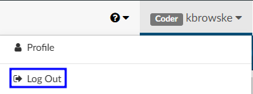

+++
title = 'Exiting a Chart'
weight = 14
+++

{}

Once a user has finished working in an account, there are three ways of proceeding:

### Cancel 

This action cancels all work in the chart and either returns the user to the Workgroup or autoloads the next account (if autoload is selected).  Upon canceling, the user will be prompted if any unsaved changes exist.

### Save

This action saves the users work and will ask the user if they want to stay in the account or exit the account. If the user wishes to exit, they will either be returned to the Workgroup or the nex account will be autoloaded (if autoload is selected).

### Submit 

This action saves **and** sends the user's work to the next phase of workflow, based on the organization's requirements. The user is either returned to the Workgroup or the next account via autoload (if autoload is selected).

### Account Changed Warning Box

Upon taking one of the actions above, Fusion CAC may present a pop-up warning that reads, “Warning: Account Changed. *The account has been changed by an upstream system*” This warning appears when Fusion CAC has received a change to the account – usually a new document – between the time the account was opened and when the user chooses to Cancel, Save, or Submit. This warning allows the user to double check their work based on new information provided to Fusion CAC. 

Selecting {}Save and Apply{} will apply the incoming changes to the account and continue with the process the user had selected. Choosing {}Apply{} will apply the incoming changes to the account and return the user to the account to continue working.  

### Ending a Coding Session (Log Off)

To log out of the application, click on the down-arrow next to the user name in the top right corner of the software, then select ‘Log Out.’

