+++
title = 'Colors and Symbols'
weight = 100
+++

The Fusion CAC 2 application contains a variety of colors and symbols. The following guide provides a
detailed explanation of the significance associated with each color and symbol.

## Top Right Corner (Any Screen)

The {}?{} icon represents the help menu where users can find the user guide, hot keys configured per organization, and more.This menu can include customized links for each organization. If this functionality is needed, contact cacsupport@dolbey.com to log a ticket. 

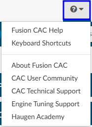

## Dashboards

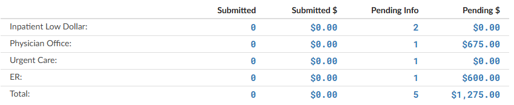

Most of the blue text on the dashboard is a clickable link. When clicked, it will open a new tab into a pop out with the details behind the number. Some numbers, such as percentage rates or averages, will not yield pop out results.

## Banner Bar

|Symbol/Color   |Meaning   |
|---------------|----------|
|ROM/SOI|Red numbers mean that the ROM or SOI is high (either a 3 or a 4) 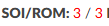|
|LOS Information|Green indicates there are still days left in the patient stay 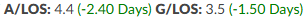 Red means they have exceeded the days.|
|DRG|A red DRG means that a mismatch occurred where the CDI and coder do not match. The exact DRG may be differtent, or if the DRGs are the same the DRG weight is different. This can occur on APR-DRGs. 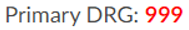 If the DRG is green it means the DRG's matched. 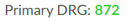|

## Navigation Tree

The viewer name will turn red to alert the user that action is needed.

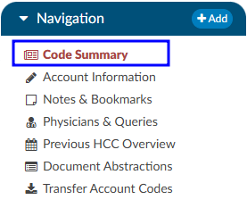

### Code Summary

|Symbol/Color   |Meaning   |
|---------------|----------|
|Blue/Red Circles Containing Numbers|These circles with numbers next to each code are the Risk of Mortality (ROM) and Severity of Illness (SOI) which can be values 1-4, this information comes from the APR-DRG which is a priority grouper licensed from 3M GPCS. 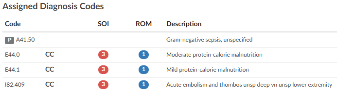|
|P Icon|Indicates the diagnosis is a principal 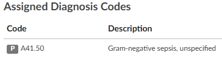|
|Numbers in Visit Reason Section|Indicates the position number of visit reason 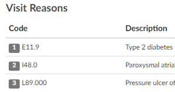|

#### Validation Results

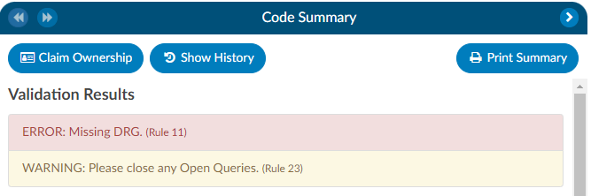

**Red**: Validation hard stop used to notify a user that there are things that they need to resolve. It **does** prevent the user from submitting the chart.

**Yellow**: This color is associated with validation soft stop used to notify a user that there may be things that they need to resolve. It **does not** prevent the user from submitting the chart.

### Physicians & Queries

The "Physicians & Queries" viewer will be highlighted with an amber background in the
Navigation Tree if the account has at least one physician query.

>[!note] The amber background does not appear if the "Physician & Queries"
viewer is selected because the "selected" background overrides the amber background.

The viewer will turn brown to indicate there are open queries awaiting a response.

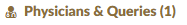

### Charges

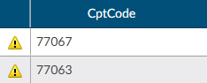

The caution symbol next to the left of the code is a edit that comes from the TruCode encoder or add on edits. If you hoover over the caution symbol you can see the edit, if you need a larger view of the edit you can open the TruCode research page for
further details.

### CDI/Clinical Alerts

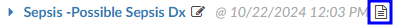

The paper icon allows users to click to enter notes to indicate thoughts on
the [CDI Alert](https://dolbeysystems.github.io/fusion-cac-web-docs/cdi-user-guide/chart-prioritization/).

### Audit Worksheet

|Symbol/Color   |Meaning   |
|---------------|----------|
|Red Title|Indicates an open audit 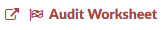|
|Brown Title|Indicates a closed audit 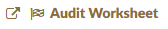|
|Astrisk|Indicates a required field 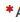|
|P Icon|Indicates the diagnosis is a principal |
|Numbers in Visit Reason Section|Indicates the position number of visit reason |
|Speech Bubble|Allows auditors to enter in notes next to any of the codes or items getting audited on the coder or auditor tree 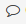|
|Blue Background|Accuracy rate lines have a blue background, so they stand out. 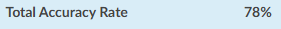|

## Document Tree

|Symbol/Color   |Meaning   |
|---------------|----------|
|Paper Icon|Text based document and may be eligible to receive code suggestions. 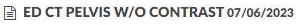|
|Camera Icon|Scanned document and is not eligible to receive code suggestions. 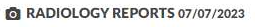|
|Pink Text|Late arriving documentation. These documents were not accessible during the coding process as they were added to the patient chart after submission. 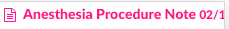|
|Black Background|The document has been archived, meaning it was removed or replaced on the account. The end user had already added codes or bookmarks on the document.|
|Red Text|Search results were found on the document. 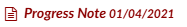|
|Grey Circle with Number|Displays the umber of instances the searched word/phrase is within the document. 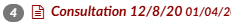|
|Square with Arrow|Indicates the user can pop out the document(s) into a separate tab. [Document Pop Out Square](DocumentPopOut.png)|
|Aqua Background|Indicates the document has been popped out into a different tab. 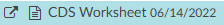|

## Document Pane

Words/Phrases and Codes can be highlighted in few different colors:

|Symbol/Color   |Meaning   |
|---------------|----------|
|Bright Yellow|The user clicked on the code from the unassigned or Show all panel linking to the code location within the document. It can also turn yellow if the user uses the search feature to search on a word or phrase. 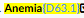|
|Green Highlight|The code is validated by an end users on a different document. This allows the end user on subsequent documents to quickly see what was already validated. Green is also used by CDI/Clinical Alerts which highlights words and phrases used to pull details out to link to text for clinical evidence for CDI/Clinical Alerts. 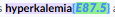|
|Caution Yellow|Identifies [caution codes](https://dolbeysystems.github.io/fusion-cac-web-docs/administrative-user-guide/tuning/#caution-code) which indicates when the system suggests codes that are flagged as cautionary. Caution codes are applied to documents that the management team has identified as requiring careful consideration. These cautionary documents enable the system to suggest codes that may not be present on provider-facing or codable documents. It's important to note that these codes cannot be validated from these documents alone. 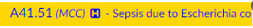 ***example:*** If a nurse mentions that a patient was treated for respiratory failure, but there is no mention of it by the provider, the caution code serves as a reminder to ensure that no relevant information is overlooked. It acts as a safety net to capture potential discrepancies or omissions in the documentation process.
|Green Paper Icon|A bookmark has been added by an end user. Hovering over this icon will display the associated note. Alternatively, users can go to notes & bookmarks within the navigation tree you can see all that were placed. 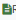|
|Green Flag| Displayed next to the code within the document and on the show all or unassigned code tree to indicate there is a comment on a code. The code comment can also be found on the notes & bookmarks under the navigation tree within the code comment section. |
|Blue Background|indicates a diagnosis code 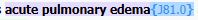|
|Red Background|indicates a procedure code 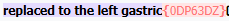|

## Code Tree

|Symbol/Color   |Meaning   |
|---------------|----------|
|H Icon|Indicates that the code is a HCC 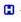|
|MCC|Indicates that the code is a MCC 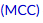|
|CC|Indicates that the code is a CC 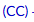|
|HAC|Returned upon computing for the MS-DRG, this indicates that the code is an HAC.|
|NOR|Indicates the procedure code is a non-OR procedure.
|Tag|Returned upon computing for the MS-DRG, this indicates that the code is responsible for one of the following quality measures **PSI**, **PDI**, **PC-06** or **Elixhauser**. 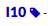|
|Purple Background on **Assigned Codes**|There are more than 25 codes and any code in purple is below the the 25th position. This is important since CMS only accepts 25 diagnosis codes in the event you need to consider resequencing codes that need to be above the 25th position.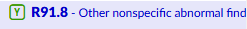|
|Exclamation Icon|Will appear on the "show all" tree when a user manually entered this code *and* the system suggested it.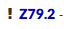|
|Person Icon|A user manually entered this code. It was not suggested by the application. Hovering over the icon will display the user who added it.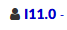|
|Caution Symbol|An edit that comes from the TruCode encoder or add on edits. If you hover over the caution symbol you can see the edit. Users needing a larger view of the edit can open the TruCode research page for further details.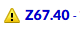|
|Green Flag|In the "Show All" or "Unassigned Code Tree," the presence of a green flag next to a code signifies that there is a comment associated with that particular code. This same flag can also be found alongside the code within a document and in the notes & bookmarks section under the navigation tree within the code comment section.|
|Pencil Icon|Exclusively available for **non-TruCode** organizations. It allows end users to manually input a code into the encoder using the compute button. This signifies that there is no direct association between the code and any specific location on a document.|
|Letter Blocks|Indicates the present on admission (POA) status. When clicked the end user can change the status to the following: <ul><li>Y = Yes</li><li>N = No</li><li>U = Undefined</li><li>W = Withdrawal</li><li>E = Exempt</li></ul> 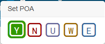|

## Tuning Dashboard

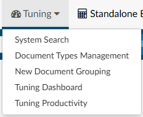

The star symbol can be found in the tuning dashboard when clicking on a numbered result. It represents the charts that an user accessed. The tuning team uses this to keep track of the cases they have reviewed vs those they have left to review.
