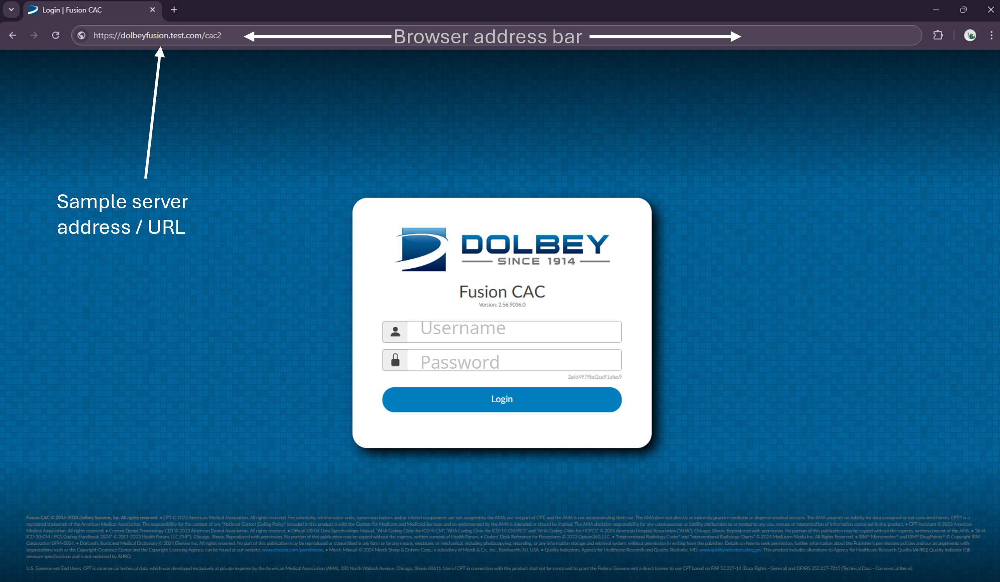

+++
title = "Getting Connected"
weight = 20
+++

Fusion CAC is a browser-based program, meaning it works entirely within your preffered web browser. This eliminates the need for downloads and installations to offer real-time collaboration for teams.

## {} Supported Browsers

Fusion CAC works on *recent versions* of the following web browsers:

  <figure>
    
    <figcaption>Google Chrome</figcaption>
  </figure>
  <figure>
    
    <figcaption>Microsoft Edge</figcaption>
  </figure>
  <figure>
    
    <figcaption>Mozilla Firefox</figcaption>
  </figure>

## {} Accessing the Fusion CAC Coding Application

To launch the CAC application:
  1. **Desktop shortcut** - Some facilities will put an icon on your desktop or in another location based on how you connect to the hospital network. Click this icon to launch the Fusion CAC application
  2. **Using the URL** - open your prefered web browser and enter your site’s Fusion CAC server
address into the address bar. The server address will be provided by your {} site
administrator or manager. It will usually look something like this: https://dolbeyfusion.test.com/cac2

Once the Fusion CAC application has loaded in your browser, enter the username
and password provided to you by your facility, and then press the
{}Login{} button.

> [!warning] Account Lock-Out
> Five consecutive failed logins will cause your account to be locked out of
> the application.  If you are locked out, contact your
> {} supervisor.

## {} Two-Factor Authentication (Optional)

> [!important] Your organization may not have Two-Factor Authentication configured
> Two-factor authentication must be configured for your site by the Dolbey
> Support team. If your site is not using two-factor authentication, this
> section will not apply to your login process.

If your site is configured for two-factor authentication, after your first
login, you will be taken to a screen showing a QR code to scan or a key to
enter into an authenticator app on your smartphone.

Once you have scanned or saved the code to your authenticator app, the temporary code for Fusion CAC will appear in your
authenticator  app with a title similar to this:

**Fusion CAC Dolbey Health Production: heminger**

At this point, your authenticator app has been
configured and will now give you time-based codes to log in to the Fusion CAC
coding application.

To view the time-based code when logging into the app, select the entry in
your authenticator app. You should see a long sequence of characters that will
change every minute.  When you login to the Fusion CAC application, you will
need to view and enter this key from your authenticator
app into the field beneath the password field.

> [!note] What if I get a new phone?
> Your {} site administrator or supervisor can reset
> your two-factor authentication setup if you have replaced or reset your phone
> and no longer have access to the "Fusion CAC" entry in your authenticator
> application.

