+++
title = 'V2.23 (December 2021)'
weight = 10
+++



### CACTWO-3581 (Enhancement)

**Allow customers with encoder other than TruCode to see Partial Code Suggestions**

TruCode encoder users today can receive benefits when the documenation is
not fully available for engine to suggest a complete code. In this case,a partial
code is suggested We have added the ability for non-TruCode encoder users
to also enjoy this feature but, TruCode must be liscensed to enable this
feature.
Please contact your sale representative for pricing to enable.

### CACTWO-3892 (Enhancement) 

**New section added to Administrative Dashboard**

New sections have been added to the Administrative Dashboard: Coding
Trends, Top 10 Queries, and Top 10 Final DRGs. Top 10 Final DRGs has a
dropdown to allow viewing for current month, prior month and last 6 months.

The Top 10 Queries in Last 30 days pane has a dropdown to allow viewing of
all accounts, inpatient accounts or outpatient accounts.

The Coding Trends per Day has a dropdown to allow viewing of Average Daily
Codedand Average TAT to Submit. This pane does not have any grid links
associated with it and is intended for informational purposes only. Coding
Trends are based on the last day work was submitted and does not include
today’s work. The last workday will show in the pane’s title bar.

### CACTWO-4386 (Enhancement)

**New Engine Outcome per CDI report**

The Engine Outcome per CDI report shows the total codes that the engine is
suggesting, and what CDI is using vs. what CDI is manually adding compared
to the coder's Final Codes. This report should tell the level of manual effort
per CDI of those codes that are being used for final code assignment by
coders. It will show total assigned codes by CDI broken down by code set along
with how many codes were suggested by the engine versus added by text
documents and non-text documents in addition to those that were added in
duplicate. Duplicate is defined as codes that both the engine and the end-user
added and are notated with an exclamation mark (!) in account detail. There
is also a column to indicate the codes manually added and how many the
coder assigned for final code assignment. This report card should be used as
an educational opportunity to show possible improvements for the end-user
and/or the code suggestions. This report is recommended to be used in
conjunction with an audit. This is not retroactive enhancement.

> [!note] CDI Feature
You must be using Fusion CAC for CDI to view this report.

### CACTWO-4412 (Enhancement) 

**Add Workgroup Type classifications to each worklist to more accurately depict the  Coding Chart Status Report**

In Workflow Management, each workgroup now has a new "WorkGroup
Type" field. This field is optional, but sites can designate a type for each
workgroup. The purpose of doing so is for current and future reporting. For
this feature, setting a workgroup to a type besides "Coding" will exclude the
account's time assigned to it in the "Coding Chart Status Report".

Workflow groups can now be excluded from the Coding Chart Status Report
if a group other than ‘Coding’ is selected. A new dropdown will appear in the
criteria pane of the workgroup:

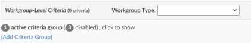

The Workgroup Type dropdown is based on a new Mapping Configuration
that the user can add to if desired. A default set is included with the upgrade.
If a user sets this field as anything other than ‘Coding’ or leaves it blank, any
account with this workflow assignment will no longer count in the ‘From
Coding Worklist’ column. In this Inpatient case, the account was assigned to
workflow that had a Workgroup Type of Audit for 1 day, then was moved to
a workflow with a Workgroup Type of Coding for another day before
submission. Only the Coding time is showing in the column.

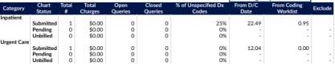

### CACTWO-4601 (Enhancement)

**Add 3 New columns to grid columns**

Three new fields are available in grid columns for use in account search: Time
Spent by CDI, Time Spent by Coding and Time Spent by First Coder. This
change is not retroactive.

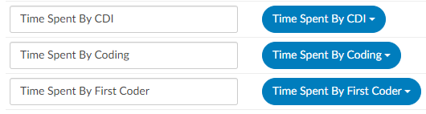

### CACTWO-4654 (Enhancement)

**Create Dashboards for Auditors**

Two additional Dashboards have been created: Audit Personal Dashboard
and Audit Management Dashboard. With the addition of these dashboards,
the original buttons used for selecting the dashboard have been changed.The
user can either click on the down arrow and drop down to see all the
dashboards, or the user can click the left and right arrows to page through
each dashboard choice.

### CACTWO-4691 (Enhancement)

**Work Available list added to all Dashboards**

A panel on the dashboards that shows all work available will now show on all
dashboards. The worklist starts with a ‘You’ assignment, then continues down
through all workflow groups in order to how they appear in your users profile.
The columns in this panel are the assigned groups, total charts in each group,
oldest discharge date and total charges.

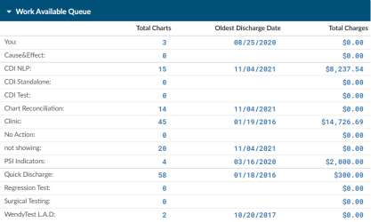

> [!info] Work Available Numbers Are Not Clickable
Most dashboard numbers in blue are clickable, but on the work
available queues they are not since some users are in force autoload mode
and therefore this view is simply a view of whats available in each.

### CACTWO-4692 (Enhancement)

**Allow Forced Autoload user to view the new Work Available Queue**

A new privilege called ‘View Work Available Queue in Forced Autoload has
been added to Role Management. When this option is enabled, a Forced
Autoload user will now see the Work Available Queue on the dashboard.

> [!note]
This feature requires Roles Management to be enabled.

### CACTWO-4698 (Enhancement)

**Scheduled Workflow for Auditors**

A new workflow category of Audit has been created which allows its assigned
workgroups to be scheduled to run. When a criteria is created for the
workgroup, a new link for adding an audit will be shown under the criteria
name:

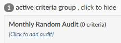

Clicking on the new link will bring up a schedule box, allowing that criteria to
only be run daily, weekly or monthly.

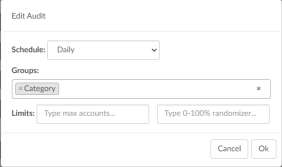

Limits for the audit are assigned at the bottom. The first box is a max amount
of accounts to pull into the workgroup, the second box is a percentage of
matched accounts to be pulled in. If both boxes are filled out, the max amount
will override the percentage. This can also be set to be run per group,
selected from the groups drop down field.

### CACTWO-4700 (Enhancement)

**Add assigned workgroup to top of Audit Worksheet**

The top of the Audit worksheet will now display any Workgroup assignments
for that account.

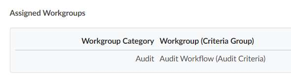

### CACTWO-4704 (Enhancement)

**Add buttons to move through document tree**

New backward and forward arrows have been added to the top of the Documents
panel. This will allow the user to move up and down through the documents listed in
the panel.

### CACTWO-4705 (Enhancement)

**Add buttons to move through viewer panel**

New backward and forward arrows now appear to the left in the blue bar of
the document viewer. This will allow users to move back and forth through
documents that have been opened into the viewer screen. Note that when a
user arrows back and forth, then clicks on another document, the user is
starting a new history for that option.

### CACTWO-4707 (Enhancement)

**Add ability to drill down to physician queries in Account Search**

‘Queries’ has been added to the Drill-Down Level options in Account Search.
This will automatically add Queries columns to the resulting account search
without the user having to add them. These default columns appear at the
beginning of the grid and can be moved to other positions.

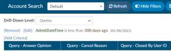

### CACTWO-4710 (Enhancement)

**Add ‘Query For’ field on queries to further define generic queries.**

The new field will appear under the template name,. This additional “Query For” field will allow the
template reason to be more specified.

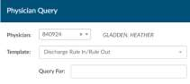

The text that is added in this field will show in a new ‘Query For’ column in these reports: 
Outstanding Queries, Query Impact by Discharge Date, Query Impact Report, Query TAT by Author
Report and Query Template Volume Overview. In order to see this new field
you must add it to the template created in forms designers.

### CACTWO-4716 (Enhancement)

**Add internal note for physician queries**

Internal only notes can now be added to Physician Query templates from [Query Designer](https://dolbeysystems.github.io/fusion-cac-web-docs/administrative-user-guide/tools/query-designer/). 

On a template, clicking the Insert dropdown will now show a new option of Add Internal Note. The
Internal note is only displayed for the user filling out the query and is not set to the provider
receiving the query. Selecting this option will add a highlighted free text line to the document

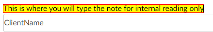

When adding a physician query the user will see the highlighted section in the
query when that template is selected.

After sending, this note will no longer
be seen unless the user has the privilege of ‘Edit Open Queries to resend’ in Role
Management. An Edit checkbox will show on the dte line, and checking it
will show the query with the internal note.

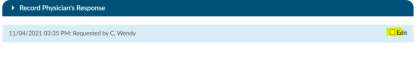

### CACTWO-4721 (Enhancement)

**Allow Validation Rules to be exported**

A new ‘Export’ button has been added to the top of the page under the save
rules button of the Validation Management page. Clicking on the down arrow
will give the user the ability to export as a CSV file.

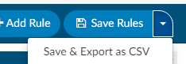

### CACTWO-4722 (Enhancement)

**Add chatroom to Validation Management**

The chatroom that automatically opens if more than one user is in the same
page has been added to Validation Management.

### CACTWO-4724 (Enhancement)

**Add Pending Reason drop down to Account List**

The Account List dropdown button now has the
option for a list of pending accounts. When
Pending Accounts is chosen, the user will get a
list of any accounts they have added a pending
reason to.

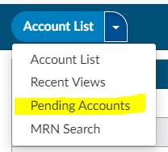

### CACTWO-4731 (Enhancement)

**Add ‘You’ count to the Dashboard**

The dashboards have a Work Available Queue panel. ‘You’ has been added to
the list of workflow to show accounts that are assigned to that user.

### CACTWO-4733 (Enhancement)

**When ESC is selected while in a field it will clear new contents**

By putting your cursor in any of the above text fields. If the field has an original
value, then change it, then press ESC. The field should revert to its original
value before you placed the cursor in the field (note: not the original field from
the database).

- Account Search
- System Search
- Tuning Dashboard
- Validation Management
- Workflow Management

### CACTWO-4741 (Enhancement)

**Move Cancel button in Physician Query**

The Cancel button has been moved a little farther away from the send button
on a Physician Query to alleviate accidental clicks.

### CACTWO-4748 Enhancement

**Add columns to Account Search Pending Reasons drilldown**

When drilling down on Pending Reasons in Account Search, new and updated
automatic columns will be added: Added By, Added On, Current Role,
Physician, Service Date.

### CACTWO-4754 (Enhancement)

**Change portions of the Audit Management viewer**

In Audit Management viewer the Abstractions section of the viewer are no
longer included in the Overall section. The Overall section has been renamed
Overall Code Statistics. The tooltips in this section will no longer include the
Abstracting values.

### CACTWO-4755 (Enhancement)

**Add Stages to the CDI Query Detail Report**

A new column for "Stage" has been added to the right of the "Financial Class"
column in the CDI Query Detail Report.

### CACTWO-4758 (Important)

**Reports updated to improve performance**

Several user reports were timing out when the user was on a large database.
Updates to reporting have been made to fix those performance problems.
The reports affected are:

- Case Mix Index Report by Attending Physician
- Outstanding Queries
- Pending Reasons
- Query Overview
- Query Stats
- Query Template Volume Overview

### CACTWO-4762 (Enhancement)

**Allow for editing of text when changing physician on a query**

When a user chooses to change a physician on a physician query after it is
sent, the other fields on the query will also be open to editing the original
query will retrain oringal text and can be found in the query list as “Canceled”

### CACTWO-4765 (Enhancement)

**Save section selection/arrangement when editing queries**

All dynamic sections on physician querieswill be saved and viewable when
editing a set query. Prior to this, when sections were changed on a query and
the query sent, if subsequently edited, the changed sections would revert to
their original positions. This will no longer happen.
Testing Steps: Create any query with a template using
sections. Rearrange/hide sections, populate some values, and send the
query. Open the query and click the "Edit" checkbox to edit the query (if you
are a non-Administrator, you need a privilege enabled to see the "Edit"
checkbox). When you edit the query, the rearranged/hidden sections are still
rearranged and hidden. Previously, all sections reverted to their original
display.

### CACTWO-4766 (Enhancement)

**Populate the name field with the grid column name**

When adding a new column in Grid Column Configuration, the Title will now
automatically be defaulted to the field name. You can still change the friendly
name if the automatic name is not what you want to use.

### CACTWO-4769 (Enhancement)

**Replace ‘filters’ with ‘criteria’**

The word ‘filter’ has been changed to ‘criteria/criterion’ throughout the
Workflow Management page for clarification purposes.

### CACTWO-4774 (Enhancement)

**Allow Autoload users work lists to be updated live**

If a change is made to an Force Autoload user’s worklist in his profile, the user
will no longer have to log out and log back in to get the new sequence. It will
happen automatically.

### CACTWO-4777 (Enhancement)

**Add more drilldown ability to Administrative Dashboard**

On the Admin Dashboard, Total Charts AutoClosed Today and Total
ChartsRejected Today statistics will now be drilldowns.

### CACTWO-4780 (Enhancement)

**Add Auditor count to Administrative Dashboard**

The Admin Dashboard will now show Auditors Online and Offline in the Users
Online pane.

### CACTWO-4781 (Enhancement)

**Change Coder Productivity Pending data in the Admin Dashboard**

On the Admin Dashboard Coder Productivity Pending Info and $ will only
reflect discharged patients. The coder Productivity Pending Info and $ should
only reflect discharged patients. We are using the pending info/$ to show
DNFB which is Discharged Not Final Billed and we are capturing non-
discharged patients here as well.

### CACTWO-4782 (Enhancement)

**Add Case Mix Index pane to Administrative Dashboard**

On the Admin Dashboard a section for Case Mix Index has been added . This
pane will show the Last 7 Days, 30 Days, 90 Days and 180 Days.

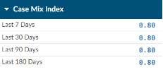

Case Mix Index is defined as the sum of DRG Relative Weights divided by the
number of accounts with a DRG Relative Weight.

### CACTWO-4783 (Enhancement)

**Add Working Case Mix Index pane to CDI Management Dashboard**

On the CDI Management Dashboard a section for Case Mix Index for Working
DRGs has been added as a pane to the Administrative Dashboard. This pane
will show the Last 7 Days, 30 Days, 90 Days and 180 Days.

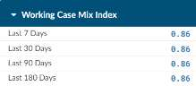

The Working Case Mix Index numbers come from the sum of Working DRG
Relative Weights divided by the number of accounts with a Working DRG
Relative Weight.

### CACTWO-4785 (Important)

**Errors occurring in the Discharged Not Final Coded report**

When a large data amount is being reported, the Discharged Not Final Coded
report would not complete as an XLSX and gave incorrect data. This has been
corrected.

### CACTWO-4786 (Important)

**Missing physician validation rule is not being triggered**

A rule to trigger for a missing physician that was set up in Validation Manager
was not triggering when the account did not have a physician. This has been
corrected.

### CACTWO-4788 (Important)

**Large accounts cause Validation Rule delays**

Long stay accounts with thousands of documents were not triggering
Validation Rules in an acceptable amount of time. Performance has been
corrected.

### CACTWO-4789 (Enhancement)

**Allow Physician ID to be added to CDI Query Detail report as XLSX**

The CDI Query Detail report will now add a Physician ID column only when it
is exported as a XLSX.

### CACTWO-4795 (Important)

**Missing drilldown columns from Account Search**

When a drilldown is used in an Account Search filter, the columns associated
with that drilldown are added to the results grid. But when scheduled as a
report, those columns were not showing in the report. This has been
corrected.

### CACTWO-4797 (Enhancement)

**Reassign a chart after a specified time period**

A new field has been added to workflow to allow accounts to be assigned to
new workgroups if they have sat too long in their original workgroup.

"WorkGroup Assigned Date" has been added to Workflow Management.
When used, this field adds a new optional workgroup field to type in the name
of a workgroup. By doing so, the workflow engine will check the assigned
date/time of the specified workgroup to determine assignment eligibility.

To test, assign any account to any workgroup (manually or automatically,
doesn't matter). In Workflow Management, create or edit a custom
workgroup with the criteria "WorkGroup Assigned Date" --> name of the
workgroup you assigned the account to --> "More Than" --> 1 day ago. Let the
Script Engine run overnight. At midnight workflow additionally assign the
account to your custom workgroup. If it didn't, attach the Script Engine log for
review.

When implemented at the site, to mimic "24 hours", the criteria should be
"More Than --> 2 days ago" since workflow works off days and not times.

### CACTWO-4798 (Enhancement)

**Change how Audit accuracy fields appear in Account Search**

In Account Search, any Audit accuracy fields were showing as a decimal point.
This has been changed to show as a percentage.

### CACTWO-4803 (Important)

**Weekly Coder Activity report receiving disconnect error**

A connection error was occurring when running the Weekly Coder Activity
Report multiple times. This has been corrected.

### CACTWO-4804 (Important)

**Not correctly checking codes for validity using the 3M CRS Encoder**

When using 3M CRS encoder, the Discharge Date was used for figuring validity
of a code in 3M CRS. Any outpatient accounts that have a discharge date that
is after the admit date are then likely to get coded with invalid codes.
Correction has been made so that outpatient accounts use the admit date as
the discharge date for figuring whether a code is valid.

> [!note] 3M CRS Users Only
This fix only applies to 3M CRS users.

### CACTWO-4805 (Important)

**Document Type Management was not saving mass edit changes**

Document type changes were not being saved properly when using mass edit
or changing document group assignments. This has been corrected.

### CACTWO-4806 (Important)

**Restored images are being marked as new documents**

If an image that has been purged is restored by redownloading, it was being
marked as a new document. This has been corrected so that restored images
are given an original import date to keep it from being considered as a new
document.

### CACTWO-4813 (Important)

**Validation rules not being triggered properly for empty fields**

A validation rule that looks for a field match was not being considered when
the field was blank. These operators have been updated to ensure that if a
property is an empty string, the validation rule will interpret it the same way
as if the field was null or didn’t exist: Not Equal, Not In List, Not Contains and
Does not Exist.

### CACTWO-4817 (Important)

**Data in Audit comment bubbles is not being retained**

Text that is attached to a code in an Audit via the comment bubble was not
being retained when sent to the Coder from the
Auditor. This has been corrected. The code will
remain with the red bubble, which when hovered
over or clicked on will show the text.

### CACTWO-4823 (Important)

**Physician deactivation is calculated in inconsistent ways**

If a physician’s deactivation date is during an inpatient account timeline, they
could still be assigned to a procedure if the date is after the physician’s
deactivation date. For the sake of consistency, the procedure date will be
looked instead of the account date to determine if a physician is deactivated.

### CACTWO-4825 (Important)

**Display of sample date on monthly run reports is not correct**

When a report is scheduled to run in a monthly format, the ‘sample’ date that
is shown to the right does not match the month dates. This has been
corrected.

### CACTWO-4826 (Important)

**Role Management not giving ‘save’ reminder**

When in Role Management and making a change, the user is not being
reminded to save when attempting to leave and open a different page. This
has been corrected.

### CACTWO-4830 (Important)

**Change how duplicate codes are calculated in Audit Worksheet**

When a procedure code is duplicated by a coder and an Auditor then updates
the Audit worksheet, one of the codes was being calculated as an additional
code. This has been corrected so that intentional duplicates are not read as
extra codes.

### CACTWO-4831 (Enhancement)

**Change coloring of Code Summary to red for warnings**

The Code Summary shows as red in the Navigation Tree if there is a validation
error. Validation warnings in the Code Summary will display in red, to indicate
more attention needs to be paid to the validation rule.

### CACTWO-4836 (Important)

**Single Path Coder is not able to submit an account**

An error was occurring when a Single Path coder role attempted to submit an
account. This has been corrected. Single Path coders can both save and
submit.

### CACTWO-4838 (Enhancement)

**Allow Account Search on accounts without date properties**

The user can now run an Account Search based on an account number without
using a date property criterion. If a user
puts together Account Search criterion
without having a date or account number
field, they will receive a new pop-up
warning box:

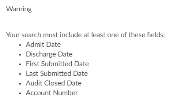

### CACTWO-4851 (Important)

**Scheduled Report is being duplicated**

If a user accidently double clicked while saving an Account Search as a
Scheduled Report, two reports were being recorded. This has been corrected.
Multiple clicking will only result in one ‘save’ of a scheduled Account Search
report.

### CACTWO-4863 (Important)

**Data entered on a pop-out worksheet not appearing on main viewer**

When popping out a worksheet and then moving to a different document on
the main viewer, if the user added data to the popped-out worksheet and
then on the main tab moved from the document back to that worksheet, the
data would not show in the main viewer. This has been corrected.

### CACTWO-4864 (Important)

**Account Search adding in columns during detail search**

After a saved Account Search is called up and the user opens multiple account
details, the Account Search adds in all the columns that are not check marked
for that search. This has been corrected.

### CACTWO-4867 (Enhancement)

**Add warning when using PrincipalDX dropdown in TruCode™**

The TruCode™ PrincipalDX dropdown button on the Compute button in
Account list will open a blank screen if used on an outpatient account. This
feature is only for inpatient accounts, so a new pop-up message will now
occur if the user tries to use PrincipalDX on an outpatient account.

> [!info]
For TruCode™ users only.

### CACTWO-4885 (Important) 

**Birthweight not updating when entered in 3M CRS**

CAC2 will now capture the birth weight from 3M CRS if it is provided from 3M
CRS. Note: The birth weight is only prompted in 3M CRS on newborn accounts
if an APR-DRG grouper is used.

> [!note] 3M CRS Users Only
This fix only applies to 3M CRS users.
