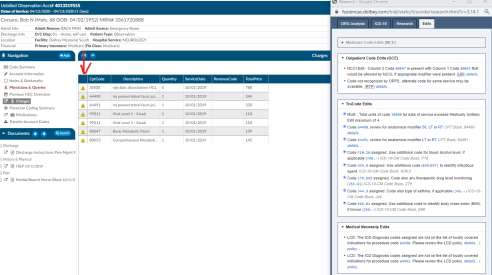

+++
title = 'V2.24'
weight = 20
+++



### CACTWO-4838 (Enhancement)

**Do not require date fields for Account Number searches**

In Account Search, filters cannot be completed unless there is a date field
included in the criteria. This has been changed so that if the user is searching on
a particular account number, they will not be alerted to select a date field.

### CACTWO-4857 (Enhancement)

**Add columns to System Search**

New columns have been added to the System Search page: Admit Date,
Discharge Date, First Submitter and Facility. They will appear as the last columns
and have the same sorting and filtering abilities as other columns on the page.

### CACTWO-4867 (Enhancement)

**Alert user for PrincipalDX usage on inpatient accounts**

The PrincipalDX button on the Compute Dropdown is for use on TruCode™
encoder inpatient accounts only. If a user accidently deploys it on an outpatient
account, the result is a blank screen. If a user does this, they will receive a
message stating the PrincipalDX option is only for inpatient accounts.

> [!note] TruCode&#8482; Users Only
This fix only applies to TruCode&#8482; users.

### CACTWO-4871 (Enhancement)

**Add Workgroup column to User Audit Trail report**

The User Audit Trail report has a new column that will display the name of the
workgroup the user opened the noted account from.

### CACTWO-4872 (Enhancement)

**Allow TruCode™ to be opened from Anesthesia codes**

The TruCode™ Encoder codebook can now be opened by clicking on an
Anesthesia Code in the TruCode™ Research Panel.
For TruCode™ Encoder users only.

### CACTWO-4900 (Enhancement)

**Allow ‘Does Not Include’ to include a multi-string value**

Currently in Validation Management Rules, using the operator ‘Does Not
Include’, such as Diagnosis Codes -- Does not Include – only allows for one
property, such as R05.

This has been changed to allow for multiple properties. For Diagnosis Codes –
Does not Include – R05, R06.02, I10, the rule will trigger if the account does not
include all of those codes. If the account has one of those codes, the rule will
not trigger.

### CACTWO-4905 (Enhancement)

**Add Physician Coding Summary to the Navigation Tree**

When a physician coder adds codes to an account, a coder working in that
account will now see an Physician Coding Summary viewer listed in the
Navigation Tree.

### CACTWO-4913 (Important)

**Editing a suggested PCS code is not defaulting the date and physician**

The date and physicians that are populated on a document from an interface,
then default onto PCS codes. When PCS codes are assigned, the defaulted data
is held. But, if a user edits a code while it is still unassigned, the date and
physician are not being defaulted in the Edit Code box. This has been corrected.

### CACTWO-4914 (Important)

**The HCC viewer was not displaying correctly on multiple MRN accounts**

When multiple accounts have the same MRN and the earliest account has an
HCC status on a code, the later account is not creating a Previous HCC Overview
viewer in the Navigation Tree. This has been corrected.

### CACTWO-4915 (Important)

**Short Cut keys are not performing according to the menu**

The Keyboard Shortcuts menu under the Help button was displaying incorrect
data for some of the code assignment shortcuts. These have
been corrected.

### CACTWO-4916 (Important)

**Workflow Categories not being deleted properly**

If one of the five default workflow categories (Audit, Autoclose, Post Discharge,
CDI/Concurrent, QA Review) is deleted when no workgroups are present,
returning to Workflow reinstates that Category. This has been corrected so that
empty categories remain deleted.

### CACTWO-4920 (Important)

**Receiving error when submitting accounts with codes on image**

In some instances, when codes are added to an image file and the account is
submitted while the user still had the image in their viewer, an error message
was occuring. The underlying issue has been corrected.

### CACTWO-4921 (Enhancement)

**Allow all codes in TruCode™ Edit panel to be clickable**

Any code that appears in the TruCode™ Edit Encoder panel can now be clicked
to open the Codebook to that code. Please note that if the user has a pop-up
blocker deployed, this can interfere, so it should be turned off .
For TruCode™ Encoder users only.

### CACTWO-4922 (Enhancement)

**Remove ‘+’ sign when not necessary in the Transactions Viewer**

In the Charge Transactions Viewer, the ‘+’ sign indicates multiple instances, and
can be clicked to show them. This change will take the ‘+’ sign away from any
transaction that has a single instance to prevent unnecessary clicking.

### CACTWO-4924 (Enhancement)

**Add new Caution Column to Transactions and Charges viewers**

A new Caution Column has been added to the Transactions and Charges
viewers for TruCode™ users. This column will indicate a flag if TruCode reports
an edit on a charge on an outpatient account.

> [!note] TruCode&#8482; Users Only
This fix only applies to TruCode&#8482; users.

### CACTWO-4927 (Enhancement)

**Add Physician Coder criteria to Validation Management**

New user level criteria has been added to Validation Management: Is Physician
Coder, Is Not Physician Coder

### CACTWO-4928 (Important)

**PSI indicators not displaying if procedure code is a multiple**

If a procedure code appeared twice on an account, but had different procedure
dates, the PSI code was not being triggered. This has been corrected.

> [!note] Quality Module Users Only
This fix only applies to Quality Module users.

### CACTWO-4929 (Enhancement)

**The Engine Outcome per Coder report has been updated**

New updates have been made to the Engine Outcome per Coder report.
- For each ‘Total For’ value, the result has been changed from an average to a sum.
- All subtotal values are now whole numbers.
- User Score and Engine Accuracy percentage show as whole numbers.

### CACTWO-4931 (Important)

**Create a warning if account is locked in use**

A new warning will appear at the top of any document that has been updated
while the account has been locked in use.

### CACTWO-4935 (Enhancement)

**New drilldown for Physician Coding added to Account Search**

A new drilldown menu that will present data for Physician Coding Assigned
Codes has been added to Account Search.

### CACTWO-4936 (Enhancement)

**Add new column to Physician Code Summary viewer**

A Physician Coder will now see an additional column in the account’s Code
Summary viewer, identifiying any Diagnosis Codes that were attached to the
Procedure Codes.

### CACTWO-4939 (Important)

**Account comments with emojis are not saving properly**

If a user added a comment with an emoji to a note on an account, the account
saved, but when later accessed, would not resave the account. This has been
corrected.

### CACTWO-4943 (Enhancement)

**Add new operator to the Physician Roles field in Validation Management**

A new operator of ‘More then Ten of’ has been add to the Physician Roles field
in the Validation Management page. Using this will alert the user that there are
more than 10 of a certain physician role on an account.

> [!note] Single Path Coding Only
This feature requires the physician coder or single path coding module.
Please contact SME Team at smeteam@dolbey.com if you want to learn more.

### CACTWO-4944 (Important)

**Blank procedure date not triggering validation rule**

When a CPT code without a date was added to an account, the validation rule
which looked for non-existing procedure dates was not triggered. This has been
corrected.

### CACTWO-4947 (Enhancement)

**Allow HTML within text fields to not cause display issues**

Previously, HTML was allowed in text fields, but some characters such as < / > =
were causing a display issue. The update has been corrected to allow those
characters to display correctly.

### CACTWO-4949 (Enhancement)

**New Query Template Volume by Discharge Date has been created**

This report is close to the Query Template Volume Overview report except that
it reports by discharge date, not query creation date. Only queries of discharged
accounts will show on this report.

### CACTWO-4950 (Enhancement)

**Allow Workgroups and Criteria to use an ‘or’ statement**

Workgroups and workgroup criteria within Workflow Mangement can now
include an ‘or’ statement. When clicking on the criteria link, and the dropdown
opens the user will now see an option to add an ‘or’ group:

Clicking on the "Add OR Group" results in a line that states ONE of the following
with an "Add OR Criteria" link.

#### Example of OR Criteria

This is an example of an “OR” criteria. Essentially, at the end of each criteria you
will add an ADD or an OR so it looks like the below. Based on this criteria, the
chart will fall into the Inpatient Surgery worklist if the chart has a patient type of
Inpatient AND the patient has been discharged and the patient has EITHER a
hospital service of SUR OR the Documents must include an Operative Report or
OP Note. The OR criteria is listed in blue to call attention.

### CACTWO-4953 (Enhancement)

**Allow ability for Workflow to have quoted, comma separated values**

When creating criteria in Workflow Management, the user can now use double
quotes around a value that contains a comma to show it is all one value:

### CACTWO-4959 (Important)

**TruCode™ DRG Analysis tab is not populating**

When a Primary Grouper is identified as a TruCode™ grouper and the Secondary
Grouper is identified as a GPCS Grouper, the TruCode™ DRG Analysis tab is not
displaying correct data if it is available. This has been corrected.
For TruCode™ Encoder users only.

### CACTWO-4960 (Enhancement)

**Allow Validation Manager to support double quotes**

In the instance of document names with commas, Validation Management
reads the entry as two separate documents. Users can now use double quotes
around a document with a comma in its name to prevent that split. As an
example, if the user wanted to make a list search for a document called Admit,
Covid19, they would write the rule as “Admit, Covid19” so that it is read as one
document, not two.

### CACTWO-4961 (Enhancement)

**Allow for double quoted documents in Account and System Search**

Double quotes can now be used around document types that have commas
inside them when searching using Account Search and System Search. In this
case, the document type of Admit, Covid-19 would be written as “Admit, Covid-
19” so that the system reads it as one document, not two

### CACTWO-4964 (Enhancement)

**Add a column for Forced Autoload to User Management**

A new column for Forced Autoload has been added to the User Management
grid. To turn it on, access the ag-grid and check the box. The new column
appears first in the grid after the Actions column, and can be moved anywhere on the grid.

### CACTWO-4965 (Enhancement)

**Autoset Exempt POA in realtime**

The Exempt POA status will now be set in realtime for any POA-exempt diagnosis
codes that are assigned. The issue occured when an account was originally
outpatient when FAE results were received (no POA) and then the account was
changed to inpatient or the code was originally not POA-exempt prior to a
coding update and then the patient remained in-house after the coding update.

### CACTWO-4968 (Enhancement)

**Combine default and custom workgroups into new columns**

New columns added to Grid Column Configuration “All Criteria Groups” and “All
Workgroups”. These columns will show default and custom workgroups and
criteria together, comma separated.

### CACTWO-4972 (Important)

**The hospital services field is not being saved correctly in reports**

When creating a user report, if the Hospital Services field was filled and then
saved, it looked like it saved. But exiting and re-entering that report showed the
field as being blank. This has been corrected.

### CACTWO-4977 (Important)

**Slowness in Account Search for very large results**

A process improvement has been made to speed up the results for Account
Search where the criteria search includes long periods of time for large amounts
of data.

### CACTWO-4978 (Important)

**Scheduled report being triggered to save without changes made**

When opening an older scheduled report, the user was receiving a ‘save’ prompt
when closing. This was due to another field being added by the system behind
the scenes. The save prompt will no longer show unless the user makes a change
or selection.

### CACTWO-4983 (Enhancement)

**Add new column to CDI Activity report**

A new column called Time Spent has been added to the end of the CDI Activity
report. This will show the time the CDI spent within the stated Category.

### CACTWO-4984 (Enhancement)

**Change Document Type Management to stop group removal**

When right clicking on any field in the Document Type Management page, the
user will no longer have the Tools option to remove grouping rows. Grouping
rows must stay static.

### CACTWO-4987 (Important)

**Change conflict occuring on null fields**

The change conflict feature is not treating null fields the same as empty fields,
causing the box to pop when it shouldn’t. This has been changed so that null,
undefined, and empty fields are all treated the same.

### CACTWO-4988 (Important)

**Transferred codes are not in the correct order**

When using the Transfer Account Codes viewer, the codes that are selected are
being copied over in reverse order. This has been changed so that the codes
copied are in the same order as on the originating account.

### CACTWO-4989 (Important)

**HTML code is appearing the in TruCode™ encoder**

When a user highlights words in a document and right clicks and selects Add
Code from Encoder, sometimes HTML coding is appearing in the TruCode™
encoder. The system has been updated to interpret that code as a blank space.

> [!note] TruCode&#8482; Users Only
This fix only applies to TruCode&#8482; users.

### CACTWO-4990 (Important)

**Physician ID drop down is not readable at screen bottom**

The Physician ID field drops down in the Physicians & Queries pane, but when
the user is at the bottom of the screen, the results cannot be seen. This field
has been changed so that it will drop up the list, instead of dropping the list
down when at the bottom of the screen.

### CACTWO-4992 (Important)

**Account change window popping during document saves**

When an account is opened that has an automatically added form, if the user
saves without adding anything to the form, then adds to the form and saves
again, the account change window was displaying. This has been corrected so
that the window no longer displays.

### CACTWO-4995 (Enhancement)

**Create field for Alternate DRG**

A new field has been created called Alternate Reconciled DRGs. This field can
be added to grids using the Grid Column Management page. Once added, it will
display manually recorded DRGs that have been added by a CDI Specialist in the
Working CDI History viewer.

### CACTWO-5000 (Important)

**Forced Autoload user is not being advanced to their next account**

If a Force Autoload user was working in an account while an administrator was
changing the assigned workgroup limits on that user, the user was not advanced
to the next assigned account upon submission of the current one. This has been
corrected.

### CACTWO-5005 (Important)

**Change CSV export view for transaction**

When right clicking in the transactions viewer to export to CSV, the grouping
row was showing up as a line in the report. If there were two transactions under
Group 88888, it was showing in the CSV report as three rows, when it was only
two. This has been corrected to no longer show the grouping row.

### CACTWO-5054 (Important)

**Prevent blank query when changing physician of responded query**

If you click “Change Physician” on a physician query with a response, the new
physician query will no longer be blank.
___

## ER E/M Module

The ER E/M Viewer is an add-on module that was partially released within 2.23 for beta testing therefore
the release notes below are changes made to this release. If you do not have this module, you can contact
the SME Team (smeteam@dolbey.com) for more information

### CACTWO-4877 (Enhancement)

**Collapse options in the ER E/M Configuration page**

The options in the ER E/M Configuration page (Trauma, No Charge, etc) can now
be collapsed and expanded to allow proper focus when working in this page.
Clicking ‘Add’ on any option will auto-expand the option panel.

### CACTWO-4925 (Important)

**Multiple issues with the new ER E/M Viewer**

These items in ER E/M Viewer were corrected or changed:
- Send Charges Outbound is now a checkbox
- New Assigned CPT Codes section will appear above Summary
- A History section will list prior submitted E/M charges below Summary
- If a duration of critical care is entered, the following two questions
(Criteria Met and Time Determined) must have an answer of Yes to
suppress the E/M Level entry
- Modifier(s) can be added if a critical care charge is present
- The quantity for a charge indicating ‘initial’ can only be 0 or 1
Erroneous Conflict Check will no longer occur.

### CACTWO-4937 (Enhancement)

**ER E/M Coding added to Validation Management**

The E/M Coding viewer can now be set as a navigation option in Validation
Management. If the rule that is set with this navigation is triggered, the account
will bring up that viewer. In this instance, if a procedure code exists but does
not have a procedure date on it, the validation rule will trigger and will take the
user to the account’s E/M Coding viewer.

### CACTWO-4938 (Important)

**E/M Coding viewer not showing as read-only**

When an account is in read-only mode, the E/M Coding viewer was not. This
has been corrected.

### CACTWO-4945 (Enhancement)

**Identify E/M Coding that has not been sent outbound**

The E/M Coding Viewer has a button to send the coding outbound. The viewer
name will now be colored red if the coding exists but has not been sent, to alert
users. Once the coding is sent outbound, the color of the viewer name will
change back to black.

### CACTWO-4948 (Enhancement)

**Add display for current E/M Coding charges in Code Summary**

The bottom of the Code Summary viewer will now display the totals of the
charges from the E/M Coding viewer.

### CACTWO-4973 (Enhancement)

**Add arrows to move columns in ER E/M Configuration**

A new column called Move with up/down arrows have been added to drop down
items in the Options section of the ER E/M Configuration page. This will allow
users to arrange the order they want those items to display

