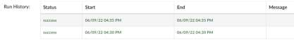
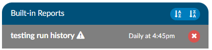
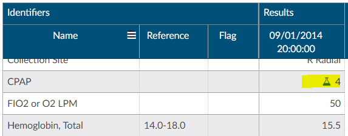
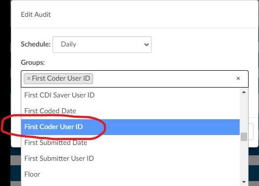
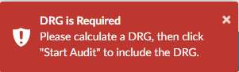
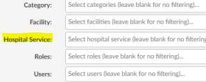
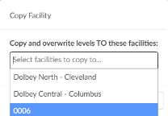
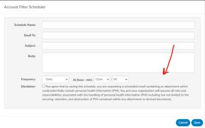

+++
title = 'V2.25'
+++



### CACTWO-3976 (Enhancement)

**Widen header banner in XLSX reports in User Reports**

The columns in XLSX user reports have been widened to show the full name
of the header to make it easier for users to understand where the data is
coming from in User Reports. Prior to this change all fields required the user
to expand each field to see the field name.

### CACTWO-4847 (Enhancement)

**Show run history of Scheduled User Report**

Scheduled User Reports will now show the run history. If the user clicks on a
report on the left side of the screen, the right side will now show a run history
above the schedule data for the last three times the report ran, whether it
was successful or errored.

### CACTWO-4942 (Enhancement)

**Allow a report deleted in JSReports to be recreated**

If a report in the Scheduled User Reports page is deleted in the JSReport
Studio, an exclamation point will appear next to the report in Scheduled User
Reports. Clicking on that report name will bring up a red toast message letting
the user know the report was deleted in JsReports, and they should either
delete it or save it again. If Saved, it will recopy to JsReport Studio

### CACTWO-4996 (Enhancement)

**Allow ‘Or’ filters in Validation Manager**

Validation Rule Editor can now be filtered using both ‘And' and ‘Or' filters.
When adding an ‘Or’ filter, the user needs to make sure they are adding ‘Or’
criteria, not regular Add Criteria. ‘Or’ and ‘And’ criteria can both be used on
the same validation rule.

### CACTWO-5001 (Enhancement)

**Alert user if scheduled Account Search report does not return any data**

If a scheduled Account Search runs but no data is returned, it currently mails
a blank report. This has been changed so that an email is no longer generated
if a scheduled Account Search returns no data.

### CACTWO-5006 (Enhancement)

**Add Specimen symbol to Flowsheet viewer**

If a discrete value on the Flowsheet viewer has a specimen, it will now show
as a beaker symbol in the Results column. Hovering over the symbol will
provide the name and site of the specimen.

### CACTWO-5012 (Enhancement)

**Add dropdown to Flowsheet viewer**

If multiple discrete values have the same major category but different
categories, clicking on the major category will now show all the discrete values
merged together. Clicking on a subcategory will show the user which discrete
values are attached to which subcategory. This will allow you to trend data
better so that all subcategories display together.

### CACTWO-5013 (Enhancement)

**Add the ability to use Or groups in Account Search**

Or group functionality that was added to Workflow can now be used in
Account Search. The user can now add an Or Group with multiple criteria
under it as part of the filter and the search can be scheduled for reporting.

### CACTWO-5024 (Enhancement)

**Add focus for the cursor in the TruCode™ Codebook**

When the TruCode™ CodeBook is opened via the Encoder button at the top
of a document, the cursor will now automatically focus in the search box. Prior
to this change the user had to place there cursor in the box.

> [!note] TruCode&#8482; Users Only
This fix only applies to TruCode&#8482; users.

### CACTWO-5025 (Enhancement)

**Remove case sensitivity from Flowsheet viewer**

When performing a search in the Flowsheet viewer, the search will no longer
be case sensitive.

### CACTWO-5026 (Enhancement)

**Allow CDM manually in the EM E/R Configuration screen**

In the EM E/R Configuration screen, after clicking Edit CDM Table, there will
now be a new button to Add CDM. This will allow the user to manually record
and save a CDM entry.

### CACTWO-5047 (Enhancement)

**Add minimize button to the "Shift Reasons for Physician Query" dialog box**

When a physician query is closed the shift reasons viewer now has a
mimumize button so you can view data behind the dialog box if needed..

> [!note] Additional Update Steps Required
If you are upgrading, please contact Support for necessary update.

### CACTWO-5066 (Enhancement)

**Add new columns to the Query Impact by Discharge Date report**

Four new columns have been added to the Query Impact by Discharge Date
report: Admit Date, Discharge Date, Financial Class and Payor.

### CACTWO-5067 (Important)

**Dashboard Prior Month Top 10 DRG is always blank**

The Top 10 Final DRGs panel in the Administrative Dashboard were not
calculating correctly for Prior Month. This has been corrected.

### CACTWO-5069 (Important)

**Workgroup level criteria is not being considered in Audit Workflow**

The Audit Category of Workflow was not considering workgroup based
criteria. This has been corrected.

### CACTWO-5071 (Enhancement)

**Allow DX associated with CPT codes or charges to be sequenced by Physician**

Coder
Currently, DX associated with CPT codes or charges that were added by a
Physician or Single Path coder are sorted alphabetically. This change will allow
that user to decide on the sequence for the codes.

### CACTWO-5085 (Enhancement)

**Add Suggested GMLOS for use in grids**

The Suggested DRG module will display the Suggested GMLOS to the account
for use in account grids.
For Suggested DRG Module users only.

### CACTWO-5087 (Important)

**Exception occuring due to criteria issues in the Validation Editor**

In Validation Rule Editor, if a criterion with the operator of ‘does not include’
is followed by a single numeric character, an exception is occuring in the
Account that triggers that validation rule. This has been corrected.

### CACTWO-5096 (Enhancement)

**Allow TruCode™ to override an unspecified code edit**

When a user receives an unspecified code edit in the TruCode™ edits tab
which results in a DRG of 999, they will now be able to override that. When
computing, if they receive the edit, the user can go to the Account Information
viewer of the account and add a Billing note.

This note defaults to None. Selecting one of the other two options and clicking
compute again will remove the edit and create a valid DRG.

> [!note] TruCode&#8482; Users Only
This fix only applies to TruCode&#8482; users. This will require a change to the account
information tab, please reach out to the support team if this needed.

### CACTWO-5098 (Enhancement)

**Add new options to the Audit Schedule grouping**

In Workflow’s category of Audit, the Audit Schedule will now allow a grouping
for User ID fields. These are all fields that end with a User ID in their
description.

### CACTWO-5099 (Important)

**Cancel button in Audit Schedule box is not working properly**

If a user clicks an ‘x’ next to an option in the Audit Schedule box in an Audit
Workflow criteria, then clicks the Cancel button, the option is still being
removed. The Cancel button should be canceling the move. This has been
corrected.

### CACTWO-5100 (Enhancement)

**Add Physician Coders to the online/offline count in Admin dashboard**

The online/offline display in the Administrative dashboard has been updated
to look at either user’s current role. These are Auditor, Coder, CDI Specialist,
Physician Coder and Single Path

### CACTWO-5102 (Enhancement)

**Prevent starting inpatient audit without a DRG**

A DRG will now be required on inpatient accounts before an audit can be
started. If it is not present, a toast message will be presented to the auditor.

### CACTWO-5104 (Enhancement)

**Allow 3M CRS to override an unspecified code edit**

When computing a DRG and finding an unspecified code edit in the 3M CRS
for in inpatient account, the user can right click on the code under Diagnosis
Code Details and choose ‘edit code properties’. Here the user will be able to
chose one of 2 values and complete the DRG, which then avoides the DRG of
999. It the user reviews the Account Information viewer on the account, they
will see the option they chose in the Billing Note, other than None. The user
can also select the billing note before they compute to avoid the DRG of 999.

> [!info] 3M CRS Users Only
This feature only applies to 3M CRS users. This will require a change to the account information
tab, please reach out to the support team if this is needed.

### CACTWO-5105 (Important)

**Working DRG data is being removed from the Account History page**

The Account Show History page has been updated with the following
changes: If a Working DRG is deleted within a sesssion, an entry will now
appear in the DRG timeline indicating this; the incorrect ‘Principal Diagnosis
Code’ entry that was being seen has been removed.

### CACTWO-5107 (Important)

**Tooltip is incorrect in Account Search**

When an Account Search filter is saved, the tooltip is not showing that user’s
ID until the Account Search Page is left and re-accessed. Also, the date/time
of the tool tip was showing the date/time the Account Search was loaded, not
the date/time of the last change to that filter. This has been corrected.

### CACTWO-5109 (Important)

**Account History is not showing role of the user**

The Account Show History page has been corrected so that the role of the
user is being properly shown in the View Changes list on the left side of the
Account Show History page.

### CACTWO-5111 (Enhancement)

**Add Hospital Service as a filter to the Coder Activity Report**

The additional filter of Hospital Service has been added to reporting. Any
Report, such as the Coder Activity Report, that can be filtered on Hospital
Service will now show in that report’s filter.

### CACTWO-5112 (Enhancement)

**Allow each transaction to be editable in the Transaction (Charges) viewer**

The Transaction/Charges viewer will now allow each transaction to be edited
by by physician coders: Diagnoses, Physician, Physician Modifiers. Prior to this
change only the main charge could be editted rather each charge nested.

### CACTWO-5114 & CACTWO-5169 (Enhancement)

**Allow EM E/R cofigurations to be copied to mutliple facilities**

If a user has a Facility Mapping, the EM E/R Configurations can now be copied
between the various facilities. If the user works has a Facility mapping, a new
option will appear in the top right of the screen allowing selection of one of
the facilities. Once a facility is chosen, that facilities levels will appear. A new
Copy button will show at the top of the Levels section. Clicking it will open a
dialog asking the user what facility to copy those current levels to. The levels
will be presented in a dropdown. In this case, I am in Dolbey South –
Cincinnati, and when I select the copy button, I have the option to pick
another facility to copy those levels to:

This option will overwrite and copy the current levels that are onscreen to the
facility that is selected. If the user does not have a Facility mapping, then these
copy options will be hidden.

### CACTWO-5115 (Important)

**Scheduled user reports will no longer run if User is disabled**

If a user creates a scheduled report and that user is then disabled, the report
will no longer run. This has been corrected so that as long as that report is
marked ‘shared’ it will continue to process if the user that created it is
disabled.

### CACTWO-5119 (Important)

**Not all audits are being counted as completed in the Dashboard**

The Audit Personal Dashboard was showing correct data for In Progress, but
the audits were not showing as completed if they were completed by the
coder instead of the Auditor. This has been corrected so that no matter how
an audit is completed, the auditor will have the audit show as completed in
their personal dashboard.

### CACTWO-5123 (Enhancement)

**Allow an account to be editable when in audit**

A new privilege has been added to Role Management called ‘Edit Account
under Active Audit’. With this privilege assigned to a role, that role will now
be able to work on accounts in an audit status, rather than be locked out.

### CACTWO-5128 (Important)

**Abnormal value flag is not showing in an exported flowsheet**

If a flowsheet with an abnormal flag is exported to CSV, the flag was not
showing on the output. This has been corrected.

### CACTWO-5136 (Important)

**Engine Outcome per CDI report was not giving correct data**

If the Engine Outcome per CDI report was run as pdf or html, it was not
matching the data when run as xlsx. When run as xlsx, the report was
exporting the data to the Coder report, not the CDI report. This has been
corrected.

### CACTWO-5137 (Important)

**Allow up to 5 CPT modifiers per CPT code for 3M CRS users**

When using 3M CRS as the grouper, CPT codes will now allow up to 5 modifiers
per code rather than 4.

> [!note] 3M CRS Encoder Users Only
This feature is only applicable to 3M CRS encoder users.

### CACTWO-5139 (Important)

**PSI 04, 18 and 19 should not require a POA of N**

These 3 PSI indicators will no longer take into consideration the POA
designation when calculating the PSI.

> [!note] Quality Module Required
If you don’t have the quality module you can contact the SME Team
smeteam@dolbey.com for more details.

### CACTWO-5141 (Important)

**EM E/R Configuration not using correct dates on new lines**

Adding new options in the EM E/R Configuration was taking the data of the
oldest effective date entry instead of the latest. This was causing anything
added after the oldest effective date entry to not be carried over to the new
option. This has been corrected.

### CACTWO-5142 (Important)

**Recent Suggested Working DRG report is missing a column**

With accounts saved under very specific circumstances, when the Recent
Suggested Working DRG report is run as an XLSX, the column is missing. This
has been corrected.

### CACTWO-5143 (Important)

**Physician Query signature is not being copied to the message**

If a signature was added to a Physician Query and sent out, that signature was
not appearing in certain outbound physician query interfaces. This has been
corrected.

### CACTWO-5150 (Important)

**Reports are not able to be stretched and are cut off**

Due to mispositioning of several buttons, the user could no longer stretch a
report and it was cut off with no scroll bars. The buttons have been moved to
correct this issue.

### CACTWO-5158 (Important)

**Open queries are not being shown in query reports**

If a physician query was initiated from an account-level physician that was
imported via ADT, the physician query was being left off these reports:

- Outstanding Queries
- Query Overview
- Query Stats
- Query Template Volume Overview
- Query Template Volume by Discharge Date

This has been corrected.

### CACTWO-5161 (Enhancement)

**Add PHI disclaimer to scheduled account search**

If a report schedule is set up for an Account Search filter, a new checkbox will
show at the bottom of the schedule screen with a disclaimer for PHI. The user
must check that box in order to save the schedule, and the box must be
checked anytime the schedule is edited.

### CACTWO-5163 (Enhancement)

**Add Query data to the Account Search drilldown**

In Account Search, if the user selects a drilldown and they have a specific
matching field that filters the same drilldown, then the grid results will
automatically filter to the values in the criteria.

### CACTWO-5164 (Important)

**Scheduled account searches not showing some Working DRG information**

properly
Fields associated with Working DRG that were used in scheduled account
searches were not showing correct totals. This has been corrected.

### CACTWO-5174 (Important)

**Validation rule for ‘does not exist’ is not working properly**

If a validation rule was set for ‘does not exist’, it would still trigger if the value
equalled “0” or “00.” This has been corrected.

### CACTWO-5180 (Important)

**Correct the way pinned columns are displayed in schedule**

If there are pinned columns in an account search that is scheduled, the
emailed report is showing the columns in their original position instead of
their pinned position. This has been corrected.

### CACTWO-5182 (Important)

**Time Spent field is not picking up all time in the account**

If a user did work in an account, saved, remained in the account to do more
work and saved or submitted, the first time before the first save was not being
counted. The ‘Time Spent’ field will now total all work done in an account
before a save/submit and exit.

### CACTWO-5187 (Important)

**POA displays as ‘Y’ rather than ‘U’ in Code Summary viewer**

In a case where an outpatient account is changed to an inpatient account,
POAs of U were displayed as Y in the Code Summary viewer. This has been
corrected.

### CACTWO-5191 (Important)

**Case Mix Index by Attending Physician sometimes showing no difference**

The Case Mix Index by Attending Physician report was using a Reconciled DRG
as the Working DRG, resulting in a difference of zero. This has been corrected,
along with the CDI Query Detail Report and Case Mix Index Comparison Trend.
