+++
title = 'V2.26 (Sep 2022)'
+++



### CACTWO-4888 (Enhancement)

**Add Discharge Not Final Coded panel to Admin dashboard**

A new panel will appear in the middle column of the Admin dashboard to show
‘Discharge Not Final Coded’ statistics. This panel will show both the last month
and current month statistics and will update during the script engine’s overnight
run. The panel can be filtered by category and facility. Clicking the Add Goals
(or Edit Goals after goals have been added) will allow users to add monetary
goals for categories. The blue numbers provide a drill down to see the accounts
behind the number of charts that are represented by the dollars holding.

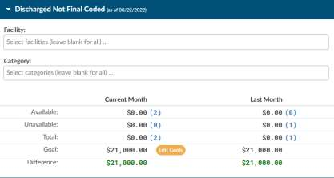

### CACTWO-5002 (Enhancement)

**Added Support for Elixhauser Comorbility Index calculations**

Elixhauser Comorbility Index calculations can now be seen in account details, if
licensed. These are triggered by certain comorbidity diagnosis codes that are
added as secondary on the account. If an account matches criteria for an
Elixhauser calculations, two things will be displayed:

The banner bar will display QI. When hovering over the QI indicator it will show
what those designations are

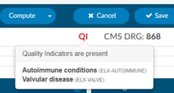

In the Code Summary viewer, the Algorithm for Quality Indicators will be
displayed at the bottom, showing the codes that match the descriptions in the
hover over of the QI tag.

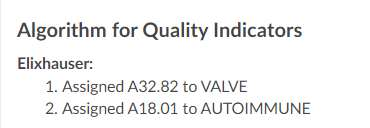

> [!note] Quality Indicators Module
Quality Indicators are an optional purchasable module.  Please contact the SME team (smeteam@dolbey.com) to
learn more about this feature.

### CACTWO-5031 (Enhancement)

**Background Color for Physician Query internal notes lightened**

When an internal note is added to a physician query templete, it is a very bright
color yellow. This has now been lightened so that the background is still yellow,
just not overly bright.

### CACTWO-5110 (Enhancement)

**Allow auditor to change coder of record**

In the Audit Worksheet, the auditor now has the option to change the coder of
record. The coder of record will appear beneath the Audit type entry, and will
have a button to change:

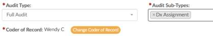
 
If the record is changed, upon saving, the user will see the new coder of record
along with the history of the previous coder of record:

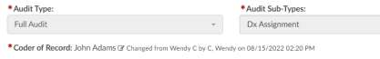

### CACTWO-5135 (Enhancement)

**Allow choice of where new Workgroup will appear in the list**

A new checkbox has been added to the Create New Workgroup option in
Workflow management. This will allow the creator to choose whether the new
Workgroup is added to the top of the Category list, or if unchecked, the new
Workgroup will go to the bottom of the category just like it currently does.

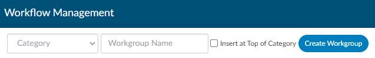

### CACTWO-5144 (Enhancement)

**Highlight assigned diagnosis codes after the 25th position**

Any diagnosis code that is in the assigned code tree to
an account will automatically be highlighted past the
25th position. This will help the coder/CDI know where
the diagnosis needs to move to make it within the top
25.

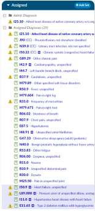

### CACTWO-5146 (Enhancement)

**Do not retrigger criteria group, if already validated**

If there are two different workgroups that have the same naming of criteria
groupsand the CDI had already validated the criteria group within the matched
critera viewer, it will not retrigger. ,

### CACTWO-5147 (Enhancement)

**Create new total active Criteria group field for columns**

A new field called ‘Active Matched Criteria Groups’ has been added to Grid
Configuration. When that has been added as a column through Grid
Configuration, the user will see a count of how many unvalidated matched
criteria groups also known as routed reasons there are on that account.

### CACTWO-5152 (Enhancement)

**Create an unspecified code field for use in Validation Rules**

A new field has been created for the Diagnosis loop called ‘Is Unspecified Code’.
An unspecificed Diagnosis code will trigger the validation rule warning when set
to True.

### CACTWO-5153 (Enhancement)

**Identify validation rule triggered in warning message**

The toast message that pops when an account is saved but has a validation rule
trigger will now show the name of the Validation Rule(s) that caused the
warning. If an account is submitted the validation box will now include a
message of all validation rules that are still present/not resolved

### CACTWO-5157 (Enhancement)

**Add field for Sequence Number and Total to Validation Manager**

The ability to add a validation rule for a sequence number for each code along
with a total has been added.

### CACTWO-5166 (Enhancement)

**New report - CDI Metric Score Card**

A new user report called CDI Metric Score Card has been created and will show
CDI activity, specifically the number of initial and follow up reviews and query
data.

### CACTWO-5176 (Enhancement)

**Add Total line to Coder Activity Report**

A grand total line has been added to the Coder Activity Report

### CACTWO-5177 (Enhancement)

**Allow Code tree to be sortable and filterable**

The All Codes tree now has a search box to filter codes. Right clicking on a code
in the tree will also show the addition of sorting codes or descriptions by a-z and
z-a.

### CACTWO-5181 (Enhancement)

**Add warning when deleting in Code Editor**

A new confirmation box will open when deleting a code in the Code Editor to
allow the user to verify that they do want to delete.

### CACTWO-5188 (Enhancement)

**Remove procedure codes from unassigned if they are a multiple**

If a procedure code appears on multipe documents and it is validated , it will no
longer appear in the unassigned code tree. This should reduce the amount of
procedure codes on inpatient charts.

### CACTWO-5192 (Enhancement)

**New Report - Case Mix Index per Month**

A new user report has been created that shows Case Mix per Month. The case
mix is the average DRG weight of submitted inpatient accounts, by Facility and
then by Financial Class. A grand Total of All Facilities will show at the bottom of
the report if data for more than one Facility occurs.

### CACTWO-5198 (Enhancement)

**Add warning statement to report description**

The descriptions of Query Impact by Discharge Date and Query Impact Reports
now includes a warning that the report should not be run as a PDF file, due to
the number of columns.

### CACTWO-5199 (Enhancement)

**Allow Documents, Flowsheets and Medications to be hidden**

This feature provides the ability to “hide” data up to the Go-Live date. The go-
live date is a new column that has been added to the Facility in Mapping
Configurations. This way, clients with multiple locations that are going live at
different dates can be set.In Role Management, a new privilege can be
assigned to any role, but the new role of MVP has been created specifically for
this request.

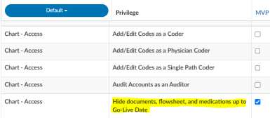

Any user with this new privilege assigned will ONLY see the Admit Document
and any document manually added to the account by a Coder or CDI via the
+Add button. Regular documents that come in BEFORE the go-live date will be
hidden. The Medications and Flowsheet viewers will also be hidden if they are
before the go-live date.

> [!info] This is for New Facility Staging
If you are live and not staging any additional facilities to added to your
system you can skip testing this, its used to stage facilities into an already
production system or to allow a site to go live without the document interfaces.
If you need more information about this feature please contact the SME Team.

### CACTWO-5215 (Enhancement)

**Ignore starting or trailing blank spaces in Workflow Management**

If a Workgroup Category or a Workgroup is created with leading or trailing blank
spaces, Workflow will now automatically strip those.

### CACTWO-5223 (Enhancement)

**Allow Physician Coder to add Pending Reasons to charges**

New optional functionality has been created to allow a Physician Coder to add a
pending reason (and note) to charges in a Charge or Transaction viewer. This
new column also will show in an Account Search with a drill down of Physician
Coder pending reason. It can also be used in a Validation rule.

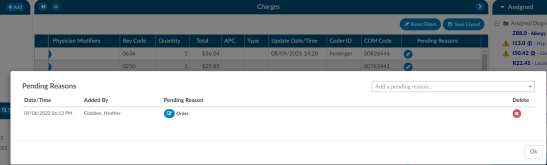

> [!note] Physician Coder Module
Physician Coder is a optional add on feature. Please contact SME Team to
learn more about how Dolbey supports professional coding.

### CACTWO-5225 (Enhancement)

**Turn off encoder for Physician Coders**

Physician Coder can now have the encoder disabled through a new setting.

> [!note] Physician Coder Module
Physician Coder is a optional add on feature. Please contact SME Team to
learn more about how Dolbey supports professional coding.

### CACTWO-5227 (Enhancement)

**Add column to Pending Reasons report**

If a Pending Reason has a physician, and that physician has a specialty field
populated, a new column called Physician’s Speciality will show on the pending
reasons report. If there are no physicians, or there are physicians without a
specialty, the column will be hidden.

### CACTWO-5228 (Enhancement)

**Add the ability to put notes on a pending reason**

When adding a Pending Reason, a new note icon will appear next to it. Clicking
the icon will open a note field for that pending reason.

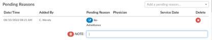

Data can be entered in that field, and if the note is no longer needed, clicking
the note icon will reopen it, and the trashcan next to the word Note will delete
it. This field has also been added to the Pending Reason drill down in Account
Search.

### CACTWO-5229 (Important)

**Worksheets are duplicating**

If a user adds a worksheet and saves the account but does not respond to the
‘Do you wish to exit the account’ pop up before the system times out, a duplicate
worksheet is created. This has been corrected.

### CACTWO-5230 (Enhancement)

**Add Physician Specialty to Account Search**

When using ‘Queries’ as a drill down in Account Search, a new column and field
for Physician Specialty will be available for use.

### CACTWO-5231 (Enhancement)

**Add a ‘cosigner’ field to physician queries**

With a new setting, a second physician field will show in the query window to
allow for a cosigner on that query. This setting is not turned on by default since
this will this field also requires an query interface change to allow this to go
outbound as well as the receiving system must support co-signer providers.

> [!info] Additional Configuration Required
Please contact SME Team to enable this functionality.

### CACTWO-5234 (Enhancement)

**Turn off conflict message for incoming charges on inpatient accounts**

If the account's charges are updated on an inpatient account by an interface
while the account is locked in use, when the user saves or submits the account,
they will not be prompted to resolve the conflict check on the charges

### CACTWO-5236 (Enhancement)

**Allow custom shift reasons created**

A new dropdown will appear at the bottom right of the Shift Reasons screen if a
mapping called ShiftReasons has been created.

### CACTWO-5237 (Important)

**Validation Rules not recognizing {Code}**

When using {Code} in a validation rule message, the code was not being
displayed. This happened when the rule originally had a loop which was
subsequently deleted. This has been corrected.

### CACTWO-5238 (Enhancement)

**New Report - Incentive Productivity**

A new user report called Incentive Productivity has been created to calculate
incentive points. In Mapping Configuration, the Category mapping now has a
column in which an incentive multiplier can be added. The report will look at
the first submitted accounts in each category, list the incentive amount, and
then create the incentive points (incentive multiplier x amount of acct submitted
in that category). If an incentive multiplier is left empty, it will be read as 1.

### CACTWO-5242 (Enhancement)

**Add checkboxes to the pre-audit section of the Audit viewer**

Check boxes have been added to the Audit viewer and show at the start of every
item in the pre-audit column. This allows the auditor to check off each code,
drg and discharge disposition as it is audited.

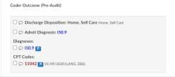

### CACTWO-5243 (Enhancement)

**Add new option to the Edit codes feature in Assigned Codes pane**

If a diagnosis code has a match in these three areas, Principal, Visit Reason,
Admit, then a new ‘Edit Only’ option will appear in the right click menu, allowing
only that particular instance to be changed.

### CACTWO-5245 (Enhancement)

**Allow pending reasons to be restricted by facility**

A new column has been added to Pending Reason in Mapping Configuration.
This allows each reason to be restricted by the facility of the account. Multiple
facilities can be added per reason.

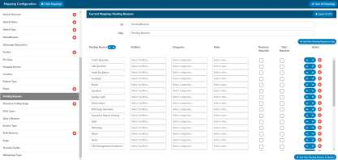

### CACTWO-5246 (Enhancement)

**Allow pending reasons to be sorted in Mapping Configuration**

In Mapping Configuration, Pending Reasons now has up/down arrows to allow
for sorting.

### CACTWO-5247 (Important)

**Long error occurring when canceling out of an account**

In certain incidents, if a timeout occurred and the user canceled out of an
account before the timeout brought up the log in screen, a long red error was
seen. This has been corrected so that if the user clicks cancel just as the timeout
occurs, they will receive a much shorter time out message.

### CACTWO-5251 (Important)

**Document Type Management page not appearing correctly**

The Document Type Management page was showing a number at the bottom
that was not matching the amount of types displayed. This was caused when a
Document Order field was populated. It has been corrected.

### CACTWO-5253 (Important)

**Validation rule using a ‘false’ statement is not working properly**

If a criterion in a validation rule used a statement checking for a ‘false’ or ‘is not
true’, the criterion was not being evaluated correctly. This has been corrected.

### CACTWO-5255 (Important)

**Workgroup is being cleared by Physician Coder submission**

When a Physician Coder submits an account, the assigned workgroup is being
cleared. A new field has been created to stop the workgroup from changing or
clearing.

### CACTWO-5265 (Important)

**Validation loop is not working if it’s the last criteria edited**

If a Validation rule is created with a loop along with other criteria, if the loop is
changed after the initial save, it is not being respected. This has been corrected.

### CACTWO-5269 (Important)

**Include autoclosed submissions in reports**

Autoclosed submits will now be included in these reports:
- Coder Activity Report
- Global Productivity
- User Detail
- Weekly Coder Activity Report

### CACTWO-5281 (Important)

**Prevent pending reason from getting deleted during upload of document**

Pending Reasons can be removed when late arriving documents come in that
have been set for a cancellation of the reason. This should not be happening
for pending reasons added by physician coders. If a document type is set up
with a cancel pending reason, it will no longer remove the reason when it comes
into the account if the reason was added by a physician coder.

### CACTWO-5307 (Added)

**filter to calendar view to filter on physician coders**

On the calendar view you can filter the data based upon a "Physician Coder"
type please note that the "Single Path" activity is also included the physician
coder data and the "Inpatient" or "Outpatient" views because single path coders
do facility coding at the same time.

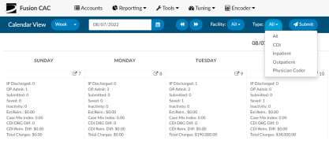
