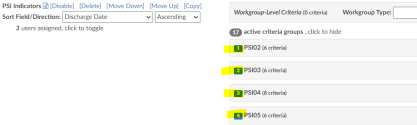
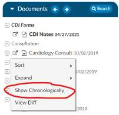
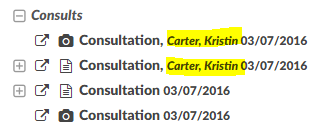
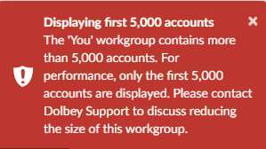
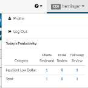
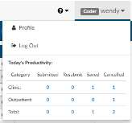
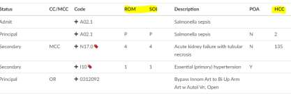

+++
title = 'V2.27 (Dec 2022)'
+++



### CACTWO-5149 (Enhancement)

**Add permission role for Dolbey Community**

A new privilege called ‘Hide Access to Dolbey Community’ has been added to
Role Management. If checked, that user type will no longer have access to
Dolbey Community in the Help menu. Dolbey Community is a new web-based
community for customer management teams launching on January 10, 2023.
Dolbey Community is intended to bring Fusion CAC users together to
collaborate and discuss topics that are important to you. You will have the
opportunity to:

- Ask questions and get answers from your peers.
- Share ideas and best practices that you've learned along the way.
- Learn tips and tricks — or pass along some of your own.
- Access resources like release notes, training videos, and marketing materials.
- Submit feature requests that may be incorporated into future releases.

If you would like a login for Dolbey Community, please reach out to the
SMEteam@dolbey.com.

### CACTWO-5171 (Enhancement)

**Hide supporting evidence from documents**

Supporting evidence will now be hidden from documents by default. If the
supporting evidence dialog is open, clicking on the icon next to the code will
reveal the secondary codes. This will now be hidden to reduce the white noise
of codes on a chart; however, the evidence is still available. Upon opening the
supporting evidence dialog you will see the evidence markers.

### CACTWO-5224 (Enhancement)

**Allow TruCode™ edits while computing with any other encoder**

If a site uses an encoder other than TruCode and wants to use the TruCode
edits to supplement their existing encoder they can now do so to display MCE,
OCE, and medical necessity edits (NCD/LCD).

> [!note] TruCode Edits License Required
This feature requires a TruCode Edits License, please contact the SME Team
for more information.

### CACTWO-5256 (Enhancement)

**Allow physicians to be attached to pending reasons from Account Search**

If a pending reason is added to an account from account search and is
configured to have a physician attached, the user can now add that physician
in Account Search. Either single or multiple accounts can be highlighted, then
in the right click menu, after Add Pending Reason is selected, if the pending
reason selected from the dropdown is set to trigger for physician, the
physician entry box will be displayed.

> [!note] Testing Steps
**Testing Steps**: In Mappings Configuration, make sure you have at least one
pending reason that requires a physician. In Account Search, select one or
more accounts, then right-click and choose "Add Pending Reason". Note that
if you select a pending reason that requires a physician, an additional
physician drop down appears. If the pending reason requires a physician, the
physician cannot be left blank. After selecting a physician reason and
physician, load the account and examine the Code Summary viewer. The
physician should be present with the newly added pending reason.

### CACTWO-5257 (Enhancement)

**Allow mass removal of pending reasons in Account Search**

If an account has multiple pending reasons, they will now all be removable
using Account Search. In Account Search, the user will need to create a search
using the Pending Reasons Drill Down Level. Highlighting one of the lines on
the account (pending reasons each have their own lines) and right clicking to
select Delete Pending Reasons will delete all reasons on the account without
having to highlight each line.

> [!info]
**Testing Steps**: Perform this action on selected accounts, then examine these
accounts in Account Detail. Any accounts with pending reasons should have
their pending reasons removed.

### CACTWO-5264 (Enhancement)

**Add number ordering for criteria groups**

Using Grid Column Configuration, first add the columns Custom Criteria
Sequence and Criteria Sequence. With these added to the Account List, users
will be able to see the sequence of the criteria group. The sequence will also
be viewable in Workflow Management, in front of each criterion. Re-
arranging the criteria list will update the sequence number as needed.

> [!info] Testing Steps
**Testing Steps**: In Grid Columns Management, add the column "Criteria
Sequence" for default workgroups and the column "Custom Criteria
Sequence" for custom workgroups. For both columns, make sure the
"Account List" checkboxes are checked. (Note that these columns are not
added automatically; not all sites will use this feature.)
>
>The criteria group sequence number is now displayed in Workflow
Management. When an account is assigned to a workgroup and criteria group,
the criteria group sequence is now recorded with the workgroup assignment.
The column "Criteria Sequence" will display the sequence number for default
workflow and the column "Custom Criteria Sequence" will display the
sequence number for custom workflow. Like with "Criteria Group", these
columns are swapped when examining a specific workgroup in the Account
List page, depending on whether the workgroup is a default workgroup or a
custom workgroup. The "Matched Criteria Groups" viewer will also display the
sequence number for matched criteria.

>[!caution] Re-run Workflow to Update Existing Accounts
This feature is commonly used with CDI and this feature is not
retroactive for existing accounts. Workflow must be rerun on existing
accounts and the account's workgroup, or criteria group must change to see
the sequence number.

### CACTWO-5283 (Enhancement)

**Allow chronological sort for documents**

The user can now right click within the document tree and a new menu option
‘Show Chronologically’ will be there. When clicked, it will sort all the
documents in chronological order. The order will be saved per user and can
easily be changed back by right clicking for the menu, from where they can
choose ‘Show Document Groups’.

### CACTWO-5294 (Enhancement)

**New capture rate report for CC/MCC**

A new user report has been created called CC/MCC Capture rate. It will show
the final result of CC/MC capture rates

### CACTWO-5296 (Enhancement)

**Show provider name on document**

If a provider name is sent in the meta data of a document, it will now show in
the Document tree, next to its document. The name is shown after a comma,
and will be order by last name, first name.

### CACTWO-5298 (Enhancement)

**Add MDC fields columns**

Grid Column Configuration will now allow the addition of 4 columns: Final
MDC, Final MDC Description, Working MDC, and Working MDC Description.

### CACTWO-5308 (Enhancement)

**Add dropdown to hide coding in Document Management**

A new column, Hide Coding, has been added to Document Types
Management, allowing the user to choose to show suggested codes based on
whether the account is inpatient or outpatient.

This will allow sites to hide codes, for example, on radiology reports or
supporting documentation "non" physician documents for inpatient charts
only.

### CACTWO-5311 (Enhancement)

**Add new sort fields to workgroups**

In Workflow Management, the fields below have been added to the Sort/Field
Direction boxes for workgroups. When no other sort order has been set in
Account list, this is the sort order that will be followed.

1. Active Matches Criteria Groups
2. Admit Date w/ Time
3. Age in Years
4. Billing Countdown
5. Discharge Date w/ Time
6. Late Document Count
7. Random Inclusion Factor
8. Total Documents

### CACTWO-5312 (Enhancement)

**Add Financial Class filter to CDI Metric Scorecard**

The CDI Metric Scorecard report is based on inpatient activity. A filter for
Financial Class has been added. Other updates to the report include number
of queries with a disagreement; percentage of queries with a disagreement;
and DRG pre-bill and post bill match rates.

### CACTWO-5313 (Enhancement)

**Add ability to use document status for validation rules**

If a document has been added as a for each loop in the Validation
Management editor. Users can now create a validation rule that will look at
each document status and report each instance of a matched validation rule
on the Code Summary viewer.

> [!info] Use Case Example
**Use Case**: Prevent coders from submitting the account when a document is in
something other than signed status and notify them using validation rules to
provide a hard or soft stop to add a pending reason. Common document
status includes but are not limited to:
>
>- D = draft
>- P = preliminary
>- F = final
>- S = signed
>- A = addendum

> [!note] Document Status Flag Required
This feature requires a document interface that provides a document status
flag. Check your interface before adopting this feature.

### CACTWO-5314 (Enhancement)

**Change expands all options to increase performance**

To help with performance, some menus have been changed. The right click
menu on the Document tree now has an Expand option that allows for
collapse or expand of documents. There is no longer a code expansion, that
is done by the plus sign only. On the Unassigned/All Codes tree, in the right
click menu, the Expand option will allow users to expand Codes. This will show
the codes, or collapse all to hide the codes and only show the headings.

### CACTWO-5316 (Important)

**Add facility filters to Administrative dashboards**

Three dashboards will now have the ability to filter by facility: Audit
Management, CDI Management and Administrative. The filters will apply to
most dashboards, except for the Autoclose, Discharged Not Final Coded, and
any panel displaying user counts. The top of the dashboard contains the filter,
and once the user clicks to filter and selects the facilities desired, clicking the
refresh button will refresh all the panels to only show the results for that
facility or facilities.

### CACTWO-5317 (Important)

**User clicking ‘refresh’ during account load causes accounts to be removed**

When an account list is in the process of being retrieved and a user clicks the
refresh button, the beginning of the list is removed. This has been corrected.

### CACTWO-5318 (Important)

**Validation Editor not evaluating criteria of Charge Codes exist correctly**

If multiple charges exist on an account and one of them does not have a CPT
code, a validation for Charges Exist does not work properly. This has been
corrected.

> [!info] Testing Steps
**Testing Steps**: You need an account with charges where at least one charge
does not have a CPT Code. In Validation Editor, add a rule "Charge Codes -->
Exists". On that account, if at least one charge has a CPT Code, the rule should
trigger even if another charge doesn't have a CPT Code.

### CACTWO-5321 (Important)

**SOI/ROM values on banner bar do not match Audit Worksheet**

If an Audit was opened on an account with SOI/ROM values, those values on
the banner bar were not matching what was showing on the Audit worksheet.
The Audit Viewer displays the ROM where the SOI should be displayed. The
data on the account and the audit is correct; it's just the display that is
incorrect. This has been corrected.

> [!note] Requires Audit Management
This feature requires Audit Management which is an additional module; please contact
SME Team if you are interested in learning more. This also requires an APR-
DRG license.

### CACTWO-5322 (Enhancement)

**Provider not showing in drop-down when last name entered contains a space**

If a Physician has a last name containing a space, such as Van Hutton or De
Graff, the physician is not found when searching on the Physicians & Queries
page or on a procedure to add the provider by the first part of the last name.
This has been corrected.

### CACTWO-5326 (Enhancement)

**Show middle name in 3M™ Coding and Reimbursement System (CRS)**

encoder
The 3M CRS encoder was only showing the patient’s last name. This has been
changed to show the patient’s first, middle and last name in the encoder.

> [!note] 3M CRS Users
This feature is for 3M CRS users only

### CACTWO-5327 (Important)

**Changing query from Canceled to Wrong Provider doubles query**

When using the "Change Physician" option on an open query a query is
created as expected, but when reopening the query and changing the
canceled reason to "Wrong Provider" a second query was resent. To prevent
this, there is now a dropdown on the Change Physician button that will drop
down the cancel reasons. Clicking Send New Query will send the query to the
new physician and close the query to the incorrect one. If a user then
reopens that canceled query and changes the cancel reason at the bottom,
an additional query will not be sent.

### CACTWO-5328 (Enhancement)

**Change HCC Viewer to show friendly value**

The HCC Viewer has been updated to show the mapped friendly value for the
Category.

### CACTWO-5331 (Important)

**CDI Activity report is displaying 00:00:00 for some charts**

On the CDI Activity report, any chart with a facility on it caused the records
‘Time Spent’ to zero out. This has been corrected.

### CACTWO-5332 (Enhancement)

**New ‘Today’s Date’ fields created**

In Grid Column Configuration, two new options have been added: Today’s
Date and Today’s Date /w Time. These can be added to show the current date
and time on any screen chosen as a column, including Scheduled Reports.

### CACTWO-5334 (Important)

**CDI Query reports percentages are not being computed correctly**

The CDI Query Score Card and CDI Query Score Card by Admission Month
reports were not calculating the DRG Pre-Bill and Post-Bill percentages
correctly. This has been corrected.

### CACTWO-5336 (Enhancement)

**Allow Modifier entry to code by using hyphen**

In version 1, the software allowed you to enter a CPT Code followed by a dash
and a modifier. The version 2 software now has this feature. When adding,
editing, or mass editing a CPT code, the modifier can be added by adding a
hyphen after the code, along with the modifier.

### CACTWO-5338 (Important)

**Prevent Out of Memory exceptions in Account list**

If there are more than 5000 accounts in a workgroup when loading the
account list, the user will now see an error message:

### CACTWO-5340 (Enhancement)

**Allow for default POA other than Y**

CAC now allows the installation to configure the default POA other than Y
Contact Support to implement this option.

### CACTWO-5341 (Enhancement)

**Add columns and calculations for Audit Abstract Report**

The Audit Abstract Report will display the calculation of modifier changes.
The number of original modifiers, plus the number of new modifiers are added
to the Pre Audit score. Several column names have been updated accordingly.

### CACTWO-5343 (Important)

**Using computed field in Account Search doesn’t return all results**

If there were more than 1000 accounts that matched an Account Search that
used a computed field, such as Age in Years, then all results were not being
shown. This has been corrected.

### CACTWO-5344 (Enhancement)

**Screen changes for the New Document Grouping page**

Several updates to the New Document Grouping page have been made. The
‘delete all’ button has been removed, and the ‘save all’ button has been
changed to ‘save all groups’ for clarity. A confirmation pop up will now occur
when deleting a document group.

### CACTWO-5348 (Enhancement)

**Prevent "Account Changed" dialog when only images are redownloaded**

When a change is made upstream to an image on an account while that
account is opened, the Account Changed box pops. This has been changed so
that only documents will cause the change box to open.

### CACTWO-5350 (Enhancement)

**Banner Bar is not showing Discharge Disposition title**

The Discharge Disposition in the banner bar has been changed to now show
the title from the Discharge Disposition mapping, instead of being hard coded.

### CACTWO-5357 (Enhancement)

**Add productivity count to top of screen so the coder does not have to return to**

dashboard to know productivity
When a user clicks on their user ID in the right corner of the screen, a new
chart will appear showing the updated work count for the day. If the user is
both CDI and Coder, the chart that appears will be based on the current profile
This allows the user to see how charts were worked today without needing to
return to the dashboard. In this instance, the user is a coder:

### CACTWO-5360 (Enhancement)

**Allow 3M CRS facility to be populated in CAC2**

Dolbey now supports the field available in 3M CRS which is an account-level
“EncoderFacility’ field.

> [!note] 3M CRS Users Only
This feature is for 3M CRS users only.

### CACTWO-5362 (Enhancement)

**Add PSI data to the After Audit section of Audit worksheet**

If an account has a PSI assignment, it shows on the Coder Outcome (Pre-Audit)
side of the Audit Worksheet. The PSI assignment will now also show on the
Auditor Outcome (Post-Audit) side after the Update Codes button is clicked

### CACTWO-5366 (Important)

**CDI Query Score Card reports should not count all accounts**

The CDI Query Score Card and CDI Query Score Card by Admission Month
should only count accounts with both Working and Final DRGs on the first
Submit in the Pre-Bill Mismatch statistics. It was counting all first submit
accounts. This has been corrected.

### CACTWO-5367 CACTWO-5366 (Important)

**CDI Query Score Card reports should not count all accounts**

The CDI Query Score Card and CDI Query Score Card by Admission Month
should only count accounts with both Working and Final DRGs on the first
Submit in the Post-Bill Mismatch statistics. It was counting all first submit
accounts. This has been corrected.

### CACTWO-5370 (Important)

**Visit Reasons being unassigned when assigning Admit or Principal Diagnosis**

On an outpatient account, if a Diagnosis code was set as a Visit Reason, then
subsequently right clicked on and added as Admit or Principal, the Visit
Reason was being deleted. This has been corrected.

### CACTWO-5371 (Enhancement)

**Allow Single Path user to switch between facility and professional charge**

If facility charges and professional charges are received separately on an
account, a single path user will be able to toggle between facility and
professional charges. The toggle will appear in the upper left corner of the
charges viewer.

### CACTWO-5375 (Enhancement)

**Add ROM/SOI indicators on more viewers**

The Working CDI History viewer and the Final Code Summary viewer will now
show columns for ROM/SOI and HAC/HCC per each code. The designation
HAC will be shown in the CC/MCC column, when applicable.

### CACTWO-5382 (Important)

**3M CRS responses are doubling**

3M CRS responses are doubling if the user is timed out of the app and then
logs back in and reopens the account. This has been corrected.
For 3M CRS users only

### CACTWO-5384 (Important)

**Audit Worksheet checkboxes are being unchecked**

If the Audit Management viewer is popped out to another tab and a checkbox
in the Coder Outcome (Pre-Audit) is checked, adding a code on the main
browser was clearing the checked box. This has been corrected.

### CACTWO-5385 (Enhancement)

**Enable Alternate Length of Stay in 3M CRS**

The ability to provide Alternate Length of Stay to 3M CRS to prevent
prompting for it with specific groupers has been added.
For 3M CRS users only

### CACTWO-5387 (Important)

**Or groups in Validation Management are not working properly**

If an Or group criteria is created in Validation Management and contains a
looped result, that result was being ignored. This has been corrected.

### CACTWO-5388 (Enhancement)

**Add Hospital Service filter to the Weekly Coder Report**

The Weekly Coder Activity report can now be filtered by Hospital Service.
Hospital Service will not appear in the header of the report as a filter unless it
is utilized.

### CACTWO-5389 (Enhancement)

**Add grand total line to CDI Activity Report**

A grand total line has been added to the CDI Activity report.

### CACTWO-5390 (Enhancement)

**Add CDI codes added via 3M CRS to All codes list for Coders**

Currently, the All Codes list (when user is a Coder) will only show CDI codes
that are added on a document. They can then be hidden by the Hide CDI
codes list. Codes that are added by a CDI via the 3M CRS encoder will now also
appear in that list.
For 3M CRS users only

### CACTWO-5392 (Important)

**User Detail report is not showing AutoClose statistics**

The User Detail report is not showing AutoClose statistics, or data for any
account with no documents, or has documents with no codes, but direct
coding via 3M CRS has occurred. This has been corrected.

### CACTWO-5393 (Important)

**Filtering results from account search does not update the displayed numbers in**

the bottom left
When a report pulled up via Account Search is subsequently filtered, the
number of lines at the bottom of the page are not updating to show the filter.
This has been corrected.

### CACTWO-5394 (Important)

**Submit button is being grayed out when it shouldn’t be**

The submit button on accounts will now be grayed out according to validation
rules, rather than being hard coded for reasons of no principal diagnosis being
assigned

### CACTWO-5395 (Important)

**Queries closed as No Opinion do not show in Account Search**

If an Account Search report is created using the Queries Drill Down level,
accounts that had queries closed as ‘No Opinion’ were showing as blank. This
has been corrected.

### CACTWO-5397 (Enhancement)

**Display physician coder data on Code Summary page**

When a physician coder is in an account, they will now see ‘Physician Coding
Last Saved’ and ‘Physician Coding Last Submitted’ data on the Code Summary
page.

### CACTWO-5398 (Enhancement)

**Add looped field for E/M in Validation Management**

User can now create a validation rule based on E/M loops in Validation
Management.

### CACTWO-5401 (Important)

**Edit pending reasons in Workflow list not dropping or closing properly**

If user edits a criteria group filter in workflow management and leaves the
edit form open, then clicks on a filter to save, the edit form was staying open,
and the Edit Pending Reason link was appearing. This has been corrected.

### CACTWO-5402 (Important)

**Code designations are not showing correctly during recalculation**

Codes that have been given a CC, MCC, or HAC designation are not updating
properly when the code itself is moved into a different position in 3M CRS or
the Assigned codes pane. This has been corrected.

### CACTWO-5403 (Enhancement)

**Allow full column name to be displayed in Account and System Search**

The Tools button in the Account and System Search pages will now display the
full friendly name of the column when deployed.

### CACTWO-5404 (Important)

**Slow loading of Dashboard if more than 5000 accounts per workgroup**

A new message will show to alert the user if there are more than 5000
accounts per workgroup in the dashboard. The limit of 5000 has been placed
to prevent lockups.

### CACTWO-5406 (Enhancement)

**Remove ROM/SOI from Pre-DRG in queries**

ROM/SOI will no longer show when the MS-DRG is grouped and APR is the
secondary grouper within a physician query.

### CACTWO-5407 (Enhancement)

**Coder DRG Summary report has been created**

A new user report called Coder DRG Summary report has been created.
Accounts must be discharged and submitted to appear in this report. This
report will show the breakdown per coder MS-DRG to show the total visits per
DRG.

### CACTWO-5408 (Important)

**Cannot reassign codes in Edit All Codes page**

With the Edit All Codes page open, changing a Secondary diagnosis to Principal
changes the codes. But, if the user then tried to change the former Principal
back to Principal, that option was not in the codes select dropdown. This has
been corrected.

### CACTWO-5413 (Important)

**Allow 3M CRS to stay open past timeout**

For sites with the 3M CRS encoder, the timeout will now be advanced by 4
hours when using 3M CRS as the encoder. If 3M is open, the timeout will be
held for 4 hours before activating.
For 3M CRS users only

### CACTWO-5414 (Enhancement)

**Disallow coders from changing charge physician**

Coders can now be prevented from changing the physician on a charge.
Please contact Support to enable this feature

### CACTWO-5416 (Enhancement)

**Allow Scheduled Reports to generate blank report for emails**

In a previous release there was a feature that if an account search yielded no
results, it would prevent a report from being generated. This feature is turned
off by default. The system will not generate an email with blank results until
it is enabled.
Please contact Support to enable this feature

### CACTWO-5418 (Enhancement)

**Show full assigned username in Code Summary**

The default Code Summary will now show the full username with the ID in
parenthesis if an account is assigned to a user rather than a workgroup.

### CACTWO-5419 CACTWO-5421 (Important)

**Edit Pending Reason link missing in Workflow Management**

When copying criteria from workflow management that has a Pending
Reason, the copy is not showing the Edit Pending Reason link at the end of the
criteria line. This has been corrected. If the workgroup is copied and another
criterion is added to the Pending Reason criteria group, it was copying down
that reason instead of showing a blank for whatever criteria was chosen. This
is now corrected.

### CACTWO-5422 (Important)

**Account Search not paging properly**

If a filter in Account Search uses a computed field (such as Age), then the
numbering of accounts per page did not show correctly. This has been
corrected.

### CACTWO-5424 (Important)

**Save Last Saver if Auditor saves/submits an account**

Currently, an Auditor will only show as last saver if there has been a
saver/submitter before. It did not show as a first saver. This has been
corrected so that no matter what, the auditor’s name will show if last saved.

### CACTWO-5427 (Important)

**Alert user to not close browser when logging out to save an account**

If the user is in an account, clicks on the Log Out menu option, and chooses
"Save the account," the user needs to be notified not to close the browser
until the save is completed. There is no visual indicator to indicate that a save
is in progress if the save takes a few seconds. Closing the browser early could
prevent the account from saving completely.

### CACTWO-5437 (Important)

**Engine Results by CDI is not filtering correctly**

When adding Users to the Users field in the Engine Outcome per CDI report,
the results were not the same as if you ran the report without filtering to
specific user. This has been corrected so that the user filter looks at the same
columns a non-filtered report does.
