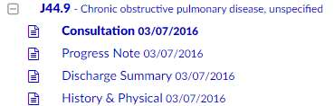
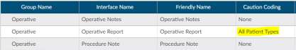
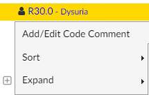

+++
title = 'V2.28 (Mar 2023)'
+++



## CACTWO-5369 (Enhancement)

**Financial Class Outcome by Discharge Report**

A New user report is created based on discharge date. The Financial Class
Outcome by Discharge report is configured as a monthly report, with a
maximum of 12 months per report. The accounts must be inpatient with a
Final DRG. If no financial classes are filtered, there will be an ‘Overall’ section
at the bottom of the report.

## CACTWO-5410 (Enhancement)

**Allow Charge viewer codes to be drag and dropped**

Physician/Single Path coders will now be able to drag and drop diagnosis
codes within the add codes list on the Charges Viewer.

## CACTWO-5411 (Enhancement)

**Allow mass editing of Charge Viewer codes.**

Physician/Single Path Coders can now select multiple lines in the Charges
Viewer, and by clicking on the Edit code icon and selecting codes, apply those
codes to all items in the selection.

## CACTWO-5429 (Enhancement)

**Allow document updates to add or cancel pending reasons**

If a document is set up to add or cancel pending reaons, those will now occur
on document updates, not just document additions.

## CACTWO-5431 (Enhancement)

**Add Working DRG History to Validator Editor.**

When setting up a validation rule, the user can now select Working DRG
History as a viewer to navigate to. When the validation rule occurs on the
Code Summary page, clicking on it will take the user to the Working CDI
History.

## CACTWO-5434 (Enhancement)

**CDI Codes on Submitted Charts report**

A New user report CDI Codes on Submitted Charts report was created.
Discharged submitted inpatient accounts with both a Final and Working DRG
will appear on this report. The Working DRG displayed on this report is the
last Working DRG computed before discharge. Because this report is so large,
it *should not be run as a PDF*.

## CACTWO-5453 (Enhancement)

**Show diagnosis designations on Unassigned code tree**

If a code in the Unassigned Code tree has the potential to be an MCC, CC or
HCC code, itwill now show next to the code for inpatient accounts. The HCC
is controlled by the HCC display flag on Category in Mapping Configuration.
No HCC will display if the admit and discharge dates are in different years.

## CACTWO-5465 (Enhancement)

**Add columns for Query Responder**

When a physician who was not the physician of record on a query answers the
query, there is no way to mark that on the query. A new column for the data
on the query responder has been added to the Physician and Queries viewer,
and are also available in the Account Search drill down level for Query.

## CACTWO-5466 (Enhancement)

**AMA CPT Utilization Report**

A new user report was created. This calculates the number of times a CPT
code is touched with any action that assigns or edits a CPT code on an account.
This is a report that Dolbey uses to report usage to the AMA per contract.

## CACTWO-5475 (Enhancement)

**Current Workgroup report**

A new report, Current Workgroup, was created. This report ignores the data
range and only reports on ‘today’s’ workgroup list. If no user is filtered for
this report, the results will output the current workgroup statistics for all
enabled workgroups that do not have a workgroup type of Purge, which is set
in Workflow Management.

## CACTWO-5480 (Important)

**Change drilldowns for Dashboard**

Drilldowns for dashboards will still allow a maximum of 5000 accounts to be
retrieved, but they will now be displayed in pages like Account Search. This
will help to improve performance.

## CACTWO-5482 (Enhancement)

**Allow ‘Query For’ field in Physician Query to be a drop down**

Mapping Configuration can have an entry added that will allow the Query For
field to be a dropdown choice field.

> [!note] Additional Configuration Required
Please contact Support to enable this option.

## CACTWO-5484 (Important)

**Change drilldowns for Calendar**

The calendar has been updated to show drilldowns that exceed 500 accounts
to page them. This will help to improve performance.

## CACTWO-5485 (Enhancement)

**Force inactivity prompt for timeouts**

A new setting will allow inactivity prompts to occur when an account is auto-
saved due to a session timeout, regardless of the minimum and maximum
minute setting.

> [!note] Additional Configuration Required
Please contact Support to enable this option.

## CACTWO-5494 (Enhancement)

**Allow physician query response to be a dropdown**

The physician query response of ‘no opinion’ can be changed to be ‘other
opinion’ with a drop up selection.The response will now show in an ‘other
opinion’ column on these user reports:

- CDI Metric Scorecard
- CDI Query Scorecard
- CDI Query Scorecard by Admission Month
- Query Stats

> [!note] Additional Configuration Required
Please contact Support to enable this option.

## CACTWO-5497 (Enhancement)

**Enhance color on codes that have been assigned multiple times on the**

account
If an account has multiples of one code, and the code is assigned from within
the document, all other instances will show as italicized with a light green
background. This will help alert the user that the code is already assigned
elsewhere in the account. In this example, a diagnosis and a PCS code have
been assigned on other documents

## CACTWO-5498 (Enhancement)

**Allow comments to be added to codes in trees**

A comment can now be added to a code on the document tree, or the
Unassigned/Show All code tree. The comment will show as a green flag in the
trees and on the code in the document. On the trees, the comment is
readable via a hover over; in the document itself, the flag can be clicked to
open the comment. The comment can be added to or deleted by erasing the
text. The comment will show in its own section in the Notes and Bookmarks
viewer, and can be edited or deleted there.

## CACTWO-5499 (Enhancement)

**Bold assigned codes in the Show All code tree**

If there is a code that appears on multiple document types and one of those
is assigned, it will now appear as BOLD in the Show All codes tree. In this
example, the code was assigned on the Consultation document type.

Please note, this may not be retroactive..

## CACTWO-5500 (Enhancement)

**Show Autoload on the User Audit Trail report**

A new autoload column has been added to the User Audit Trail Report, which
will populate with TRUE for activites in which auto-load was enabled. This is
NOT retroactive.

## CACTWO-5501 (Enhancement)

**Add columns to User Detail and User Session Log reports**

Columns for Discharge Date were added to the User Detail and User Session
Log reports. A column for Total Charges has also been added to the User
Session Log report.

## CACTWO-5507 (Enhancement)

**Add sequencing column for Physician and Single Path Coders**

A new column has been added to the Add Code dialog box within the charges
viewer for Physician Coders. This way no matter how long the list is, the user
can always see how many codes are in the list

## CACTWO-5508 (Important)

**Non-stop scrolling occurring in Account Search**

If the down/up arrow is clicked when using ‘ Less than’ or ‘More than’ under
date options in Account Search, the scrolling never stops. This has been
corrected.

## CACTWO-5519 (Important)

**Inpatient Coder Scorecard report not filtering user properly**

When filtering by user, the report was not evaluating that user as the Audit
coder of record; instead it was evaluating as the auditor that opened the
audit. This has been corrected for both the Audit – Inpatient Coder Scorecard
and the Audit- Outpatient Coder Scorecard.

## CACTWO-5532 (Important)

**Working History is duplicating**

Working CDI History was duplicating the first baseline DRG. This has been
corrected.

## CACTWO-5534 (Important)

**Engine Outcome per CDI report needs a column change**

The Totals column is actually based on averages, so the name of the column
has been changed to Averages.

## CACTWO-5535 (Important)

**Caution codes should not be assignable**

If a Document Type is set to have a caution code, it will now be unassignable.
In this case, the Operative document called Operative Report is set to have
Caution Coding for all patient types:

In the Unassigned Codes pane, any code attached to that document will show
in a yellow background, and will not have the option to assign on the right
click menu.

## CACTWO-5536 (Important)

**Data on worksheets is disappearing when printing then leaving viewer**

If a worksheet with a multi-line text field is added to an account and filled in,
printing it and then moving to another viewer, like Physicians and Queries,
was blanking out the sheet data. This has been corrected.

## CACTWO-5549 (Enhancement)

**Remove blue bar titles in a template with sections**

For Physician Query templates that use sections, the blue bar will still show,
the title or wording within that bar will no longer show. Blue bar remains so
that section can still be moved around or deleted.

## CACTWO-5556 (Enhancement)

**Create new fields for Grid Configuration**

New fields have been created in the Grid Configuration for addition to pages.
Fields are Physician Coding First Coder and Physician Coding First Submitter.
These fields are retroactive.

## CACTWO-5562 (Important)

**Scheduled Reports not opening if report is actively running**

Several reports were not opening if they were being actively processed at the
moment a user tried to open them. This has been corrected.

## CACTWO-5563 (Important)

**CC/MCC Capture Rate report totals are not correct**

Non-CC/MCC DRGS are being calculated in the totals of the CC/MCC Capture
Rate report. This has been corrected.

## CACTWO-5565 (Enhancement)

**Add Working and Final Principal Diagnosis Code fields**

New field options for setting up criteria for Final, Working and Physician
coding. The new fields will start with Principal for final coding, Working
Principal for CDI and Physician Coding Principal for Physician coding.

## CACTWO-5566 (Important)

**Charges attached to codes not included in encoder calculations**

When calculating APC or EAPG for charge codes with the TruCode™ or 3M™
encoders, the charge per unit was not included. This has been corrected.

## CACTWO-5567 (Important)

**Lists with spaces and commas are not correctly triggering workflow**

If a list in a workgroup criteria was created with a space or spaces before
commas within the list, the criteria was not being triggered. This has been
corrected.

## CACTWO-5570 (Important)

**Names are being created with starting or ending spaces**

User ID, first, middle and last name fields should not be able to be created in
User Management if they start or end with spaces. This has been corrected
and if a space is detected, a red error message will appear.

## CACTWO-5589 (Important)

**Display issues when toggling in Show History**

When in Show History, if the user was toggling on and off the workflow button
after selecting a record, display issues were occurring. This has been changed
so that if a user makes a selection from the lefthand list and then toggles on
and off either the User or Workflow buttons, the selection will clear.

## CACTWO-5590 (Important)

**TruCode™ Standalone not adding codes**

When clicking the Pencil symbol next to a blank code field in TruCode
Standalone encoder and selecting a code, the code was not being added to
the field. This has been corrected.

> [!info]
This feature is only applicable if you have the TruCode encoder.

## CACTWO-5592 (Important)

**TruCode™ Standalone not editing codes properly**

When editing a code in the TruCode™ Standalone feature, instead of replacing
the old code with the new one selected from the Code Book, it was keeping
the old code and adding the new one on its own line. This has been corrected.

> [!info]
This feature is only applicable if you have the TruCode encoder.

## CACTWO-5596 (Important)

**Workgroup not appearing in Account List dropdown**

If a Workgroup contains more than 5000 accounts, it is not appearing in the
Account List dropdown. This has been corrected.

## CACTWO-5604 (Important)

**Prevent Change Conflict message for custom workflow flags**

If a site has custom workflow flags implemented, they will now be able to
prevent the change conflict dialog from appearing when saving or submitting
an account.

> [!info]
Please contact Support to implement this feature.
