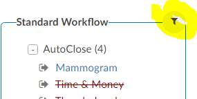
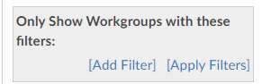
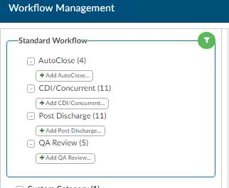
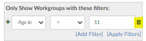
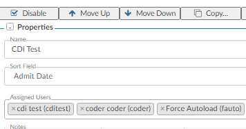
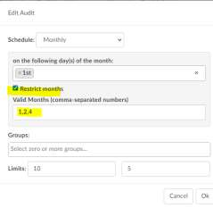
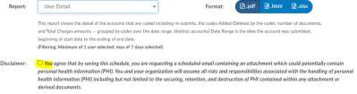

+++
title = 'V2.51 (Jul 2023)'
+++


## CACTWO-5202 CACTWO-5648 (Enhancement)

**Added the ability to see APR-DRG in Principal Dx Analyzer for TruCode**

When a TruCode user clicks the Principal Dx option on the Compute button,
they will now see data columns for APR-DRG (if they are set up with an APR-
DRG Grouper). If an account is not configured to use an APR-DRG grouper,
they will only see the usual MS-DRG data.

> [!note] TruCode™ Users Only
This feature only applies to TruCode™ users.

### CACTWO-5921 (Enhancement)

**New Page Display for Workflow Management**

The new workflow management page display offers new capabilities
including:

- Enhanced Vertical Viewing Space for Workgroups - This display
provides an improved vertical viewing space, allowing workgroups to
access and manage their workflows more efficiently.
- Side-by-Side Comparison of Workgroups - This will allow users to
compare and analyze workgroups with a side-by-side comparison.
- Filtering Ability to Search Workgroups by Specific Fields - This
feature allows you to filter on all workgroups that has a specific field
- Cleaner/Sleeker Look and Feel

We understand the importance of ensuring a smooth transition. To
accommodate your preferences, we have implemented a convenient option
to switch between the classic view and the new page display. To facilitate the
adoption of this new view, we will be maintaining the classic workflow
management for a few releases. This way, you can transition gradually and
comfortably, choosing the workflow management that suits your immediate
needs. To simplify the transition process further, we have imported all your
existing workflows into the new workflow management system. This means
you can make changes in either of the pages and it updates the other.

This will allow you to become familiar with the enhanced features and
maximize the benefits they offer.

### CACTWO-5244 (Enhancement)

**Allow filtering in Workflow Configuration workgroups**

Users can now filter Workgroups by a variety of fields in the new workflow
managment. At the top of the new Workgroup column there is a filter icon.

Clicking on the filter icon will open a gray box from where the user can add
filter, and then Apply it to whittle down the workgroups to only the ones the
user wants to review.

After the Apply Filters link is clicked, the workgroups will filter to only show
accounts that match the filter. The filter symbol turns green to alert the user
that they are working within a filter.

When the filter is no longer necessary, the user can click the green filter icon
to open the filters. A little garbage can will show to the right of the filter,
allowing it to be deleted.

### CACTWO-5488 (Enhancement)

**Support Pediatric Quality Indicators**

The application now supports PDI – Pediatric Quality Indicators .
This feature is included in the Quality Module, please contact support to
enable. If you do not have the Quality Module this is an additional cost.

### CACTWO-5597 (Enhancement)

**Assigned users in workgroups will show both name and ID number**

The new Workflow Management will now display both the name and login
ID of the assigned users.
In the new Workflow Management, the assigned users will now show both
their login ID and their name.

### CACTWO-5633 (Enhancement)

**Allow Flowsheet comments to pop out**

If a Discrete Value comes in with data in the comment field, the user can
now right click and choose ‘View Result in Window’ in order to see the full
comment.

### CACTWO-5666 (Enhancement)

**Allow Charges viewer to auto-refresh**

It will now refresh the Charges viewer if it is open when an account change
conflict occurs.

### CACTWO-5672 (Enhancement)

**Add time to procedure dates in Account Search**

If the user wants to see time along with the dates assigned to procedure
codes, they can have a script run to add that. Then, when drilling down in
Account Search and selecting procedure code options that have dates, the
time will also display.

> [!note] Additional Configuration Required
Please contact Support to enable this feature.

### CACTWO-5698 (Enhancement)

**Check DRG weight to determine if there is DRG Reconciliation mismatch**

During Reconciliation of the CDI DRG and Coder DRG, the weight of those
DRGs will also be compared.With APR-DRG you have the same DRG with a
different DRG Weight due to the ROM/SOI that drives the DRG weight.

### CACTWO-5714 (Important)

**Not receiving timeout reminder**

When timing out of CAC while in a physician query, when logging back in,
the user is not receiving the timeout reminder letting them know the account
was not completed. This has been corrected.

### CACTWO-5754 (Important)

**Shorten date/time fields in Form Designer**

The date and datetime fields in Form Designer takes up the whole line, which
doesn’t allow for additional data to be added next to the date or datetime.
These fields have now have a shortened max width.

### CACTWO-5756 (Enhancement)

**Allow sharing of worksheets**

A new section in Form Designer has been created called Shared Worksheets.
Worksheets added here will be visible and editable by both CDI and Coders.
With the help of Support, worksheets that are currently CDI OR Coder can be
changed to Shared.

> [!note] Additional Configuration Required
Please contact Support to change existing worksheets to Shared.

### CACTWO-5761 (Important)

**Account List sort order is not being retained**

If a user had no accounts in his ‘You’ folder, but does have accounts in other
workgroups, then a sort order that is created is not being retained when
moving back and forth to the Recent Views screen. This has been corrected.

### CACTWO-5767 (Enhancement)

**Add a Physician Charges drill down for Account Search and Validation Editor**

A new drill down in account search was created for Physician Charges and
within Validation Editor.

> [!note] Physician Coding Users Only
This feature only applies to Physician Coding users.

### CACTWO-5771 (Enhancement)

**Allow mappings to be dragged and dropped**

Mappings can now be dragged and dropped within the list to other positions,
rather than using up and down arrows. The drag must be done from any
whitespace on that line, you cannot drag from within the input boxes or
buttons.

### CACTWO-5775 (Enhancement)

**Allow Workflow Audits to be done in monthly schedules**

When setting up an Audit workflow criteria, clicking on the line to create the
audit will now allow the user to schedule monthly and restrict the months –
numerically – that the audit occurs. In this instance, the Restrict Months box
is checkmarked and it is set to run on the first, second and fourth month of
the year.

### CACTWO-5778 (Enhancement)

**Remove several columns in the Physician Coding Assigned Codes drill down**

Several columns have been removed from the Physician Assigned Codes drill
down in the account search as they are not useful.

- Physician Coding Episode
- POA Exempt Code
- Is Principal
- POA
- PPC

### CACTWO-5787 (Enhancement)

**Allow reports with PHI to be scheduled**

Currently, user reports that include PHI cannot be scheduled. That has been
changed so that all reports can be scheduled. Reports with PHI will show a
disclaimer message when they are chosen. The disclaimer must be
checkmarked in order for the schedule to be saved.

### CACTWO-5795 (Important)

**Single Path and Physician coders are handling code validation differently**

Code validity was in question since Single Path follow Discharge Date and
Physician Coders follow Admit date. When an accounts dates crossed a
quarter, codes were not validation properly. This has been updated so that
both Single Path and Physician coders follow the Discharge date.

### CACTWO-5800 (Important)

**Drag and drop in the Edit All Codes table is stopping the scroll bar**

When clicking on a code in the Edit All Codes table to drag and drop, the scroll
bar no longer works. This has been updated so that to drag and drop, the
user must drag and drop in white space on that line, or from the POA, Date or
Physician boxes.

### CACTWO-5805 (Enhancement)

**Add a query type column in the Queries drill down in Account Search**

A new Query Type column is now available in the Queries drill down in
Account Search. Retrospective will show in the column if the Query was
created after the Discharge Date. All other accounts will show as Concurrent.

### CACTWO-5814 (Important)

**Validation rules based on Physicians assigned to Procedures do not work**

Validation rules that included a filter of Procedure Physicians was not
reading the field when looping through multiple Procedures. This has been
corrected.

### CACTWO-5825 (Enhancement)

**Show Physician Specialty in Charges and Transactions viewer**

Physician Coders can now see the specialty of the Physician assigned to a
procedure code in the Charges/Transactions viewer if the opt-in script has
been run.

> [!note] Additional Configuration Required
Please contact Support to activate this option.

### CACTWO-5829 (Important)

**Navigation Tree is showing Physician Queries when there aren’t any open**

If the user was reviewing their accounts using Autoload and pinned the
Navigation Tree so that it was open, the Navigation Tree was showing a color
alert for Physician Query, indicating there is an open query, even when there
was not. This has been corrected.

### CACTWO-5874 (Important)

**3M™ date fields are grayed out in the Encoder**

When 3M™ is launched via the Encoder menu and the user changes to
APCFinder or DRGFinder, the Admit and Discharge date fields are locked. This
has been corrected.

> [!note] 3M™ Users Only.
This fix only applies to 3M™ users.

### CACTWO-5895 (Enhancement)

**Add today into the last 7 days calculation on the CDI Management**

Dashboard
In the CDI Management Dashboard, ‘today’ work was not being included in
the last 7 days calculation for intial cases reviewed and cases re-reviewed.
Today’s work will now be included.
