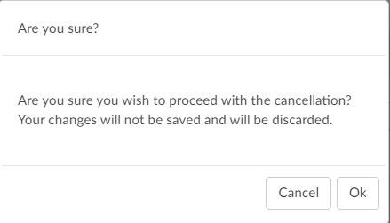

+++
title = 'V2.52 (Sep 2023)'
+++



## CACTWO-5428 (Enhancement)

**Allow an alt-click to open code editor**

In the Assigned code tree, the user can now alt-click to get a partial code
editor that is based on that assigned code. In the Unassigned code tree, an
alt-click will open a full code editor, since no action has been assigned yet to
that code.

## CACTWO-5504 (Enhancement)

**Add verification prompt to Cancel button**

A new message box will prompt when a user cancels out of an account after
making a change and not saving.

## CACTWO-5533 (Enhancement)

**Improve support for copying and pasting queries**

Some customers create a physcian query from within form designer and then
copy and paste it into a different system, they were finding that the signature
block could not be copied and was indented and wanted it to be left aligned.
Additionally, any input fields where the user typed information into was bold
and they requested non-bolding. This enhancement covers these three items:

1. Signatures will no longer be indented
2. After the query is created, the query contents and the signature can now be copied together.
3. Text entered into field will no longer display in bold

> [!note] Additional Configuration Required
Please contact Support to activate the non-bold text option. The
bolding was intially added as an option for those sites to be able to tell what
was keyed in by the end user appart from the template.

## CACTWO-5539 (Enhancement)

**Warn user if no shift reasons selected**

If a user closes a query and does not make a valid selection in the manual
shift reason box, a warning will alert them that no selections have been
made, and they can either ok that or cancel it and make a selection.

 
## CACTWO-5588 (Enhancement)

**Added ‘starts with’ to be used as an operator in some criteria**

The ability to use ‘starts with’ in criteria has been added in these pages for all
fields that provide a list of string values, such as codes and document types:

- Account Search
- Workflow Management
- Validation Management

An example of how you would use this would be if you want to run an account
search to look for procedures with a range. For example, any procedure code
that begins with 021 or 02Y. You would write the logic like the below.

**Assigned Procedure Codes** --> Starts With --> 021,02Y

> [!note] Additional Configuration Required
If you wish to use this operator with AutoClose, you must contact
Support for updated AutoClose script.

## CACTWO-5602 (Enhancement)

**Remove ‘hover’ from the Navigation Tree**

The Navigation Tree will no longer expand when hovered over. The user will
now have to specifically click the arrow to open it. The system will remember
this preference between accounts.

## CACTWO-5618 (Enhancement)

**Add Elixhauser code description to tag**

If a code has a tag after it, which identifies an Elixhauser code, hovering over
the tag will now give the Elixhauser definition previously it only displayed the
abbreviations it now displays the friendly name as well. This can be seen
across all appropriate viewers in an accounts Navigation Tree.

## CACTWO-5681 (Enhancement)

**Add notes to Audit worksheet for the outcome columns**

In the Audit Management viewer, the Coder and Auditor outcome columns
now have a conversation bubble added to the right of each column heading,
to be used for general audit notes.

## CACTWO-5764 (Enhancement)

**Add patient fields to the sort order in Workflow Management**

The sort on a workgorup in Workflow Management will now allow sorting by
patient fields, such as patient last name.

## CACTWO-5798 (Enhancement)

**Allow text changes in Audit viewer for Training Recommendations**

The Auditor can now format the text in the Training Recommentations box
within the audit viewer. To do this highlight the words and the format menu
will be presented like other areas in the software.

## CACTWO-5799 (Enhancement)

**Add CPT Modifiers as part of the CPT code errors**

The Audit Management viewer will now include totals for modifiers, including
modifiers that were added or removed, CPT Score and Error rate.

## CACTWO-5827 (Enhancement)

**Allow criteria to use a specific code and POA value**

There is now the ability to create account search and workflow criteria with a
criteria of ‘Assigned Diagnosis Code of a specific code with POA of N. Note this
is a new field “Assigned Diagnosis Codes with a POA of N “ For example, a user
may want to review any patient that has a diagnosis code for acute kidney
failure with a POA of N.

## CACTWO-5861 (Enhancement)

**Add the ability to check a box on shift reasons dialog next to the code that caused the shift**

When a physician query is closed that creates Shift Reasons, if you have
manual shift reasons turned on you will now see a check box next to the codes
that allows you to check the box next to each code that was the reason for
the shift.

If the user checks a box, that code will appear in the shift reason description on the closed
query.

## CACTWO-5891 (Enhancement)

**Add Document Date to Account Changed warning box**

A new column for Document Date has been added to the Account Changed
warning box. Now when a document is added to an account from an outside
feed and the account is saved aftere that, the warning box will now show the
date of the added document.

## CACTWO-5893 (Enhancement)

**Create a collapse/expand menu option in Flowsheet**

In the Flowsheet viewer, a right click in the Major Category column will show
a menu allowing the user to expand or collapse all categories.

## CACTWO-5899 (Enhancement)

**Allow clicking on white space to update Flowsheet**

In the Flowsheet viewer, Major Category column, when you moused over the
major categories the whole section would highlight in blue and the mouse
becomes a hand with a finger to indicate you can click it. However, the actual
click is only registered if you were to click on the major category. This has
been updated so that if the user clicks on the white space next to the subject,
the Flowsheet viewer will update to show that subject’s data.

## CACTWO-5911 (Enhancement)

**Allow Final Code Summary to pop out to a new tab**

The Final Code Summary viewer now has the ability to pop out into another
browser tab.
Please contact Support to enable this option.

## CACTWO-5927 (Enhancement)

**Automatically un-filter when deleting filters in new Workflow Management**

page
If a filter is created on the new Workflow Management previously, if you
clicked the garbage can icon and didn’t click “apply filters again it didn’t
unfilter.
Now by clicking on the filter, it turns green once the parameters are set, and
filters accordingly. But if you click on the filter again and then the garbage
can, the workgroups that had been filtered out are not coming back without
having to click extra keys. This has been corrected so that when a filter is
deleted, all the workgroups return.

## CACTWO-5930 (Enhancement)

**Make the disabled workflow criteria coloring more obvious**

Currently, when disabling criteria in the new Workflow Management page,
the criteria is struck out with red hyphens. To make this more noticeable, the
entire square the has the criteria will be surrounded by a red hyphenated line.

## CACTWO-5931 (Enhancement)

**Add tag on categories in new Workflow Management for active numbers**

A gray oval tab has been added next to each Category in the the new Workflow
Management page to show the number of active workgroups.

## CACTWO-5939 (Enhancement)

**Prevent Autosave during timeout if another save/submit occurred**

If an account is opened in two different browsers and one of them is saved
before an auto timeout occurs, the account will ‘read’ that the account was
updated in another browser, and when timing out, will not autosave the
account. This is so that work done and saved in a second browser is not
overwritten by the first browsers time out.

## CACTWO-5945 (Enhancement)

**Add ablility to copy rows in Flowsheet**

In the Flowsheet viewer, the user can now right click on a row and select to
copy the row.

When pasted, the Name column and the Date/Results column will appear; the
reference column will not. For example

| Name                     | 03/27/2023 12:20:08 | 03/27/2023 20:12:43 |
| ------------------------ | ------------------: | ------------------: |
| Base Excess Art (mmol/L) | 6.9                 | 6.6 3.1             |

## CACTWO-5948 (Enhancement)

**Add Total Auditor Drafts to the Dashboard**

In the Open Queries panel of the Dashboard, Total Auditor Drafts have been
added for consistency.

## CACTWO-5967 (Important)

**PPC code is not being retained when leaving and re-entering an account**

When computing a DRG, PPC codes are sometimes added to the account. If
the user saved the account, left, and reopened later, the PPC was no longer
showing. This has been corrected so that PPC codes remain in the banner bar
and on the Code Summary viewer.

## CACTWO-5968 (Important)

**Friendly name change causing issues with pulling up worksheets**

If the friendly name of a worksheet is changed in Document Types
Management, users adding that worksheet designed in form designer on an
account would not get the correct worksheet. This has been corrected.

## CACTWO-5970 (Important)

**Shared Minor category not showing proper data in Flowsheet**

If a Flowsheet viewer has a minor category that shares its name with other
minor categories clicking on one was showing the data for all, which it should
not do. This has been corrected.

## CACTWO-5974 (Enhancement)

**Create select all button next to the code type section in Audit Management viewer**

Auditors will now see a checkbox on the Audit Worksheet on each code type
heading, ie, Diagnosis. Clicking on that box will select all codes under that
heading. This allows the auditor to check off the codes they reviewed as part
of there audit, if needed.

## CACTWO-5978 (Important)

**Add Random Inclusion Factor as a sort column in workflow management**

In workflow management, random inclusion factor field was not available.
This feature adds this as a sort option.

## CACTWO-5982 (Enhancement)

**Add an ‘Add All’ button to charges viewer for physician coders**

When a physician coder is working in a charge viewer, they can add all
diagnosis that have been added to the assigned code tree by clicking on the
‘Add All’ button will add all diagnosis codes assigned to the account, up to 12
codes.

## CACTWO-5983 (Important)

**Procedure PPCs are not being counted in the Final PPC Total field**

Previously, only Diagnosis PPCs were counted in the Final PPC Total field. This
has been corrected so if the Final PPC Total column has been added to the
grid, it will count both Diagnosis and Procedure PPCs.

## CACTWO-5987 (Important)

**Manual assignment of custom categories not being applied**

When manually assigning an account to a custom workflow category from
account search, it was not displaying on show history. This has been
corrected.

## CACTWO-5989 (Enhancement)

**Update PSI and PDI Quality indicators**

The PSI and PDI Quality Indicators have been updated to AHRQ v2023

## CACTWO-6004 (Enhancement)

**Move the Add/Edit Code Comment option in the right click menu**

Add/Edit Code Comment has been moved below the Edit
Code option in the right click menu found in the
document code tree and the Show All Code tree. This
was requested by a few customers as the users were
familiar with where the assign secondary fields were and
it was causing them to scroll and accidently click the
wrong action. This field has been moved down since its
not used as much as these other fields

## CACTWO-6032 (Important)

**Unable to copy and paste a list in Workflow Management**

If a user wants to copy all or part of a list contained in a criteria in the new
workflow management page, they are able to highlight, but it does not copy.
This has been corrected.

## CACTWO-6056 (Important)

**Unable to see full name of Workgroup in new Workflow page**

A long Workgroup name is not being displayed properly in the new workflow
management page. The view has been changed to show as much of the name
as possible followed by ellipsis. Workgroups also now have a hover over
which will show the full name of the group.

## CACTWO-6059 (Enhancement)

**Allow Validation Management to filter for code comments**

In Validation Management, the user can select the ‘for each’ checkbox and
see a new option of Code Comments. Also added to the Navigation dropdown
is Notes & Bookmarks. This will take the user to the Notes & Bookmarks
viewer when the validation rule in Code Summary is clicked on.
